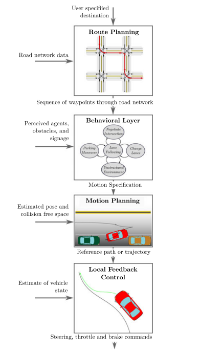
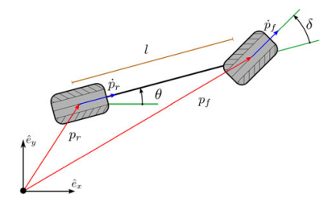

# A Survey of Motion Planning and Control techniques for Self-Driving Urban Vehicles城市自动驾驶车辆运动规划与控制技术综述

## 介绍

车辆自动化分级：0-5级

- 0级：所有驾驶任务都由人类驾驶员负责
- 1级：含有基本的驾驶辅助系统，如自适应巡航控制系统，防抱死制动系统和电子稳定控制系统
- 2级：含有最小化的纵向/横向控制或紧急制动
- 3级：系统可以监测环境，并在特定条件下实现完全自主驾驶
- 4级：在特定条件下实现完全自主驾驶，并且在操作员要求干预时未能控制车辆的情况下，可以安全控制车辆
- 5级：在所有驾驶模式下都是完全自主的

## 决策层概述

- **路径规划**：为决策最高层，通过将路网表示为一个有向图，其边权值对应于穿越某路段的代价，这样的路线可以被表述为在路网图上寻找最小代价路径的问题
- **行为决策**：负责根据其他交通参与者的感知行为、道路状况和基础设施的信号，在任何时间点选择合适的驾驶行为
- **运动规划**：当行为层决定在当前环境中执行的驾驶行为，如巡航车道，变道或右转时，所选择的行为须为反馈控制器可以跟踪的路径或轨迹
- **车辆控制**：使用反馈控制器选择适当的执行器输入来执行计划的运动并纠正跟踪误差

## 运动控制模型

### 单轨模型（自行车模型）

- 模型特征：
  -  汽车由**两个**由**刚性**连杆连接的**轮子**组成，且车轮在与地面的**接触点不打滑**，可以绕其旋转轴**自由旋转**。
  - **前轮**有一个额外的**自由度**，它被允许围绕一个轴正常的运动平面旋转

- 总结：汽车在不同步向前移动的情况下**无法进行横向位移**

- 其中参数：

  -  Pr和Pf分别表示为后轮和前轮在静止或惯性坐标系中的位置，基向量为（$\hat{e_x},\hat{e_y},\hat{e_z}$）
  -  θ为车辆所面对方向的角度，定义为$\hat{e_x}$与Pf-Pr之间的夹角
  -  δ是前轮的转向角
  -  $\dot{p_r}$和$\dot{p_f}$为Pr和Pf对时间的导数
  
- 两轮微分约束关系：

  - 后轮沿$\hat{e_x}$方向的运动为：$x_r=p_{r}\cdot\hat{e_x}$；沿$\hat{e_y}$方向的运动为：$y_r=p_{r}\cdot\hat{e_y}$

  - **后轮行驶速度**：$v_r=\pm\dot{p_r}$，其中正负号用来表示正行驶和倒车

  - 标量约束：

    - $\dot{x_r}=v_{r}\cdot\cos{\theta}$ ; $\dot{x_f}=v_{f}\cdot\cos{(\theta+\delta)}$ 

    - $\dot{y_r}=v_{r}\cdot\sin{\theta}$ ; $\dot{y_f}=v_{f}\cdot\sin{(\theta+\delta)}$ 

    - $\dot{\theta}=\frac{v_r}{l}\cdot\tan{\delta}$ ; $\dot{\theta}=\frac{v_f}{l}\cdot\sin{\delta}$ 

  - 前后**两轮速度关系**：$\frac{v_r}{v_f}=\cos{\delta}$

- 存在问题：
  - 前轮的转向角极限$\delta\in[\delta_{min},\delta_{max}]$
  - 后轮的前进速度可接受范围$v_r\in[v_{min},v_{max}]$
  
- 解决方法1：

  新增转向角的积分率：$\dot{\delta}=v_{\delta}$，并限制转向率$v_{\delta}\in[\dot{\delta}_{min},\dot{\delta}_{max}]$

  但是，此技术会增加模型的维度，使得运动规划和控制问题复杂化

## 运动规划

主要内容：接受车辆周围的静态和动态障碍物的信息，并生成满足车辆运动的动态和运动学约束的无碰撞轨迹

### 路径规划

在车辆的配置空间$\chi$中找出一条从初始配置0出发并到达目标区域的路径$\sigma(\alpha):[0,1]\rightarrow\chi$，同时满足给定的全局和局部约束。

- 路径质量
  - **可行路径**规划：确定一条满足某些给定问题约束的路径，而不关注解决方案的质量
  - **最优路径**规划：在给定的约束条件下，找到一条最优质量准则的路径问题

- 数值分析方法

  - **变分法**： 将路径表示为由有限维矢量参数化的函数，并通过使用非线性连续优化技术对矢量参数进行优化来寻求最优路径
  - **图搜索方法**：将车辆的配置空间离散为一个图，其中顶点表示车辆配置的有限集合，边表示顶点之间的过渡。通过在这样的图中执行搜索最小代价路径来找到所需的路径
  - **增量搜索方法**：对配置空间进行采样，并增量地构建一个可达性图，一旦图足够大，以至于至少有一个节点在目标区域内，则通过从开始配置跟踪通向该节点的边来获得所需的路径

  **注意**：可以通过组合这些方法来利用每种方法的优点

### 轨迹规划

适用于**动态环境**下或有动态约束的运动规划问题，即一个时间参数化函数$\pi(t):[0,T]\rightarrow\chi$的轨迹

- 数值分析方法
  - 变分法
  - 转化为附加时间维的位形空间中的路径规划 
