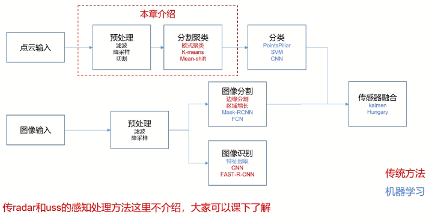
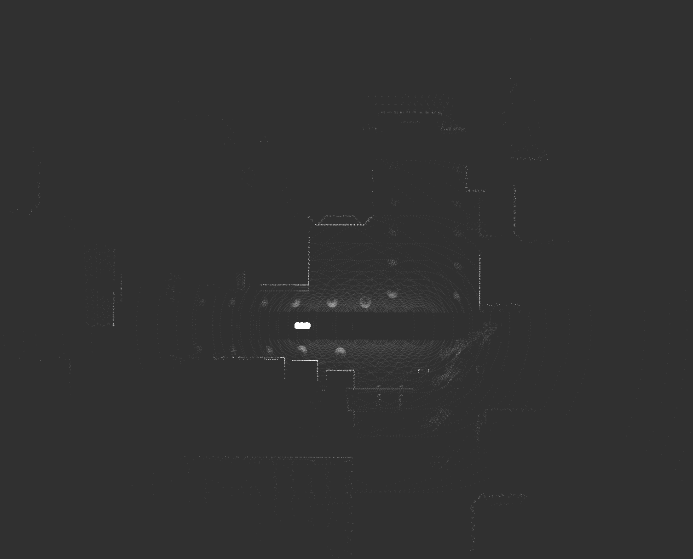
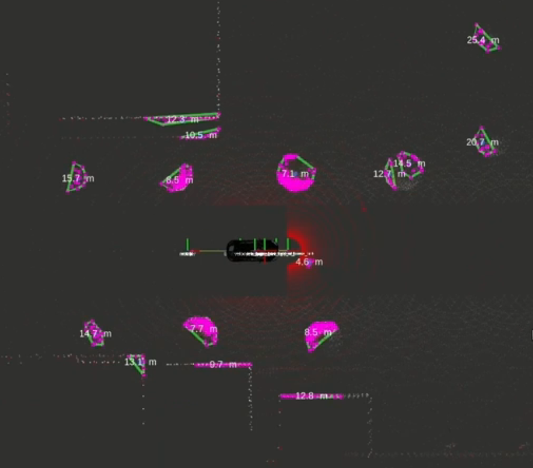
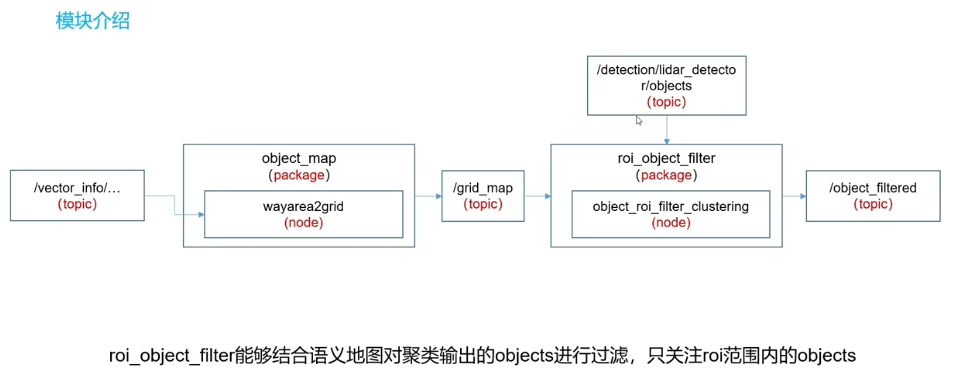
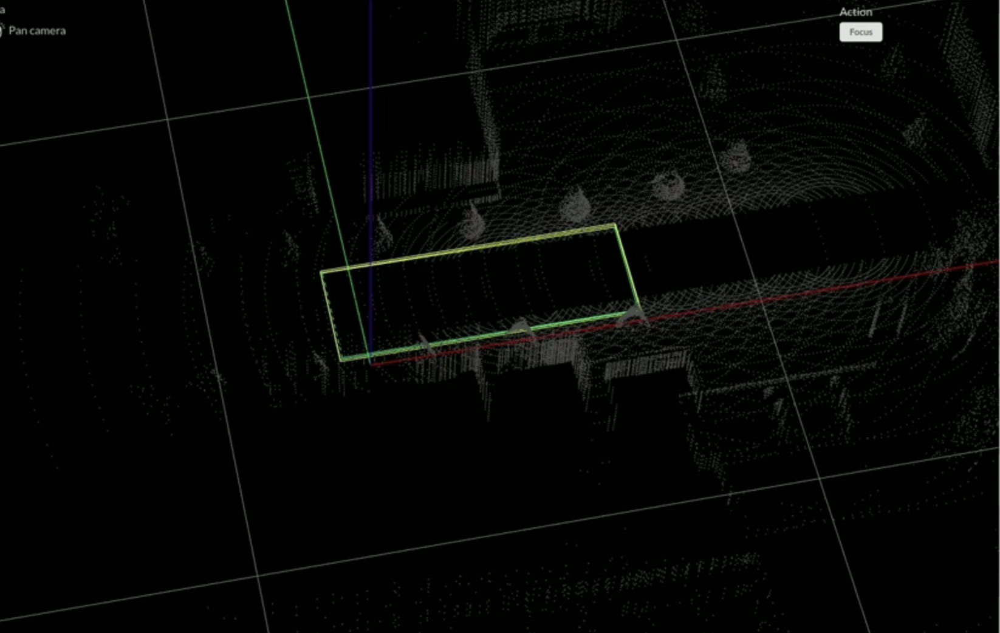
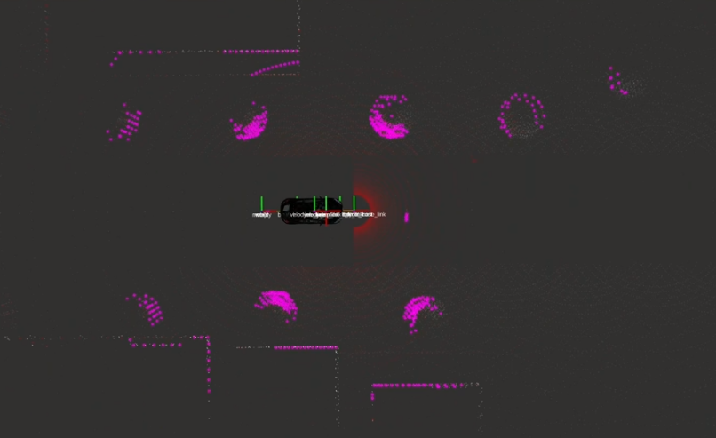
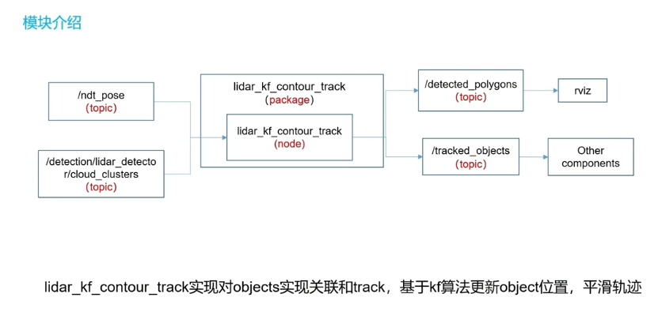
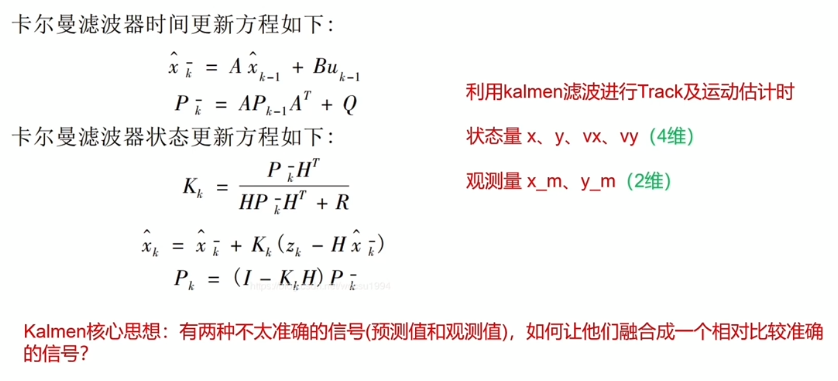
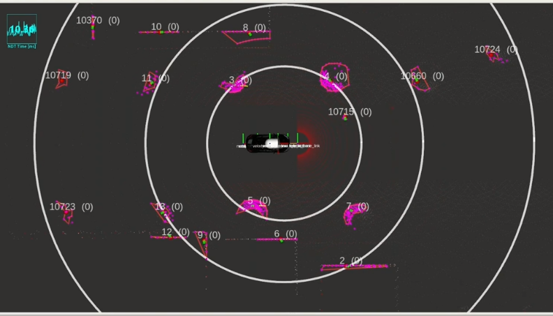
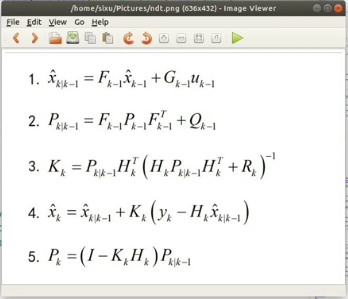

# 感知模块

## 常见感知方法概述


- lidar：激光雷达
- radar：毫米波雷达（对速度比较敏感，所以对动态物体的track、速度感知的时候，都要参考radar，且在此情况下的radar效果好于lidar和相机）
- uss：超声波雷达（倒车雷达）



（本章慕课不涉及机器学习的知识）

传感器融合，指对不同传感器的数据，采取不同权重去综合考虑，在不同情况更相信某种传感器的数据（**一般以安全为主的原则**） 


## lidar_euclidean_clustering（欧式聚类）模块源码解析及实践


- package包含一个主节点-欧式聚类的计算

- 输入：当前的scan，即points_raw

- 输出：列出了两个最关键的（其实也相同）

  - 聚类产生的点云的团 - `clusters`

  - 基于这些团点云做了一些统计处理，得到了点云团的几何特征：例如团点云外界多边形的尺寸，中心点等等 - `objects`

- `clusters`和`objects`这两个话题通过欧式聚类这个节点发布出去，会有其他模块订阅接收。例如：
  - 生成感知到的动态物体的track的模块会直接订阅点云团`clusters`作为输入；
  - 结合语义信息去过滤不需要的点云团的模块会订阅点云团的几何信息`objects`作为输入


### 欧式聚类算法步骤

1. 找到空间中某点P11，用**KD-Tree**找到离他最近的n个点；
2. 判断这n个点到P11的距离。将距离小于阈值d的点P12、P13、P14等放在Q类；
3. 在Q(P11)里找到一点P12，重复步骤1；
4. 在Q(P11,P12)找到一点，重复步骤1，找到P22，P23，P24全部放在Q类；
5. 当Q再也不能有新点加入了，则完成搜索。

- **欧式聚类就是一个递归的思想，lidar_euclidean_clustering模块是通过调用PCL库提供的一个欧式聚类的包来实现的，其实我们也可以自己写代码来实现欧式聚类这个过程**

- 无论是PCL库提供的接口，还是我们自己写一段代码实现欧式聚类，**欧式聚类的输出都应该是一系列索引，即聚类后每一类的索引（会把属于一个类的点云放在一个cluster里）**
- **欧式聚类的实现，关键在于基于kd-tree实现快速的检索查找！**（单纯用欧氏距离去暴力检索，那么所需算力会非常高。但是如果借用这种树状结构去检索所有点，将会非常高效）


#### KD-tree

参考资料：https://zhuanlan.zhihu.com/p/402555908

- KD-Tree是K-dimension tree的缩写，是对数据点在k维空间中划分的一种数据结构

- KD-Tree是一种平衡二叉树

  - 若它的左子树不为空，则左子树上所有结点的值均小于它的跟结点的值
  - 若它的右子树不为空，则右子树上所有结点的值均大于它的跟结点的值
  - 它的左、右子树也分别为二叉搜索树

  

欧式聚类算法中，就是将点云按照如上树状结构存进去，实现快速的检索计算。

（KD-Tree的源码非常复杂，自己写的话没有很大意义。欧式聚类的递归步骤可以自己写，其中用到的KD-Tree可以采用本模块提供的源码）


虽然有一个主CPP，但会经常跳转到其他.cpp，不过重点操作还是主cpp中的主回调里

**涉及到的重点函数：**

- 主回调 - `velodyne_callback()`
- - 根据距离做一个分割，聚类，得到clusters - `segmentByDistance()`
  - 对点云团clusters做一个几何信息的统计，得到objects - `SetCloud()`
  - 最后，对已经完成了聚类的clusters，再做两次聚类（可能两团离得近的cluster，就是一个物体，看能不能把它们合在一起） - `checkClusterMerge()`


### 仿真实践

仿真是下一章的重点，这一章为了演示感知模块的效果，搭建了一个简单的仿真环境，展示一下欧式聚类。

这是一个简易的仿真环境，车辆静止，主要进行感知模块的仿真，操作步骤如下：

1. 启动地图

   ```
   roslaunch autoware_quickstart_examples mini_map.launch
   ```

2. 启动定位

   ```
   roslaunch autoware_quickstart_examples mini_localization.launch
   ```

3. 启动rviz



**由于没有加入GPS，所以利用`2D Pose Estimate`，手动给一个初始位姿**（在小车模型上点击并朝右拉一下）

**这时在打开rviz的这个终端中，会打印一条INFO：`setting pose ：...`**

4. 启动Gazebo，开始仿真（即提供传感器的原始数据）

   ```
   roslaunch autoware_quickstart_examples mini_sil_env.launch
   ```

**注意：我在这里启动gazebo的时候遇到报错**


- 解决办法：**重新配置gazebo**

  ```
  sudo apt install ros-melodic-gazebo-ros-pkgs
  ```

  **加载完之后，再次启动gazebo仿真即可**

gazebo启动后，仿真也随之开始：在gazebo中，小车上的各类传感器收集到仿真环境的数据，并且Rviz中也同步显示激光雷达的探测效果（显示的红色点云即为探测到的周围物体，包括数、同态行人）

- 这个简单的环境world是官方自带的，但讲师在车前加了动态行人（主要为了在track模块中演示，可视化感知到的动态物体的track）

- 以及在车体引擎盖上加了一个激光雷达（原本的激光雷达在车顶，可能有盲区）

**启动gazebo的同时，也打开了一个rqt界面，用来控制车速、方位（stop键可以一键停车）**

- 可以将控制车速的滑块向上滑，使得小车向前行驶一点，离行人更近，这样能更清晰地感知到行人


5. 启动感知模块

```
roslaunch lidar_euclidean_cluster_detect lidar_euclidean_cluster_detect.launch
```

这时，可以在Rviz中，显示绿色框包围起来的一团团点云簇，即clusters（**欧式聚类的效果**）



**绿色框是objects的显示，对应左侧插件栏中`Perception->Tracked Objects`，Topic选择`detection/lidar_detector/object_markers`**

**粉色点云团是点云簇的显示，对应左侧插件栏中`Perception->Clustered Points`，Topic选择`/points_cluster`**

感知模块的输入是原始点云，对应：Rviz左侧的插件栏中，Sensing文件夹下的`Points Raw`，展示为红色点云（可以将Size的值调大，使点云可视化更明显）

感知模块的输出是点云簇以及点云簇的几何信息，展示为粉色点云团和绿色框以及中心位置


### 源码解析

本章介绍的感知模块，采用的是欧式聚类方法


- **感知模块的启动文件：`lidar_euclidean_cluster_detect.launch`**

launch文件中，可调节的参数非常多，对应源码，都可以调试

除了启动欧式聚类模块，还启动了roi滤波（之后会介绍，即将感知和语义地图关联，通过添加一些语义信息，通过过滤算法来判断，过滤掉一些我们不需要的clusters或objects）


- **主cpp，即源码文件：`lidar_euclidean_cluster_detect.cpp`**

  - 输入：1218行开始

    ```
      // Create a ROS subscriber for the input point cloud
      ros::Subscriber sub = h.subscribe(points_topic, 1, velodyne_callback);
    ```

    从输入这里看出，重点是一个主回调函数`velodyne_callback()`

  - 输出：1108行开始

    ```
      _pub_cluster_cloud = h.advertise<sensor_msgs::PointCloud2>("/points_cluster", 1);
    
      //note-tianyu pub的是地面点云scan
      _pub_ground_cloud = h.advertise<sensor_msgs::PointCloud2>("/points_ground", 1);
      _centroid_pub = h.advertise<autoware_msgs::Centroids>("/cluster_centroids", 1);
      //这里pub的是去掉地面的点云scan
      _pub_points_lanes_cloud = h.advertise<sensor_msgs::PointCloud2>("/points_lanes", 1);
    
      _pub_clusters_message = h.advertise<autoware_msgs::CloudClusterArray>("/detection/lidar_detector/cloud_clusters", 1);
      _pub_detected_objects = h.advertise<autoware_msgs::DetectedObjectArray>("/detection/lidar_detector/objects", 1);
    ```

    其中，`/points_cluster`是用于Rviz中订阅显示的点云簇；

    `/points_ground`和`/points_lanes`分别是地面点云和去掉地面的点云；

    以及发布autoware_msgs格式的`/detection/lidar_detector/cloud_clusters`，用于后续track模块的订阅输入；

    同样是autoware_msgs格式的`/detection/lidar_detector/objects`，用来在Rviz中显示点云簇的几何信息（即将粉色点云团框起来的**绿色框**）

    - 但其实在Rviz中，无法直接显示objects。而需要用专门可视化objects的包（在欧式聚类的启动launch的最后，加入`visualize_detected_objects`节点），以Marker形式来显示


- **主回调函数：`velodyne_callback()` - 欧式聚类感知模块的完整步骤（滤波、切割、去地面、聚类、可视化的顺序 ）**

1. 首先定义一些pcl的智能指针，方便后面调PCL库
2. 利用`pcl::fromROSMsg()`将输入的原始点云，从ROS格式转成PCL的格式，方便PCL库直接处理
3. 对输入点云进行一些预处理：（有if(xxx)判断的，表示该项预处理可通过参数设置来选择进行与否）

**滤波、切割、去地面：**

- 去掉邻近的点云（如打在车上的不要）- `removePointsUpTo()`

- 降采样 - `downsampleCloud()`

- 对点云进行高度裁剪 - `clipCloud()`

- 仅仅关注lane范围内的点云，相当于对点云左右进行裁剪 - `keepLanePoints()`

- 移除地面 - `removeFloor()`（通过掉用一个PCL库函数`removeFloor()`。思想就是创建平面（地面）模型，遍历所有点，符合这个平面方程的点都去除掉。**即拟合平面去除法**）

  - 在移除地面这一步中，利用`publishCloud()`，将地面的点云和去除地面后剩下的点云分别发布出来（对应上面讲的输出中`/points_grouns`和`points_lanes`）

  **在Rviz中，左侧插件栏中的`Sensing->Points Raw`，topic可以选择原始输入点云`points_raw`、去除地面后的输入点云`/points_lanes`等等多种点云**

  - 额外再提供了一种差分法线特征算法再对点云进行一次去除地面的过滤 -  `differenceNormalsSegmentation `

4. 正式进入**欧式聚类的接口**，根据距离分块和感知障碍（**下面会有单独分支讲这个函数**）

`segmentByDistance(diffnormals_cloud_ptr, colored_clustered_cloud_ptr, centroids, cloud_clusters);`

在`segmentByDistance()`中，先调用`clusterAndColor()`函数，开始聚类；聚类结束后，对当前检测到的多种聚类进行check，再进行两次聚类，将可以进一步融合的去融合

```
if (all_clusters.size() > 0)
  checkAllForMerge(all_clusters, mid_clusters, _cluster_merge_threshold);
else
  mid_clusters = all_clusters;
  
if (mid_clusters.size() > 0)
  checkAllForMerge(mid_clusters, final_clusters, _cluster_merge_threshold);
else
  final_clusters = mid_clusters;
```

跳转到`checkAllForMerge()`函数去解析（**下面会有单独分支解析`checkAllForMerge()`**）

执行了两次合并操作，最后得到`final_clusters`，是最终结果！

5. 发布聚类结果 - `publishCloudClusters()`

   **欧式聚类的输出是`cloud_clusters`，并调用 就在`segmentByDistance()`调用的 下面几行的`publishCloudClusters()`函数发布出去**。

- 转到`publishCloudClusters()`函数的定义中：（**下面还会单独列出一个分支讲这个函数**）

  除了发布聚类后的点云簇，还会利用`_transform_listener()`监听函数知晓很多TF关系并发布出去；

  另外，还会调用`publishDetectedObjects()`函数，将点云簇的几何信息objects发布出去


- **欧式聚类入口 - `segmentByDistance()`**
  - 函数最开始，有一个判断决定是否多线程来进行欧式聚类，默认不使用
  - 将pointcloud根据距离的远近分成五部分，分别进行聚类
    -  分成五部分的目的：根据距离的不同，对不同距离的点云进行一个聚类分辨时，聚类计算的阈值也会不同
  - 之后，调用`clusterAndColor()`函数，正式进入聚类


- **欧式聚类正式处理- `clusterAndColor()`**

  跳转到`clusterAndColor()`的定义：

  - 首先将input的点云2d化，因为之前预处理已经对高度进行预处理了，且真正对聚类影响比较大的是xy，所以索性直接将所有点云的z赋为0

  - 调用pcl点云库，进行欧式聚类

    - 利用PCL库中关于欧式聚类的封装

      ```c++
      pcl::EuclideanClusterExtraction<pcl::PointXYZ> ec;
      ec.setClusterTolerance(in_max_cluster_distance);  //
      ec.setMinClusterSize(_cluster_size_min);
      ec.setMaxClusterSize(_cluster_size_max);
      ec.setSearchMethod(tree);
      ec.setInputCloud(cloud_2d);
      ec.extract(cluster_indices);
      ```

    其实到这里已经完成了欧式聚类！调用库函数，只需要做好一些参数的设置

    - 最大最小点云簇的范围`_cluster_size_min`、`_cluster_size_max`，即什么范围标准可以看作一簇

    - 搜索方式`tree`（kd-tree）

    - 输入`cloud_2d`（经过一系列预处理和2d化的原始点云）

    - 以及最后的输出是点云簇的索引`cluster_indices`（`std::vector<pcl::PointIndices> cluster_indices`的size等于cluster的数量，每一个PointIndices中存储了该聚类簇属于原本点云的下标）

      **聚类的完成的运算结果相当于是一个"嵌套的vector",里面存储的每一块cluster中的points的index**

  - 上一步调用完这些库函数完成欧式聚类后，得到分好类后所有点的索引（但实际上还没有一类类分开保存），故之后经过一次遍历，根据索引，将input_cloud分配到各个cluster中

    ```
    for (auto it = cluster_indices.begin(); it != cluster_indices.end(); ++it)
    {
      ClusterPtr cluster(new Cluster());
      //根据索引，将input_cloud分配到各个cluster中
      cluster->SetCloud(in_cloud_ptr, it->indices, _velodyne_header, k, 255,
                        0,
                        255, "", _pose_estimation);
      clusters.push_back(cluster); // 将input_cloud分配到各个cluster中
      
      k++;
    }
    ```

    可以看到这一步还调用了`SetCloud()`函数（传入的参数有原始点云、聚类后的点云索引等），跳转其定义阅读（**下面有单独分支解析**）

  - `clusterAndColor()`的 聚类结束后，再进行两次聚类，合并靠近的点云簇

    - 二次聚类，消除误差 - `checkAllForMerge()` 

      这个函数实现了：对进行过一次聚类的点云簇，再进行一次聚类操作（有些点云团离得比较近，可能第一次分成了两块，但其实他们可能是一个物体，所以再进行一次聚类将这种情况尽可能消除）

      a. 调用`checkClusterMerge()`，得到哪些clusters可以进一步合并，得出merge_indices；

      - `checkClusterMerge()`

        首先遍历之前聚类后的一块块点云团，**利用递归操作**，遍历每块的时候，判断这块点云和其他点云是否距离足够近可以判断成可以合并，得到针对每一块点云可以合并的其他快的的索引

      b. 调用`mergeClusters()`，根据merge_indices来进行merge（将可以合并的集合，合并成一个新的类）；

      - `mergeClusters()`

        将上一步得到的可以合并的点云簇，进行一个累加；

        最后，再调用一下`SetCloud()`，因为合并以后有一些点云簇发生变化了，要重新统计每块的几何信息

      c. 将没有合并的点云簇加到`out_clusters`这个容器的后面（前两步merge了的点云簇已经放入到这个容器）


-  **点云簇的几何信息统计 - `SetCloud()`（定义在cluster.cpp中）**

  - 这个函数是针对每一簇点云团的处理，

    即在上一步最后的代码段中，遍历欧式聚类结果的索引，将原始点云分块保存，得到属于每一类的点云，

    将同属于一类的点云都传入`SetCloud()`函数，做一个几何信息的统计。**即通过这个函数得到这个模块的第二个输出-objects**

a. 首先遍历同属一类的点云，计算出点云簇的平均值和中心点；

b. 根据边界点（max-min），计算出bounding_box，即外接矩形的端点；

c. 估计姿态。调用opencv的库来计算外凸形状，即用外界多边形来拟合这一簇点云。得到外界多边形后，就可以利用形状和朝向去拟合一个位姿

d. 设置了bounding box的朝向，只考虑yaw角，因为当成是在一个平面

e. 获取特征值和特征向量，ndt里面提过，从特征值和特征向量中可以看出几何类型


- ##### 欧式聚类结果的发布 - `publishCloudClusters()`

欧式聚类的结果，一团团的点云簇其实是相对于雷达坐标系。正是因为在这个publish函数的开头对多种TF进行了监控（就包括对雷达和地图之间TF的监控），才能做进一步处理讲点云簇转换到map坐标系（能在Rviz中显示也证明了点云簇已经转变成相对于map坐标系）

在`publishCloudClusters()`的最后，将点云簇和点云簇的几何信息分别发布出去，其中将点云簇几何信息打包为objects，调用`publishDetectedObjects()`函数来发布

`publishDetectedObjects()`：跳转到发布objects的函数定义，其实就是获取了bounding_box的pose、外界多边形的几个端点等信息，再发布出去


## roi_objects_filter模块源码解析及实践



roi指的是可通行区域，即语义地图中标注的wayarea

- **为什么要过滤？**

上一节欧式聚类后，感知到周围的一些房子、树等等，但这些其实都不太影响车子的正常行驶。我们更关注在小车的可通行区域中存在的一些障碍物，**所以利用这个模块，对之前所有感知到的objects过滤后，留下可通行区域内的objects**；

`detection/lidar_detector/objects`是上一节中欧式聚类模块的输出，这里作为roi模块的输入；

`/vector_info`是在第一章地图模块，map_file模块中的vector_map_loader节点，读取语义地图后，将语义信息转为这个格式又发布出去（包括很多，比如lanes、crosswalk、wayarea等等），这里作为roi模块的输入；

过滤的方法本身很简单，但是在过滤之前要做的：wayarea2grid节点，将语义信息`/vector_info`转换成栅格地图的格式`/grid_map`（栅格地图就像是二进制区域，相当于就两种情况，存0的格子不可以通行，存255的可以通行）；

object_roi_filter_clustering节点，过滤的方法很直接：就是遍历所有objects，在wayarea的就留下；


wayarea2grid：在主回调中，将wayarea这个语义信息，转成栅格地图

roi_object_filter：之前已经有转成栅格地图格式的语义信息，在roi的主回调中，check一下point（就是object的中心点）在不在可通行区域内


### 仿真实践

对欧式聚类检测的结果objects进行过滤

所以这次实践是建立在上一节欧式聚类的基础上，**得到objects后，才有进行这一步的基础**

**这一步对objects的过滤操作其实是可选可不选，如果需要对objects过滤，那么启动这个模块之前，要做好准备工作：**

- 打开`lidar_euclidean_cluster_detect.launch`（欧式聚类的启动文件），将其中21行的`use_vector_map`的参数值，修改成true（修改后记得编译）

- 利用Autoware Tools绘制好语义地图（**这里我们只关注车道上的信息，即可通行区域wayarea**）

绘制好后，也要导出语义地图，即将语义信息保存在本地，格式为`wayarea.csv`

如下图所示，在wayarea中，其实只有行人（参考上一节的仿真环境来说），路边的树和房子经过roi模块后应该都被过滤掉了



1. 启动地图

   ```
   roslaunch autoware_quickstart_examples mini_map.launch
   ```

2. 启动定位

   ```
   roslaunch autoware_quickstart_examples mini_localization.launch
   ```

3. 启动rviz

**由于没有加入GPS，所以利用`2D Pose Estimate`，手动给一个初始位姿**（在小车模型上点击并朝右拉一下）

4. 启动Gazebo，开始仿真（即提供传感器的原始数据）

   ```
   roslaunch autoware_quickstart_examples mini_sil_env.launch
   ```

5. **启动语义信息`/vector_info`解析模块，即wayarea2grid模块**（在欧式聚类之前启动，因为这次的欧式聚类加入了roi过滤，这个过滤需要栅格地图为输入）

   ```
   roslaunch object_map wayarea2grid.launch
   ```

6. 启动欧式聚类（带roi）

   ```
   roslaunch lidar_euclidean_cluster_detect lidar_euclidean_cluster_detect.launch
   ```

   相较于上一节的感知演示，这次Rviz中：小车周围象征树和房子的**点云簇都没有绿框包裹了，表明不在wayarea的objects被过滤掉了！**
   
   
   
   可以在Rviz中把栅格地图（即栅格格式的wayarea）显示出来：在左侧插件栏中，`Perception->Occupancy Grid Map`，将Topic选成`/occupancy_wayarea`，此时就能完成对wayarea的显示！（**灰色就是栅格地图的可通行，剩余黑色都是栅格地图的占用，即不可通行**）
   
   
   
   **打开wayarea的显示后，就会更明显发现：不在wayarea区域的点云簇都没有绿色框（objects）了，只有小车前方，在wayarea里的象征行人的点云簇还有绿框（虽然很小，但放大看还有）**


### 源码解析

- **wayarea2grid.cpp**

  之前map_file模块中的vector_map_loader节点，读取vector_map的.csv信息后，转存为专门为语义信息设置的数据格式vector_info，又发布出来，供其他模块订阅

  而wayarea2grid模块就是其中之一，订阅发布出来的vector_info

  - 输出

    ```
    PublishGridMap(gridmap_, publisher_grid_map_); // roi_object_filter模块顶阅的
    PublishOccupancyGrid(gridmap_, publisher_occupancy_, grid_layer_name_, grid_min_value_, grid_max_value_, grid_position_z_); // Rviz订阅，可视化用的
    ```

  - 输入（不明显）

    ```
    // 由此订阅包含"wayarea"在内的"vector map info"的topic
    LoadRoadAreasFromVectorMap(private_node_handle_, area_points_);
    ```

    `LoadRoadAreasFromVectorMap()`函数的定义在object_map_utils.cpp中：

    ```
    // 实际上除了wayarea，还订阅了与其密切相关的points、line等语义信息
    vmap.subscribe(in_private_node_handle,
                       vector_map::Category::POINT | 
                       vector_map::Category::LINE |   
                       vector_map::Category::AREA |
                       vector_map::Category::WAY_AREA, 10);
    
    ...
        
    for (const auto &way_area : way_areas)
    {
      vector_map_msgs::Area area = vmap.findByKey(vector_map::Key<vector_map::Area>(way_area.aid));
      //note-tianyu 根据area信息在vmap中找到out_area_points，确定area的边界点（解析vector info）
      out_area_points.emplace_back(SearchAreaPoints(area, vmap)); // SearchAreaPoints()
    }
    ```

    **重点是，根据订阅的几类语义信息，通过`SearchAreaPoints()`函数，将area的边界点找到，即解析vector info**

    跳转到`SearchAreaPoints()`定义：（在object_map_utils.cpp中）

    - **解析area的边界点 - `SearchAreaPoints()`**

      先从几个.csv文件开始阅读：（这几个语义信息是依次关联上的！）

      ```
      //area.csv
      AID,SLID,ELID 
      1,1,4
      ```

      - AID是**area的id**，**S**(start)**LID**是**起始line的id**；**E**(end)**LID**是**结束line的id**

    
      ```
      //line.csv
      LID,BPID,FPID,BLID,FLID
      1,1,2,0,2
      2,2,3,1,3
      3,3,4,2,4
      4,4,1,3,0
      ```
    
      - LID是**line的id**，四条线和上面的area.scv对上了（从1到4）
    

      - BPID和FPID是line的起始和终点的**point的id**
    
      - BLID和FLID是后方和前方**连接line的id**
    
        **注意：**有效的line的LID不为0，若后方没有连接的line，则其BLID== 0。同样前方没有line，则FLID== 0。

      ```
      PID,B,L,H,Bx,Ly,ReF,MCODE1,MCODE2,MCODE3
      1,33.0000142,129.2959412,0,4.383,-15.252,1,4929,43,9
      ...
      ```
    
      Point是 VectorMap 中最基本的和唯一的带有坐标信息的数据，所有的其他数据都链接自Point
    
      - PID：Point本身的标识
    
      - L：Longtitude，经度
    
      - B：Latitude，纬度
    
      - H：制作 VectorMap 时的高度，也就是Z值
    
      - Bx：投影的X坐标，**转换为Map的坐标时对应y值**
    
      - Ly：投影的Y坐标，**转换为Map的坐标时对应x值**

        **注意：** 以 Line 的 BPID 和 FPID 为线索找寻Point，需要注意重复性问题，即当前 Line 的 FPID可能是下一条 Line 的 BPID，需要注意。
    
    
    
    - 总结：从区域area，到线line，再到点point
    
    - **根据上面三个.csv展示的数据格式，在`SearchAreaPoints()`中：根据area、line、point的id去层层检索，得到了wayarea的边界点**（结合三个.csv文件，这个函数的源码非常好读懂）
    
      ```
        std::vector<geometry_msgs::Point>
        SearchAreaPoints(const vector_map::Area &in_area, const vector_map::VectorMap &in_vectormap)
        {
          //找到area的start line
          ...
          //遍历所有line（正常该area关联的最后一个line的flid为0，这里先处理前面的line）
          ...
            // 得到line的两个端点
          ...
          //这里再处理最后的line
          ...
          return area_points;
        }
      ```
    
      最后返回`area_points`


- **回到wayarea2grid.cpp中**，此时已经得到area的边界点`area_points`，再根据area_points_形成的多边形来在设定grid_map中实现可通行区域的绘制

```
 if (!area_points_.empty())
      { //note-sixu 根据area_points_形成的多边形来在设定grid_map中实现可通行区域的绘制，主要是调用cv::fillConvexPoly函数
        FillPolygonAreas(gridmap_, area_points_, grid_layer_name_, OCCUPANCY_NO_ROAD, OCCUPANCY_ROAD, grid_min_value_,
                         grid_max_value_, sensor_frame_, map_frame_,
                         tf_listener_);
```

跳转到` FillPolygonArea()`函数的定义：（也在object_map_utils.cpp中）

**调用opencv的一个函数，在栅格地图中绘制可通行区域 - ` FillPolygonAreas()`**

这个函数的定义也很简单，先对map做一些设置，因为要把map转成grid_map格式，有一些补偿信息要算，

最后通过调用`cv::fillConvexPoly()`（opencv库的一个函数）来实现绘制！


- **roi_object_filter.cpp**

通过wayarea2grid模块，已经得到栅格地图。

在这个模块中，就是判断欧式聚类出来的点云簇在不在可通行区域内，在的话才保留。

- 输出（258行开始）

  ```
  roi_objects_publisher_ = node_handle_.advertise<autoware_msgs::DetectedObjectArray>(roi_topic_str, 1);
  ```

  和欧式聚类的输出objects是一样的数据格式`autoware_msgs::DetectedObjectArray`，因为过滤就只是减少了objects的数量

- 输入（232行）

  ```
  //note-tianyu 该topic直接从欧式聚类模块订阅  detections_range_subscriber_=in_private_handle.subscribe(objects_src_topic_,1,&RosRoiObjectFilterApp::DetectionsCallback,this); 
  //订阅的是wayarea2gird模块的输出wayarea_gridmap_subscriber_=in_private_handle.subscribe(wayarea_gridmap_topic_,1,&RosRoiObjectFilterApp::WayAreaGridMapCallback,this);
  ```

  在这个函数中，还提供了保证消息同步的api函数，因为同时订阅了两类信息

  

- **主回调函数`DetectionsCallback()`**

实际上又是**调用了`SyncedDetectionsCallback()`函数**，转到其定义：

```
RosRoiObjectFilterApp::CheckPointInGrid(const grid_map::GridMap &in_grid_map,
                                        const cv::Mat &in_grid_image,
                                        const geometry_msgs::Point &in_point)
{
  // calculate out_grid_map position
  ...
  // coordinate conversion for cv image
  // 转换到图像的坐标系上
  ...
  // 不能越过边界
  ...
  // 获取该像素位置的"像素值"，能够确定是否是可通行区域
  if (in_grid_image.at<uchar>(cv_y, cv_x) != gridmap_no_road_value_)
  {
    return true;
  }

  return false;
}
```

`in_point`就是objects的中心点，先将其转换到图像坐标系上（栅格地图存的是像素值，所以这里要设置这些点的像素值）；

判断这些中心点的像素值是否为255，是的话就是可通行区域，return true！（栅格地图存的值就是0或255）

**参考仿真实践那一块的图，灰色就是像素值为255的可通行区域，剩余黑色都是像素值为0的不可通行区域**


## lidar_kf_contour_track模块源码解析及实践

基于卡尔曼滤波的track模块介绍

**这个模块可以直接对欧式聚类后的objects进行追踪，也可以利用roi__object_filter模块先对objects进行一次可通行区域的过滤，然后对留下来的objects进行追踪**。所以第一节欧式聚类是重点，其余的模块都是为其服务的！



这个模块的两个输出：

- `detected_polygons`是供Rviz订阅的，可以将objects的轨迹等状态量可视化出来。
- `tracked_objects`，例如会被后面的规划模块订阅


#### 1. 外界多边形的估计

#### 

区分于之前欧式聚类中的多边形估计是直接调用opencv的库，这里提出了一种不一样的做法

重点还是在主回调`callbackGetCloudClusters()`中，对欧式聚类得到的点云簇进行一系列处理；

`ImportCloudClusters()`进行一些格式转换，其实也是在欧式聚类得到的点云簇的几何特征提取出来；

`EstimateClusterPolygen()`是进行多边形估计！

- **我们这里一直强调外界多边形的估计，是因为之前欧式聚类只得到bounding_box（外接矩形），其实是不够准确，可能外接矩形会浪费很多空间。而有了更精准的外界多边形后，我们能对物体的形状做更好的估计，后续的规划也能更合理**

`DoOneStep()`是正式对轨迹的获取


#### 2. 正式track


之前track过的的objects是有一个track_list，我们是要把新进来的object和之前的track_list中的进行比较，看track_list中有没有和我们输入的object很近的点，如果有，那就代表这个object已经被track过了；如果没有，那么这个object会作为新的object，走一遍卡尔曼滤波的流程。

新进入的object当作观测，通过这些观测来进行一个卡尔曼滤波的更新。我们就能在之前一帧的位置、速度的基础上，有一个预测值，有了预测后，我们用输入来做一个update观测，最终我们就得到当前帧比较精确的x、y、Vx、Vy。

得到这些后，我们就可以得到它更多的一些运动状态信息，包括加速度、朝向等


#### [卡尔曼滤波](https://zhuanlan.zhihu.com/p/45238681?utm_source=wechat_session&utm_medium=social&utm_oi=744316812249804800)




### 仿真实践

需要在欧式聚类的基础上，因为必须先有objects

按照第一节的步骤，依次启动各节点，启动欧式聚类的感知模块，得到objects

再启动卡尔曼滤波的track模块：

```
roslaunch lidar_kf_contour_track lidar_kf_contour_track.launch
```

**左侧插件栏中，`Planning->OP Planner->Tracked Contours`，Marker Topic选择`/detected_polygons`**，即可看到track的效果：

在Rviz中可以看到：

- 大部分objects都是静态的，所以基本只有一个id显示；

  只有车前的一个行人是动态的，可以看到他的id、轨迹以及朝向




### 源码解析

包括：`lidar_kf_contour_track_core.cpp`、`PolygeonGenerator.cpp`、`SimpleTracker.cpp`（都在lidar_kf_contour_track这个包中）

从主CPP - `lidar_kf_contour_track_core.cpp`开始阅读：（中间涉及到的一些函数可能会在剩下两个cpp）


- **先看`lidar_kf_contour_track_core.cpp`**

  - 输入（48行）

    ```
    sub_cloud_clusters     = nh.subscribe("/detection/lidar_detector/cloud_clusters", 1, &ContourTracker::callbackGetCloudClusters, this);
    sub_current_pose     = nh.subscribe("/ndt_pose",   1,  &ContourTracker::callbackGetCurrentPose,   this);
    ```

    输入是欧式聚类出来的点云簇，以及其位姿

  - 输出（51行）

    ```
      pub_AllTrackedObjects   = nh.advertise<autoware_msgs::DetectedObjectArray>("tracked_objects", 1);
      pub_DetectedPolygonsRviz = nh.advertise<visualization_msgs::MarkerArray>("detected_polygons", 1);
      pub_TrackedObstaclesRviz = nh.advertise<jsk_recognition_msgs::BoundingBoxArray>("op_planner_tracked_boxes", 1);
      pub_TTC_PathRviz    = nh.advertise<visualization_msgs::MarkerArray>("ttc_direct_path", 1);
    ```

    `/tracked_objects`和`/detected_polygons`包含的信息是差不多的；

    `/detected_polygons`是专门供Rviz订阅的，是`Marker`格式的。虽然名为detected多边形，但它包含了很多信息：除了点云簇的外界多边形，还有track的轨迹和id，还包括了四个圆环（感知区域，越往外的圆环越不重要，越里面的圆环包围的目标生命周期越长，关注的时间更长）；

    `/ttc_direct_path`是碰撞时间，即检测两者速度等，防止碰撞。


- **主回调函数 - `callbackGetCloudClusters()`**

开头先是两个标志位，要保证位姿和点云簇的信息都已经订阅进来；

1. 调用`ImportCloudClusters ()`函数，将接受到的聚类类型转换成`PlannerHNS::DetectedObject`格式：

   - 这个函数主要是对一些特征数据做提取，并且一些几何特征在聚类算法的过程中已经实现了，直接读进来就可以（之前欧式聚类模块中的`SetCloud()`函数已经提取了大部分几何信息）

     **然后，调用`EstimateClusterPolygon()`，根据当前cluster所包含的点云几何特征，来估计其多边形形状 **（和欧式聚类模块中直接调用opencv的库去得到多边形形状的方法不一样！）

     ```
     obj.contour = polyGen.EstimateClusterPolygon(point_cloud ,obj.center.pos,avg_center, m_Params.PolygonRes) // 读取了点云簇的中心、位姿、分辨率信息
     ```

   - `EstimateClusterPolygon()` - 拟合外接多边形

     这个函数在`PolygeonGenerator.cpp`中

     在解析代码之前，先总体概述一下如何实现的：对于一团点云簇，先用一个外接圆包裹住，点云簇的中心点是圆心，按照预先设定（`m_Params.PolygonRes`的值决定几等分），圆心和圆周上若干个点相连，将圆几等分，**然后找每条平分线上离圆心最远的一个点云点，将这些点相连就形成外界多边形**

   - 调用`CreateQuarterViews()`函数，根据设置的分辨率参数相当于将圆弧按设置好的分辨率来进行等分，由此得到min_ang和max_ang，表示等分后每个扇形区域的两条边（为下一步处理每个扇形区域做准备）

   -  遍历所有point到cluster位置原点的距离，调用`UpdateQuarterView()`函数（这个函数定义在`PolygeonGenerator.hpp头文件中`）去找到每个扇形区域离中心点最远的一个point

   -  这一步很有意思，相当于在已经添加的多边形相邻点中又多插入了一个，增大了一下分辨率。

   -  将找到的最远point连接起来，更新多边形的中心点位置，得到每个点云簇的外界多边形。返回给`obj.contour`变量


2. 得到外界多边形后，过调用`DoOneStep()`函数，正式进入到track模式。（**下面有单独分支解析这个函数**）

   跳转到`DoOneStep()`函数定义去阅读（其定义在`SimpleTrack.cpp`中）

3. 将处理得到的信息发布出去：`LogAndSend()`函数发布的信息，是真正为之后规划模块订阅使用的；`VisualizeLocalTracking()`函数发布的信息，是专门为Rviz可视化的


-  **实现Track的主函数 - `DoOneStep()`**

在`SimpleTrack.cpp`中：

1. 开头先计算了一下车子自身的漂移，即根据之前的pose和当前的pose来算出当前位置的一个漂移。（不过在我们本章搭建的仿真实践环境中，车子暂时是不动的，所以这里的漂移是0）
2. 接收输入的objects，`m_DetectedObjects = obj_list`
3. 接下来提供了三种track的方式，根据预先设置，进入到某一分支的哪个方法来实现track（**我们实际用的第二种，用卡尔曼滤波来更新**）
   - 第一种方式只是用了最近的距离来强关联，不算是一个track，可能有时候效果还不错。但并没有用卡尔曼滤波来更新实际的一个位置 - `AssociateOnly()`
   - 第二种其实是另外两种的的结合。因为第一步也还是要关联，也是用最小距离这种暴力的方法来关联。不过关联之后，又利用卡尔曼滤波来对其位置和速度进行一个update - `AssociateSimply()`（后续跳转阅读！）
   - 第三种和第二种差别不是很大


- **卡尔曼滤波更新的track方式 - `AssociateSimply()`**

```
void SimpleTracker::AssociateSimply()
{
  ...
  // 根据距离来进行暴力匹配
  MatchWithDistanceOnly();
  // 对每一个track到的object来进行kf更新
  for(unsigned int i =0; i< m_TrackSimply.size(); i++)
    m_TrackSimply.at(i).UpdateTracking(m_dt, m_TrackSimply.at(i).obj, m_TrackSimply.at(i).obj);
   ...
}
```

算法流程概述：**先对欧式聚类detect到的objects作暴力匹配，匹配到之后，用 速度 \* 时间 对下一个位置进行预测；将匹配上的objects作为观测measurement，来对这些观测做一个update更新**

详细介绍第二种track方法，即卡尔曼滤波更新的方法，跳转阅读`AssociateSimply()`函数：

1. 先把表示所有objects是否更新过的标志位置成false

2. 根据距离来进行暴力匹配 - `MatchWithDistanceOnly()`

   - `MatchWithDistanceOnly()` - **完成了predict的工作**

     把输入的objects遍历一遍，把每个object在track的序列中寻找，哪一些跟它距离最接近，当距离满足提前设置的阈值，那么就表示关联上了，**两个分支：**

     - 如果满足关联条件了，就进入到一个track上了的分支：我们会对一些标志位、track的序列等进行更新（例如，把刚刚找到了关联的新输入object的id 设置成在 track序列中关联上的物体id一样，表示它们是一个东西，不用对这个“新入”的object作卡尔曼滤波更新；更新一下track序列；把这个object和其关联上的物体都从各自集合中删除，表示下次不要遍历他们了等等）
     - 如果没有找到任何满足关联的物体，表示没有track上，进入到没有track上的分支：则真正新添加一个object，这个object还没有任何信息，所以需要对它作卡尔曼滤波更新，得到它的状态信息。
       - **其实track序列最开始是空的，经过第一次关联搜索后被识别为新object加进去，才有东西。所以对于每个新添加进来且未被track过的object，都要设置一个卡尔曼滤波器**

     **这两个分支的目的：就是把所有detect到的object都必须搜集到，并且各自都构造一个卡尔曼滤波器，为了后续对每个object进行状态的更新**（没关联上的object表示之前没卡尔曼过，则必须新建卡尔曼滤波器为了之后的状态更新；关联上的object表示之前对它有过建立滤波器，所以无需再多操作，等待后续的更新即可）

     ```
     KFTrackV track(m_DetectedObjects.at(0).center.pos.x, m_DetectedObjects.at(0).center.pos.y,m_DetectedObjects.at(0).actual_yaw, m_DetectedObjects.at(0).id, m_dt, m_nMinTrustAppearances);
     ```

     **跳转阅读`KFTrackV()`函数**（下面会单开一个分支解析）

   无论是进入到track过还是没track过的分支，到这里都完成了卡尔曼滤波中的预测步骤！并且每个分支最后都要对几个序列或集合进行更新。**并且通过`m_TrackSimply = newObjects;`，得到匹配上的序列`m_TrackSimply`（里面包含的objects都是建立了卡尔曼滤波器的）**

3. 对每一个track到的object来进行kf更新 - `UpdateTracking()`

   ```
    for(unsigned int i =0; i< m_TrackSimply.size(); i++) //遍历暴力匹配后的结果-m_TrackSimply
       m_TrackSimply.at(i).UpdateTracking(m_dt, m_TrackSimply.at(i).obj, m_TrackSimply.at(i).obj);
   ```

   - `UpdateTracking()` - **完成update的工作**

     现在已经匹配过了，只要再对track list（即`m_TrackSimply`）遍历一遍，来对它进行更新

     **跳转阅读`UpdateTracking()`函数**（下面会单开一个分支）


- **卡尔曼滤波器的构造函数 - `KFTrackV()`**

定义在`SimpleTracker.h`头文件中：

1. 先对一些状态信息、重要参数进行初始化

2. 调用opencv的一个卡尔曼滤波库

   `m_filter = cv::KalmanFilter(nStates,nMeasure)`

   `nStates`表示估计状态的维数：4维（x、y、Vx、Vy）

   `nMeasure`观测值的维数：2维（即把欧式聚类detect的值当作观测值）

3. 搭建一个transform矩阵：有了速度，乘上Δt，得到这一帧的位移，再加上上一帧的位移，作为下一帧的预测。是一个很简单的预测模型

4. 初始化阶段，设置好状态（位置x和y，初始速度是0）；以及设置好一些误差量

对照着公式，代码一一对应：P、Q、R就是对应公式里的，F是上一步的transform矩阵：

```
#if (CV_MAJOR_VERSION == 2) // c. transform矩阵
    m_filter.transitionMatrix = *(cv::Mat_<float>(nStates, nStates) << 1  ,0  ,_dt  ,0  ,
        0  ,1  ,0  ,_dt  ,
        0  ,0  ,1  ,0  ,
        0  ,0  ,0  ,1  );
#elif (CV_MAJOR_VERSION == 3)
    m_filter.transitionMatrix = (cv::Mat_<float>(nStates, nStates) << 1  ,0  ,_dt  ,0  ,
        0  ,1  ,0  ,_dt  ,
        0  ,0  ,1  ,0  ,
        0  ,0  ,0  ,1  );
#endif    
   // d. 初始化阶段
    m_filter.statePre.at<float>(0) = x;
    m_filter.statePre.at<float>(1) = y;
    m_filter.statePre.at<float>(2) = 0;
    m_filter.statePre.at<float>(3) = 0;

    m_filter.statePost = m_filter.statePre;

    setIdentity(m_filter.measurementMatrix);

    cv::setIdentity(m_filter.measurementNoiseCov, cv::Scalar::all(0.0001));//R
    cv::setIdentity(m_filter.processNoiseCov, cv::Scalar::all(0.0001));//Q
    cv::setIdentity(m_filter.errorCovPost, cv::Scalar::all(0.075));//p

    m_filter.predict(); // 初始化阶段，完成预测！
```



**初始化阶段，最后`m_filter.predict()`来做一个先验的预测**

**到这里，就完成了predict，下一步要做的就是更新，**

**从`KFTrackV()`的调用地方，返回到`MatchWithDistanceOnly()`调用地方，即回到`AssociateSimply()`函数**

**`AssociateSimply()`函数接下来的操作就是更新**


- **更新 - `UpdateTracking()`**

在 `AssociateSimply()`的最后调用：

```
 for(unsigned int i =0; i< m_TrackSimply.size(); i++) //遍历暴力匹配后的结果-m_TrackSimply
    m_TrackSimply.at(i).UpdateTracking(m_dt, m_TrackSimply.at(i).obj, m_TrackSimply.at(i).obj);
```

定义在`SimpleTracker.h`头文件中：

```
void UpdateTracking(double _dt, const PlannerHNS::DetectedObject& oldObj, PlannerHNS::DetectedObject& predObj)  // oldObj是之前匹配上的，需要被更新；predObj是更新后的结果
{...
  cv::Mat_<float> measurement(nMeasure,1);
  cv::Mat_<float> prediction(nStates,1);
  // 已经匹配到的值作为观测
  measurement(0) = oldObj.center.pos.x;
  measurement(1) = oldObj.center.pos.y;
  // 根据观测来进行update
  prediction = m_filter.correct(measurement); // 卡尔曼滤波器
 
 ... // 之后是对一些状态信息作计算
 } 
```

**从调用和定义可以看出，`m_TrackSimply.at(i).obj`就是之前暴力匹配后的track_list，即作为`oldObj`需要被更新！**

将已经匹配到的值作为观测，对这些观测，来进行update（利用上一步匹配过程中构造的卡尔曼滤波器）；

**利用卡尔曼滤波器更新了位置和速度后，**

**利用位置和速度这两个状态，去额外计算一些其他的状态信息，如朝向角**（虽然卡尔曼滤波是更新位置和速度，但是这里通过位置和速度信息，去计算了一些其他状态信息）；

最后为迎来对下一个周期的object值进行更新，提前做好预测 。

**对于这个模块的使用，是建立在欧式聚类得到objects后。所以也可以利用4_2节中的roi过滤模块，过滤得到只在车道里的objects，然后利用卡尔曼滤波track模块只关注车道里的objects**
