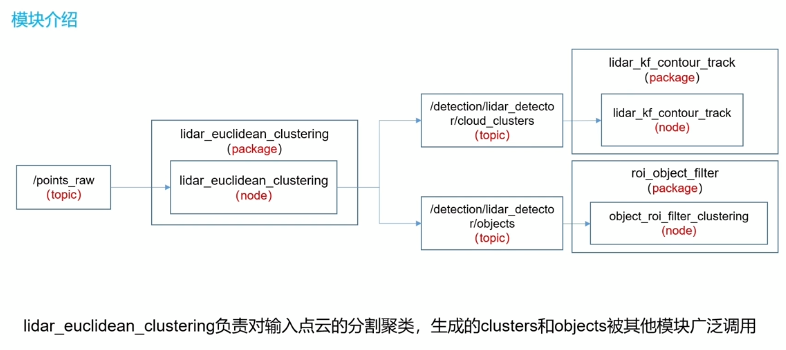
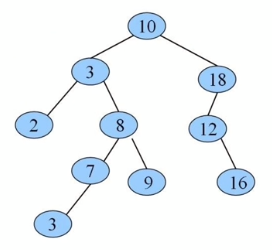
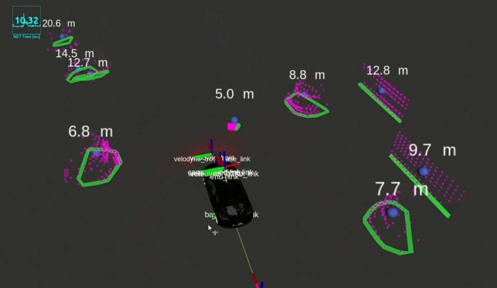
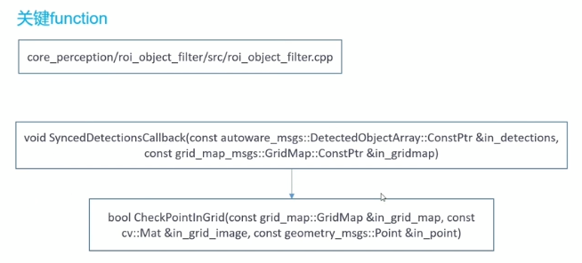
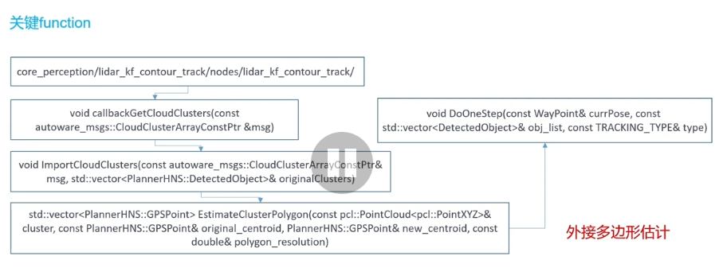
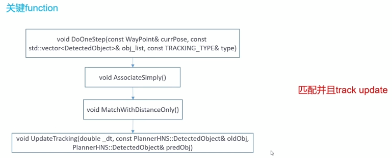

# 感知模块

## 常见感知方法概述


- lidar：激光雷达
- radar：毫米波雷达（对速度比较敏感，所以对动态物体的track、速度感知的时候，都要参考radar，且在此情况下的radar效果好于lidar和相机）
- uss：超声波雷达（倒车雷达）


（本章慕课不涉及机器学习的知识）

传感器融合，指对不同传感器的数据，采取不同权重去综合考虑，在不同情况更相信某种传感器的数据（**一般以安全为主的原则**） 


## lidar_euclidean_clustering（欧式聚类）模块源码解析及实践



- package包含一个主节点-欧式聚类的计算

- 输入：当前的scan，即points_raw

- 输出：列出了两个最关键的（其实也相同）

  - 聚类产生的点云的团 - `clusters`

  - 基于这些团点云做了一些统计处理，得到了点云团的几何特征：例如团点云外界多边形的尺寸，中心点等等 - `objects`

- `clusters`和`objects`这两个话题通过欧式聚类这个节点发布出去，会有其他模块订阅接收。例如：
  - 生成感知到的动态物体的track的模块会直接订阅点云团`clusters`作为输入；
  - 结合语义信息去过滤不需要的点云团的模块会订阅点云团的几何信息`objects`作为输入


### 欧式聚类算法步骤

1. 找到空间中某点P11，用**KD-Tree**找到离他最近的n个点；
2. 判断这n个点到P11的距离。将距离小于阈值d的点P12、P13、P14等放在Q类；
3. 在Q(P11)里找到一点P12，重复步骤1；
4. 在Q(P11,P12)找到一点，重复步骤1，找到P22，P23，P24全部放在Q类；
5. 当Q再也不能有新点加入了，则完成搜索。

- **欧式聚类就是一个递归的思想，lidar_euclidean_clustering模块是通过调用PCL库提供的一个欧式聚类的包来实现的，其实我们也可以自己写代码来实现欧式聚类这个过程**

- 无论是PCL库提供的接口，还是我们自己写一段代码实现欧式聚类，**欧式聚类的输出都应该是一系列索引，即聚类后每一类的索引（会把属于一个类的点云放在一个cluster里）**
- **欧式聚类的实现，关键在于基于kd-tree实现快速的检索查找！**（单纯用欧氏距离去暴力检索，那么所需算力会非常高。但是如果借用这种树状结构去检索所有点，将会非常高效）


#### KD-tree

参考资料：https://zhuanlan.zhihu.com/p/402555908

- KD-Tree是K-dimension tree的缩写，是对数据点在k维空间中划分的一种数据结构

- KD-Tree是一种平衡二叉树

  - 若它的左子树不为空，则左子树上所有结点的值均小于它的跟结点的值
  - 若它的右子树不为空，则右子树上所有结点的值均大于它的跟结点的值
  - 它的左、右子树也分别为二叉搜索树

  

欧式聚类算法中，就是将点云按照如上树状结构存进去，实现快速的检索计算。

（KD-Tree的源码非常复杂，自己写的话没有很大意义。欧式聚类的递归步骤可以自己写，其中用到的KD-Tree可以采用本模块提供的源码）


虽然有一个主CPP，但会经常跳转到其他.cpp，不过重点操作还是主cpp中的主回调里

**涉及到的重点函数：**

- 主回调 - `velodyne_callback()`
- - 根据距离做一个分割，聚类，得到clusters - `segmentByDistance()`
  - 对点云团clusters做一个几何信息的统计，得到objects - `SetCloud()`
  - 最后，对已经完成了聚类的clusters，再做两次聚类（可能两团离得近的cluster，就是一个物体，看能不能把它们合在一起） - `checkClusterMerge()`


### 仿真实践

仿真是下一章的重点，这一章为了演示感知模块的效果，搭建了一个简单的仿真环境，展示一下欧式聚类。

这是一个简易的仿真环境，车辆静止，主要进行感知模块的仿真，操作步骤如下：

1. 启动地图

   ```
   roslaunch autoware_quickstart_examples mini_map.launch
   ```

2. 启动定位

   ```
   roslaunch autoware_quickstart_examples mini_localization.launch
   ```

3. 启动rviz


**由于没有加入GPS，所以利用`2D Pose Estimate`，手动给一个初始位姿**（在小车模型上点击并朝右拉一下）

**这时在打开rviz的这个终端中，会打印一条INFO：`setting pose ：...`**

4. 启动Gazebo，开始仿真（即提供传感器的原始数据）

   ```
   roslaunch autoware_quickstart_examples mini_sil_env.launch
   ```

**注意：我在这里启动gazebo的时候遇到报错**


- 解决办法：**重新配置gazebo**

  ```
  sudo apt install ros-melodic-gazebo-ros-pkgs
  ```

  加载完之后，再次启动gazebo仿真即可

gazebo启动后，仿真也随之开始：在gazebo中，小车上的各类传感器收集到仿真环境的数据，并且Rviz中也同步显示激光雷达的探测效果（显示的红色点云即为探测到的周围物体，包括数、同态行人）

- 这个简单的环境world是官方自带的，但讲师在车前加了动态行人（主要为了在track模块中演示，可视化感知到的动态物体的track）

- 以及在车体引擎盖上加了一个激光雷达（原本的激光雷达在车顶，可能有盲区）

**启动gazebo的同时，也打开了一个rqt界面，用来控制车速、方位（stop键可以一键停车）**

- 可以将控制车速的滑块向上滑，使得小车向前行驶一点，离行人更近，这样能更清晰地感知到行人


5. 启动感知模块

```
roslaunch lidar_euclidean_cluster_detect lidar_euclidean_cluster_detect.launch
```

这时，可以在Rviz中，显示绿色框包围起来的一团团点云簇，即clusters（**欧式聚类的效果**）


**绿色框是objects的显示，对应左侧插件栏中`Perception->Tracked Objects`，Topic选择`detection/lidar_detector/object_markers`**

**粉色点云团是点云簇的显示，对应左侧插件栏中`Perception->Clustered Points`，Topic选择`/points_cluster`**

感知模块的输入是原始点云，对应：Rviz左侧的插件栏中，Sensing文件夹下的`Points Raw`，展示为红色点云（可以将Size的值调大，使点云可视化更明显）

感知模块的输出是点云簇以及点云簇的几何信息，展示为粉色点云团和绿色框以及中心位置




### 源码解析

本章介绍的感知模块，采用的是欧式聚类方法

- **感知模块的启动文件：`lidar_euclidean_cluster_detect.launch`**

launch文件中，可调节的参数非常多，对应源码，都可以调试


## roi_objects_filter模块源码解析及实践


roi指的是可通行区域，即语义地图中标注的wayarea

- **为什么要过滤？**

上一节欧式聚类后，感知到周围的一些房子、树等等，但这些其实都不太影响车子的正常行驶。我们更关注在小车的可通行区域中存在的一些障碍物，**所以利用这个模块，对之前所有感知到的objects过滤后，留下可通行区域内的objects**；

`detection/lidar_detector/objects`是上一节中欧式聚类模块的输出，这里作为roi模块的输入；

`/vector_info`是在第一章地图模块，map_file模块中的vector_map_loader节点，读取语义地图后，将语义信息转为这个格式又发布出去（包括很多，比如lanes、crosswalk、wayarea等等），这里作为roi模块的输入；

过滤的方法本身很简单，但是在过滤之前要做的：wayarea2grid节点，将语义信息`/vector_info`转换成栅格地图的格式`/grid_map`（栅格地图就像是二进制区域，相当于就两种情况，存0的格子不可以通行，存255的可以通行）；

object_roi_filter_clustering节点，过滤的方法很直接：就是遍历所有objects，在wayarea的就留下；



wayarea2grid：在主回调中，将wayarea这个语义信息，转成栅格地图

roi_object_filter：之前已经有转成栅格地图格式的语义信息，在roi的主回调中，check一下point（就是object的中心点）在不在可通行区域内


### 仿真实践

对欧式聚类检测的结果objects进行过滤

所以这次实践是建立在上一节欧式聚类的基础上，**得到objects后，才有进行这一步的基础**

**这一步对objects的过滤操作其实是可选可不选，如果需要对objects过滤，那么启动这个模块之前，要做好准备工作：**

- 打开`lidar_euclidean_cluster_detect.launch`（欧式聚类的启动文件），将其中21行的`use_vector_map`的参数值，修改成true（修改后记得编译）

- 利用Autoware Tools绘制好语义地图（**这里我们只关注车道上的信息，即可通行区域wayarea**）

绘制好后，也要导出语义地图，即将语义信息保存在本地，格式为`wayarea.csv`

如下图所示，在wayarea中，其实只有行人（参考上一节的仿真环境来说），路边的树和房子经过roi模块后应该都被过滤掉了


1. 启动地图

   ```
   roslaunch autoware_quickstart_examples mini_map.launch
   ```

2. 启动定位

   ```
   roslaunch autoware_quickstart_examples mini_localization.launch
   ```

3. 启动rviz

**由于没有加入GPS，所以利用`2D Pose Estimate`，手动给一个初始位姿**（在小车模型上点击并朝右拉一下）

4. 启动Gazebo，开始仿真（即提供传感器的原始数据）

   ```
   roslaunch autoware_quickstart_examples mini_sil_env.launch
   ```

5. **启动语义信息`/vector_info`解析模块，即wayarea2grid模块**（在欧式聚类之前启动，因为这次的欧式聚类加入了roi过滤，这个过滤需要栅格地图为输入）

   ```
   roslaunch object_map wayarea2grid.launch
   ```

6. 启动欧式聚类（带roi）

   ```
   roslaunch lidar_euclidean_cluster_detect lidar_euclidean_cluster_detect.launch
   ```

   相较于上一节的感知演示，这次Rviz中：小车周围象征树和房子的点云簇都没有绿框包裹了，表明不在wayarea的objects被过滤掉了！


## lidar_kf_contour_track模块源码解析及实践

基于卡尔曼滤波的track模块介绍

**这个模块可以直接对欧式聚类后的objects进行追踪，也可以利用roi__object_filter模块先对objects进行一次可通行区域的过滤，然后对留下来的objects进行追踪**。所以第一节欧式聚类是重点，其余的模块都是为其服务的！


这个模块的两个输出：

- `detected_polygons`是供Rviz订阅的，可以将objects的轨迹等状态量可视化出来。
- `tracked_objects`，例如会被后面的规划模块订阅


#### 1. 外界多边形的估计

#### 

区分于之前欧式聚类中的多边形估计是直接调用opencv的库，这里提出了一种不一样的做法

重点还是在主回调`callbackGetCloudClusters()`中，对欧式聚类得到的点云簇进行一系列处理；

`ImportCloudClusters()`进行一些格式转换，其实也是在欧式聚类得到的点云簇的几何特征提取出来；

`EstimateClusterPolygen()`是进行多边形估计！

- **我们这里一直强调外界多边形的估计，是因为之前欧式聚类只得到bounding_box（外接矩形），其实是不够准确，可能外接矩形会浪费很多空间。而有了更精准的外界多边形后，我们能对物体的形状做更好的估计，后续的规划也能更合理**

`DoOneStep()`是正式对轨迹的获取


#### 2. 正式track



之前track过的的objects是有一个track_list，我们是要把新进来的object和之前的track_list中的进行比较，看track_list中有没有和我们输入的object很近的点，如果有，那就代表这个object已经被track过了；如果没有，那么这个object会作为新的object，走一遍卡尔曼滤波的流程。

新进入的object当作观测，通过这些观测来进行一个卡尔曼滤波的更新。我们就能在之前一帧的位置、速度的基础上，有一个预测值，有了预测后，我们用输入来做一个update观测，最终我们就得到当前帧比较精确的x、y、Vx、Vy。

得到这些后，我们就可以得到它更多的一些运动状态信息，包括加速度、朝向等


#### [卡尔曼滤波](https://zhuanlan.zhihu.com/p/45238681?utm_source=wechat_session&utm_medium=social&utm_oi=744316812249804800)


### 仿真实践