# 规划模块

## 自动驾驶规划算法概述


### 规划算法总结


**最常见的规划算法就是基于图搜索和基于采样的算法**

- 其中，用的最多的可能就是大名鼎鼎的A-star算法，它是在栅格地图中具体操作，所以属于图搜索算法


## 本章所涉及的规划决策方案介绍

为什么要分别介绍几种决策规划方案：

- 实际上自动驾驶涉及到的决策规划逻辑是比较复杂的，分别介绍几种决策规划逻辑更有助于理解，通过根据不同的实际应用场合来**选择合理**的决策规划方式（**亦或是混搭**）


### 四种方式

方式1在`lane_planner`模块种介绍；方式2、3在`astar`模块中进行介绍；方式4在`op-planner`模块中介绍

**方式1：最基本的决策规划方案**

- 基于vector map的lane信息作为行车轨迹，**障碍物停止（不避让），支持信号灯**

**方式2：基于局部静态规划方案**

- 方式1的基础上，添加了基于`astar`的局部避让算法，**遇障避让**（保证安全前提下）。

**方式3：基于手动指定终点的全局路径规划**

- 方式3更强调的是同仿真环境的互动操作，**手动选取**区域内的终点，**自主规划全局路径**，同时支持**局部避让**

**方式4：基于局部动态规划的方案**

- 方式4基于`op-planner`算法，也是以vector map的lane信息来作为基础轨迹，**实时规划多条可选权重轨迹**


### 仿真实践

依次启动如下文件

```
1、roslaunch autoware_quickstart_examples new_map.launch

2、roslaunch autoware_quickstart_examples new_localization.launch

3、rviz
```

在rviz页面手动给定一个初始位姿

```
5、roslaunch vehicle_gazebo_simulation_launcher world_test_citysim_a.launch
多等一会，3-5mins都有可能

6、roslaunch vehicle_gazebo_simulation_launcher world_test_citysim_b.launch
等到前面的gazebo world启动成功且定位成功后再启动

7、roslaunch autoware_quickstart_examples new_detection.launch
```

以上步骤在之前已经介绍过

**之后就是四种规划方案，但是其中也包括了运动控制模块的启动，因为这样可视化效果更好。我们本章暂时只要关注规划路径**


#### 方式1：lane_planner

**基于vector map的lane来进行寻轨，遇到障碍物停止（也能识别信号灯），但不规划避让**

```
# 规划模块
8、roslaunch autoware_quickstart_examples new_mission_planning.launch 

# 运动控制模块
9、roslaunch autoware_quickstart_examples new_motion_planning.launch  
```

这种方式就是将vector map中绘制的**lane语义信息**，可视化出来，**启动规划模块，可以看到一长串路径点：**

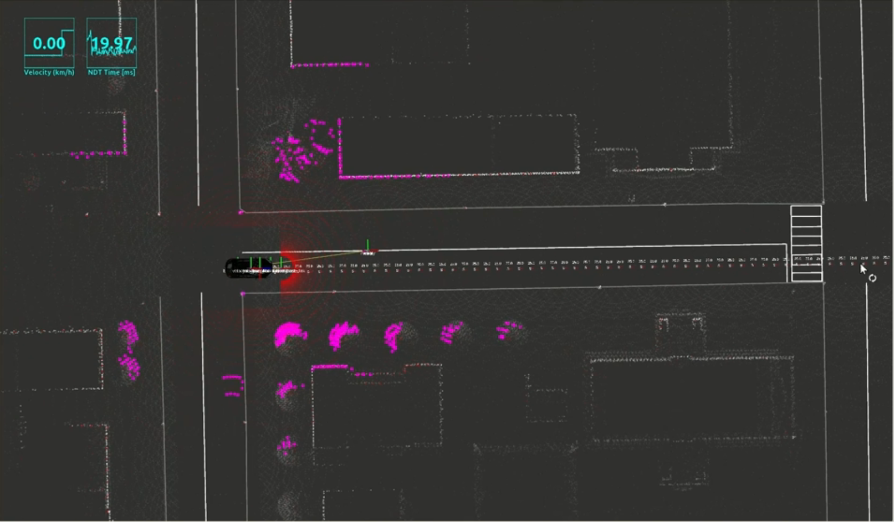

**启动运动控制模块，可以看到速度规划的一些信息：**

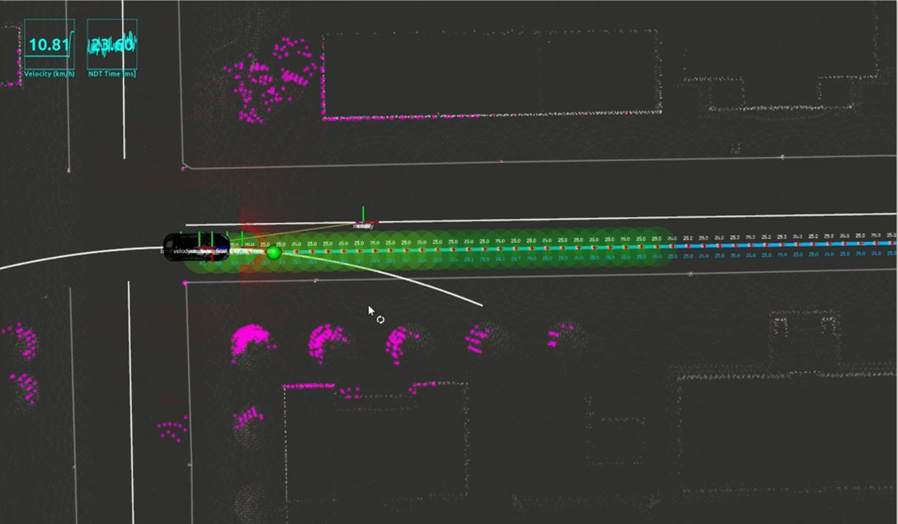

在Gazebo中放置一个障碍物，如信箱，则可以观察到Gazebo中小车**停止前进**，Rviz中速度规划也变成零（放大页面，鼠标移至绿色区域可以显示出速度规划信息，**在路径点下方的一串蓝色数字**）：


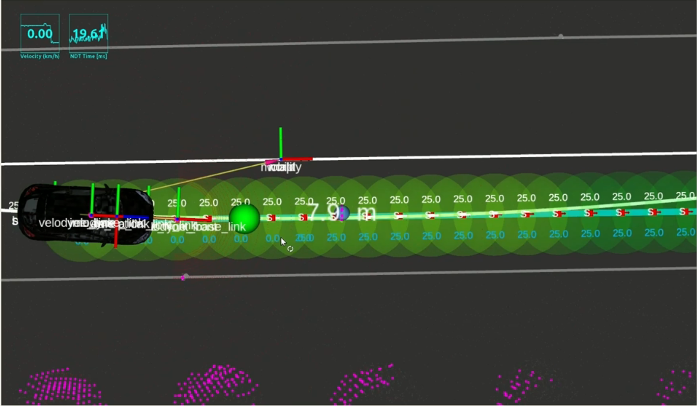

**将障碍物拿走后，小车又会恢复前进**


#### 方式2：lane_planner+A*(避障)

**基于vector map的lane来进行寻轨，基于`astar avoid`来进行规划避让**

方式2和方式1类似，只不过遇到障碍物后，**会规划一条路线去避让**，但也是基于主要的lane去做局部规划避让

```
# 加载A*所需要的costmap
7、roslaunch costmap_generator costmap_generator.launch;
# 规划模块
9、roslaunch autoware_quickstart_examples new_mission_planning.launch;
# 运动控制模块（基于A* avoid）
10、roslaunch autoware_quickstart_examples new_avoid_motion_planning.launch;
```

启动`costmap_generator.launch`，即加载一副`costmap`，可以理解为栅格地图，因为A*算法就是基于栅格图去做规划的：（**一定要等到栅格地图显示出来后，再启动后续launch**）

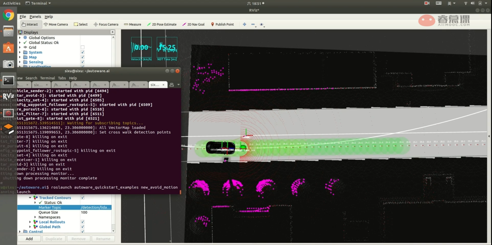

与方式1一样做法：在Gazebo环境下，在小车主路径上放置一个信箱作为障碍物，观察添加了A* avoid的规划控制的效果：

**信箱位置在Rviz中也能以粉色点云簇的形式展示在车前（这是感知模块的知识），同时由于刷新率设置的问题，信箱位置会间歇显示黑色长条，表示的是栅格地图中的占用信息！**

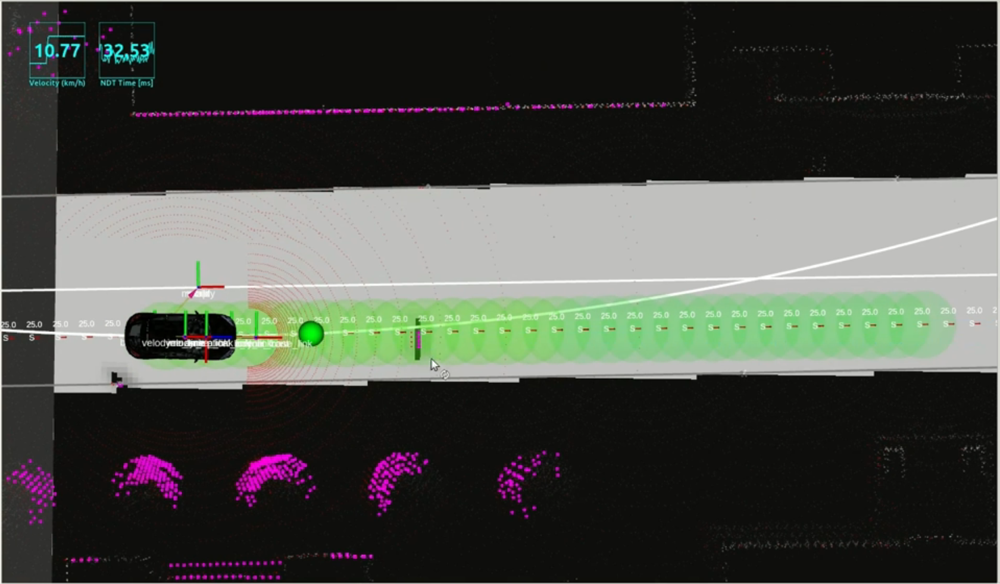

可以看到，已经规划出了一条避障路线：

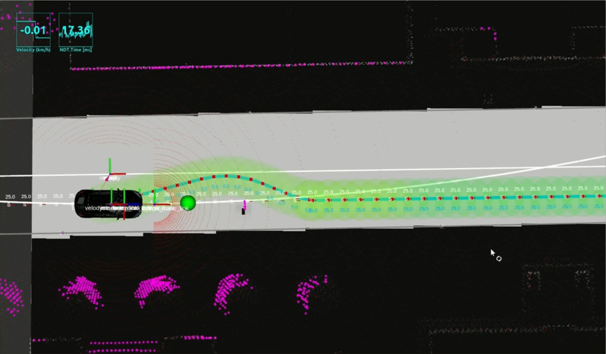

**小车只有靠近障碍物的时候，才会出现短暂停车，此时就是在规划避障路线；避障路线规划出来后，小车会重新启动**

这个避障规划的过程按理来说很快，但是由于仿真演示的电脑性能差异，可能自己演示的时候会比较慢


#### 方式3：A*

**用`astar`算法来进行规划避让, 手动选择目的地**

```
# 规划模块（A*、costmap）
8、roslaunch autoware_quickstart_examples new_manual_astar_planner.launch
# 运动控制模块
9、roslaunch autoware_quickstart_examples new_motion_planning.launch
```

依次启动规划和运动两个launch文件后，一定要等到栅格地图显示出来：

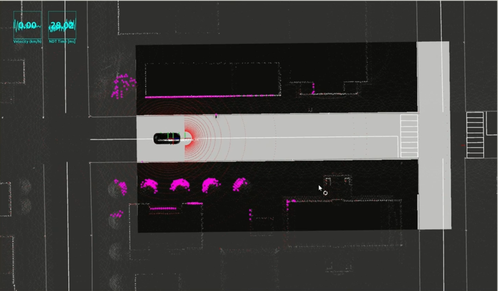

**利用Rviz上方工具栏中的`2D Nav Goal`，在图中手动设置一个终点：（选择一个好规划的点，因为太苛刻的位置可能规划不出来）**

等待一会，就会显示出规划的路线：（其实A*算法规划的速度很快，主要是将规划信息可视化出来的过程缓存比较大，会久一些）

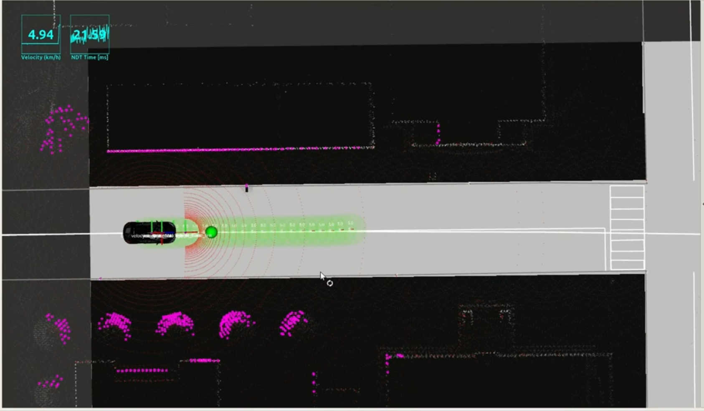

**在小车行进的过程中，依旧可以利用`2D Nav Goal`去设置新的目标点，小车会立即重新规划**

在方式3中，小车在行进的过程中，逻辑是不断地重新规划，但其实我们再没有设置下一个目标点前，不需要这么浪费算力


#### 方式4：lane_planner+op_planner

**基于vector map的lane来进行寻轨，基于op-planner来进行规划避让**

```
# 规划模块（open-planner）
8、roslaunch autoware_quickstart_examples new_op_planner.launch;
# 运动控制模块
9、roslaunch autoware_quickstart_examples new_motion_planning.launch;
```

依次启动规划和运动两个模块，Rviz中可视化出**七条轨迹，并且每条轨迹都有各自的权重。==越往内的轨迹权重越高，颜色越绿，代表越安全==**

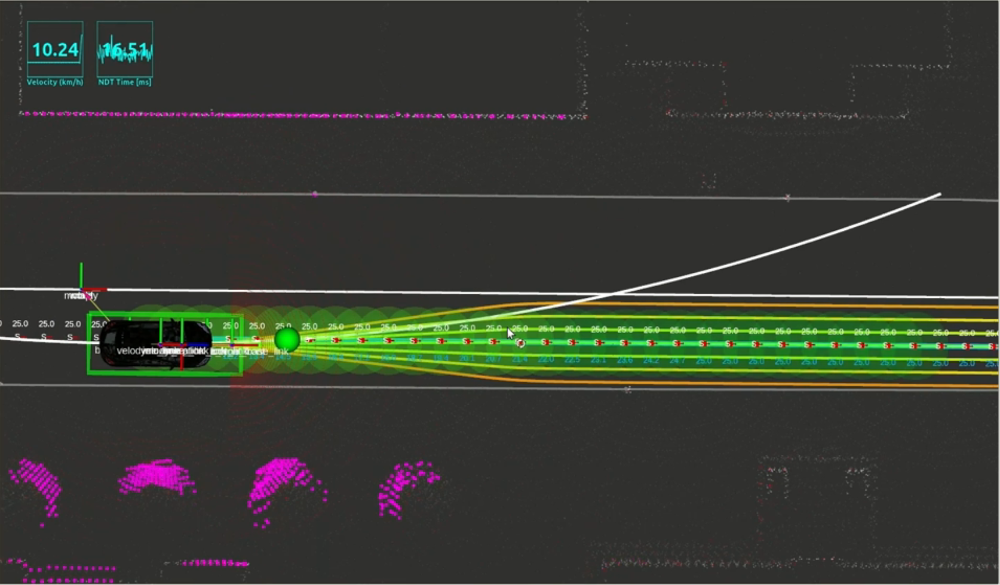

同样的，在Gazebo场景下，在下车前方偏左放置一个信箱作为障碍物：

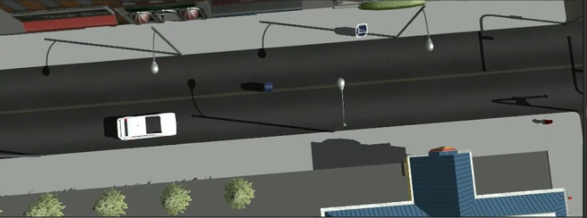

此时，Rviz中原本的七条轨迹中，**挨近信箱的的两条都变成红色，表示非常的不安全，即有障碍物，大概率不会沿着红色路径行进：**

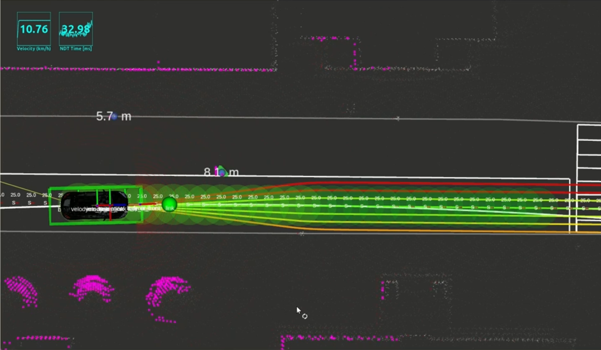

可以往小车正前方再放置信箱，可以发现中间的轨迹也变红了。

**因为我们暂时只处于规划阶段，（虽然控制模块也启动了，但是还未将op-planner的反馈信息用到运动控制中去），所以当小车前方的多条路径都变红后，小车会直接停下**

之后，可以将不同轨迹的权重与控制模块结合起来，做到一个避障的效果


## `lane_planner`模块源码解析及仿真

`lane_planner`模块相当于对行驶轨迹的一个前置处理，因为上一节演示的局部规划无论是A*还是op_planner都需要基于一条基础的轨迹来进行操作，**lane_planner就是为了输出一条基础的轨迹，相当于一条全局路径**

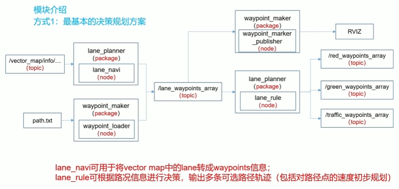

- `lane_planner`模块的输入
  - 之前map_file模块读取vector_map并将语义信息转为topic并发布出去，其中的lane语义信息被规划模块订阅，即`/vector_map/info..`
  - 语义信息可以被保存为.txt格式，lane_planner模块也可以直接读取.txt格式文件
  - 没有在上图中写出的：也可以将A*等模块规划出来的路径作为lane_planner模块的输入
- 通过`lane_navi`或`waypoint_loader`节点，将lane语义信息订阅或读取进来，并转换成**`lane_waypoints_array`**，**这个topic非常重要，`lane_waypoints_array`已经相当于一条基本的路径（全局路径）**，并且可以被后续很多模块订阅
  - `lane_waypoints_array`**是以lane数组的形式存储**，只不过`lane_planner`模块只输出一条路径，所以数组的size是1

之后，`waypoint_marker_publisher`节点将刚刚生成的一条全局路径可视化在Rviz中

- **`lane_rule`节点则是可以将路况信息，尤其是红绿灯信息读取进来，来进一步规划路径**
  - 例如是红灯，则新规划出一条红色路径
  - 只要存在如红绿灯这样的语义信息，这个节点都会将其转换成相应的一条路径并显示出来，供之后某个模块可能对其有所操作

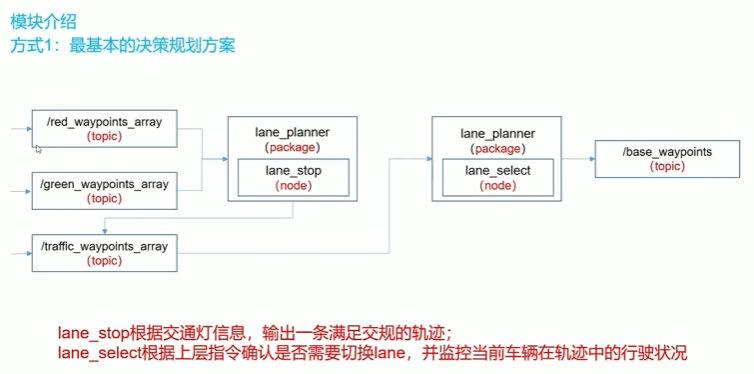

规划除了规划路径（位置），也会规划速度。上图中根据红灯、绿灯规划出的路径在路径位置上没有很大差别，**主要体现在速度规划上不一样**

- 如果有红灯、绿灯语义信息，则相应规划处`red_points_array`和`/green_waypoints_array`，通过`lane_stop`节点，从而输出一条满足交规的轨迹`traffic_waypoints_array`；
- 如果无红绿灯语义信息，则直接从之前的全局路径生成`traffic_waypoints_array`

最后通过`lane_select`模块决定是否更换新轨迹。例如在十字路口，根据红绿灯，可能要变道后右转等等


`lane_planner`模块主要从宏观的角度去规划，即注重全局路径的规划选取，即起点到终点怎么走，中途的细节不太去管（所以遇到障碍物只是机械地停下来）。之后其他模块的避让功能属于局部操作


### 源码解析

`lane_planner` 模块主要是方式1和方式2中用到，方式2相较于方式1只是多了利用A*的避障。两种方式中：对lane的处理，对一些路况信息的决策，以及之前直播课演示的遇到红绿灯会有一个停车再启动的操作，都是lane_planner模块完成的。


#### **new_mission_planning.launch**

路径为：`src/autoware/documentation/autoware_quickstart_examples/launch/sil_env_demo/`

首先阅读方式1的规划模块启动文件 - `new_mission_planning.launch`：

```
// new_mission_planning.launch
...
<!-- lane_navi -->
<include file="$(find lane_planner)/launch/lane_navi.launch" />
<!-- lane_rule -->
<node pkg="lane_planner" type="lane_rule" name="lane_rule" output="log" />
<!-- lane_stop -->
<node pkg="lane_planner" type="lane_stop" name="lane_stop" />
<!-- lane_select -->
<node pkg="lane_planner" type="lane_select" name="lane_select" />
...
```

可以看到，就是之前模块介绍中所说的四个节点：`lane_navi`、`lane_rule`、`lane_stop`、`lane_select`

方式1的规划效果主要是：将存好的一些路径点读取进来，并在Rviz中的地图上显示一串路径点。这主要是`lane_navi`节点实现的：

```
// lane_navi.launch //
...
<node pkg="lane_planner" type="lane_navi" name="lane_navi" output="screen">
      <param name="velocity" value="$(arg velocity)" />
      <param name="output_file" value="$(arg output_file)" />
  </node>
  
  <node pkg="waypoint_maker" type="waypoint_marker_publisher" name="waypoint_marker_publisher"/>
...
```

- `lane_navi`将一系列路径点读取进来，并转化为`/lane_waypoints_array`这个topic发布出去

  `waypoint_marker_publisher`节点会订阅`/lane_waypoints_array`这个话题，用于Rviz可视化；

  之后`lane_rule`节点也会订阅`/lane_waypoints_array`这个话题，根据红绿灯信息，会转而输出红色轨迹或绿色轨迹


#### **lane_navi.cpp**

路径为：`src/autoware/core_planning/lane_planner/nodes/lane_navi/`

先看`lane_navi`节点的输入、输出

- 输入

  ```
  ros::Subscriber route_sub = n.subscribe("/route_cmd", sub_route_queue_size, create_waypoint);
  ros::Subscriber point_sub = n.subscribe("/vector_map_info/point", sub_vmap_queue_size, cache_point);
  ros::Subscriber lane_sub = n.subscribe("/vector_map_info/lane", sub_vmap_queue_size, cache_lane);
  ros::Subscriber node_sub = n.subscribe("/vector_map_info/node", sub_vmap_queue_size, cache_node);
  ```

  讲师其实对源码做了一些修改的，在课程中的演示，只订阅了下面三个vector_map相关的语义信息作为规划模块的输入；因为`/route_cmd`在实车调试的时候才可能有

- 输出

  ```
  waypoint_pub = n.advertise<autoware_msgs::LaneArray>("/lane_waypoints_array", pub_waypoint_queue_size,pub_waypoint_latch);
  ```


针对point、lane、node三种信息的订阅，分别有三个回调函数，**每个回调函数中都会执行`update_values()`函数：**

```
// lane_navi.cpp
void cache_point(const vector_map::PointArray& msg)
{
  all_vmap.points = msg.data; // 填充一下all_vmap，all_vmap就是为了：方便update_values()开头判断所有的数据是否都读取进来
  update_values();
}
```

跳转阅读`update_values`

**`update_values()`主要实现数据的格式转换和转存：**

- 即读取point、lane等语义信息，开头先缓存在lane_vmap中，后续通过一些操作转成`autoware_msgs::LaneArray lane_waypoint`格式，
- 最后将lane_waypoint发布出去

```
void update_values()
{
  if (all_vmap.points.empty() || all_vmap.lanes.empty() || all_vmap.nodes.empty())
    return;
  //note-tianyu 读取输入的vector_map_info中的point，lane,stopline等元素，建立一个lane_vmap
  lane_vmap = lane_planner::vmap::create_lane_vmap(all_vmap, lane_planner::vmap::LNO_ALL);

  autoware_msgs::LaneArray lane_waypoint;
  ...
```

- points、lanes、node虽然是通过三个回调函数读取进来的，但这里可以看出缺一不可，否则update_values()不会执行后续操作
- 之前讲解感知模块的时候，roi模块也读取过语义信息，那时有对 Autoware专门为vector map info定义的数据格式做一个解析（即点、线、区域逐层存储的，且之间有id维系）

这里规划模块对语义信息的读取过程也是一样的，`create_lane_vmap()`的定义中：先找所属区域，再找点、再找线，然后统一存储到`lane_vmap`这个中间缓存中。可以跳转阅读`create_lane_vmap()`（但不是很重要）；

然后通过遍历`lane_vmap`这个中间缓存，计算每个waypoint的yaw值；

接下来，再对每个waypoint设置一些关键信息，如header、位姿、速度等：

```
autoware_msgs::Waypoint w;
w.pose.header = header;
w.pose.pose.position = lane_planner::vmap::create_geometry_msgs_point(lane_vmap.points[i]);
w.pose.pose.orientation = tf::createQuaternionMsgFromYaw(yaw);
w.twist.header = header;
// 这里可以直接更改lane转化的waypoint的速度值
w.twist.twist.linear.x = 25 / 3.6; // to m/s
l.waypoints.push_back(w) // 将waypoints存入一整条轨迹中
```

- 规划不仅要给出位置，也要给出该waypoint的速度，因为之后控制模块会根据这个点的速度信息对底盘做运动控制
- 但这里的速度不一定是最后的速度，只是我们暂时给的一个速度

最后，将`lane_waypoint`发布出去：

```
waypoint_pub.publish(lane_waypoint);
```

根据`lane_navi.cpp`的发布句柄，`lane_waypoint`被命名为 **`/lane_waypoints_array`这个话题名**，并发布出去


#### **lane_rule.cpp**

路径为`src/autoware/core_planning/lane_planner/nodes/lane_rule/`

先看`lane_rule`节点的输入输出：

- 输出

  ```
    traffic_pub =n.advertise<autoware_msgs::LaneArray>("/traffic_waypoints_array", pub_waypoint_queue_size, pub_waypoint_latch);
    red_pub = n.advertise<autoware_msgs::LaneArray>("/red_waypoints_array", pub_waypoint_queue_size, pub_waypoint_latch);
    green_pub =n.advertise<autoware_msgs::LaneArray>("/green_waypoints_array", pub_waypoint_queue_size, pub_waypoint_latch);
  ```

  分别是前方遇到红灯规划出的路径`/red_waypoints_array`、遇到绿灯规划出的路径`/green_waypoints_array`以及没有红绿灯则直接输出基本轨迹`/traffic_waypoints_array`

- 输入

  ```
    ros::Subscriber point_sub = n.subscribe("/vector_map_info/point", sub_vmap_queue_size, cache_point);
    ros::Subscriber lane_sub = n.subscribe("/vector_map_info/lane", sub_vmap_queue_size, cache_lane);
    ros::Subscriber node_sub = n.subscribe("/vector_map_info/node", sub_vmap_queue_size, cache_node);
    ros::Subscriber stopline_sub = n.subscribe("/vector_map_info/stop_line", sub_vmap_queue_size, cache_stopline);
    ros::Subscriber dtlane_sub = n.subscribe("/vector_map_info/dtlane", sub_vmap_queue_size, cache_dtlane);
    ros::Subscriber config_sub = n.subscribe("/config/lane_rule", sub_config_queue_size, config_parameter);
    ros::Duration(1).sleep();
    ros::Subscriber waypoint_sub = n.subscribe("/lane_waypoints_array", sub_waypoint_queue_size, create_waypoint);
    ros::spin();
  ```

  其中，除了基本语义信息（point、lane、node），`lane_navi`节点输出的基本轨迹（`/lane_waypoints_array`），**这里特别地还订阅了`/stopline`（这是和红绿灯信息直接相关的）**

  - `/stopline`是和红绿灯绑定的语义信息，如前方遇到红灯，则要让在`/stopline`的waypoints的速度信息为零（一个减速过程）；如果遇到绿灯，则在`/stopline`的下一个位置的waypoints要开始恢复正常行驶（一个加速过程）
  - `/dtlane`我们暂时不涉及，因为我们之前用的Autoware Tools这个标注工具不支持`dtlane`这个语义信息，后续会介绍一些`dtlane`和普通`lane`的区别

订阅每个话题都有一个回调函数，同样地，每个回调函数都是执行`update_values()`

```
void update_values()
{
  if (all_vmap.points.empty() || all_vmap.lanes.empty() || all_vmap.nodes.empty() || all_vmap.stoplines.empty() /*|| all_vmap.dtlanes.empty()*/)
    //跑gazebo仿真时，暂时将dtlanes相关的注释掉
  return;
    
  ...
      
  if (!cached_waypoint.lanes.empty())
  {
   autoware_msgs::LaneArray update_waypoint = cached_waypoint;
   create_waypoint(update_waypoint);
  }
}
```

`dtlane`在本课程的仿真中先暂时注释掉，因为我们没有这类语义信息

- `DTlane`相较于普通lane，**多了曲率半径的处理，这样就可以根据曲率半径对waypoint的速度作进一步优化处理**。因为直线和弯道的曲率半径相差很多，且直线速度和转弯速度通常也不一样，所以通过`DTlane`可以对waypoint的速度作进一步细分处理

  **但其实我们只用普通lane的规划过程，也有对直线和弯道的行驶速度作差异化处理。因为点位置都知道，曲率半径可以算出来的。所以和使用`DTlane`相比，使用普通lane的规划只是多进行了几步运算**

update_values()的最后，执行了`create_waypoint()`，此时跳转阅读

这个函数开头部分的操作和`lane_navi`节点的`update_values()`函数的操作一样，即将时间戳、id等信息赋给waypoints；

接着，将waypoints组成的lane存入各个数组，如红灯轨迹的array、绿灯轨迹的array、普通轨迹的array，供后续操作；

然后就是利用`DTlane`对速度信息做一个优化（只不过本课程的演示不涉及这个操作）;

```
for (size_t j = 0; j < lane.waypoints.size(); ++j)
{
  //note-tianyu 在这里出于对路况的分析，又乘了一个速度系数
  lane.waypoints[j].twist.twist.linear.x *= create_reduction(fine_vmap, j);
  if (fine_vmap.dtlanes[j].did >= 0)
  {
    lane.waypoints[j].dtlane = lane_planner::vmap::create_waypoint_follower_dtlane(fine_vmap.dtlanes[j]);
  }
}
```

然后是**速度滤波**的操作；

```
/* velocity smoothing */
  for (int k = 0; k < config_number_of_smoothing_count; ++k)
  ...
```

接下来是一个在十字路口加速的函数 - `apply_crossroad_acceleration()`，跳转阅读，其中也会用到`DTlane`的信息，所以暂时也不是很重要。并且现在的waypoints也都有初速度，所以这里加速的操作不是很必要；

之后是一个根据`stopline`来进行加减速的函数 - `apply_stopline_acceleration()`，**这个函数非常重要，因为遇到红灯减速，变成绿灯又加速的操作都是由它完成**，

```
lane = apply_stopline_acceleration(lane, config_acceleration, fine_vmap, config_number_of_zeros_ahead, config_number_of_zeros_behind);
```


- 跳转阅读`apply_stopline_acceleration()`

```
autoware_msgs::Lane apply_stopline_acceleration(const autoware_msgs::Lane& lane, double acceleration,double stopline_search_radius, size_t ahead_cnt, size_t behind_cnt)
{
  autoware_msgs::Lane l = lane;
  // 得到了stopline邻近的waypoints的index
  std::vector<size_t> indexes = create_stop_indexes(lane_vmap, l, stopline_search_radius);
```

- 之前在标注stopline的时候，将其和某一小段lane关联起来了，

所以根据这个关系，`apply_stopline_acceleration()`的开头，就是找到在stopline附近的waypoint；

- 可以跳转阅读`create_stop_indexes`，其中就是根据stopline和lane id的关系，确定stopline是否已经出现lane经过的范围之内，来找到确定的waypoint index

得到了index后，就可以**开始正式的规划**：`apply_acceleration()`；

```
for (const size_t i : indexes)
  l = apply_acceleration(l, acceleration, i, behind_cnt + 1, 0);
```

- 跳转阅读`apply_acceleration()`，其思路非常直白，就是根据stopline所在的waypoint，依据小车设置的加速度，将stopline前面的几个waypoint的速度设置成**从正常速度依次递减**，达到一个速度降为0的效果；将stopline后面的几个waypoint的速度依次设置成**从0递增到正常速度**

  **加速度大小的设置**在`lane_rule.cpp`文件的630行

**到这里，我们就得到了根据红绿灯信息规划的路径：`/red_waypoints_array` 、`/green_waypoints_array `**（现在只是得到了这几条路径，仅仅可以可视化一下）

- 正如之前所说，红绿灯路径和没有红绿灯的路径`/traffic_waypoints_array`在课程demo的演示中，位置上没有什么差别，差异主要体现在waypoint的速度信息上

**`/red_waypoints_array` 、`/green_waypoints_array`以及`/traffic_waypoints_array`在哪里被订阅，进行后续操作：lane_stop节点**


#### lane_stop.cpp

路径为`src/autoware/core_planning/lane_planner/nodes/lane_stop/`

`lane_stop`节点比较简单

- 输出

  ```
    traffic_pub = n.advertise<autoware_msgs::LaneArray>("/traffic_waypoints_array", pub_waypoint_queue_size,pub_waypoint_latch);
  ```

- 输入

  ```
   ros::Subscriber light_sub = n.subscribe("/light_color", sub_light_queue_size, receive_auto_detection);
    ros::Subscriber light_managed_sub = n.subscribe("/light_color_managed", sub_light_queue_size,receive_manual_detection);
    ros::Subscriber red_sub = n.subscribe("/red_waypoints_array", sub_waypoint_queue_size, cache_red_lane);
    ros::Subscriber green_sub = n.subscribe("/green_waypoints_array", sub_waypoint_queue_size, cache_green_lane);
    ros::Subscriber config_sub = n.subscribe("/config/lane_stop", sub_config_queue_size, config_parameter);
  ```

  这个节点将之前的到的红绿灯路径都读取进来，作为被选择对象；

  同时会订阅`/light_color_managed`，这是**我们在演示时手动设置的信号灯数据，即我们可以手动设置信号灯为绿灯或红灯**

  - `/light_color`**是autoware自带的traffic light detection模块的输出信息，我们这里不涉及到这个模块**。相当于我们用手动给一个红绿灯信息来替代它去感知红绿灯

    `/light_color_managed`的回调函数：

    ```
    void receive_manual_detection(const autoware_msgs::TrafficLight& msg)
    {
      if (config_manual_detection)
        select_current_lane(msg); // 根据红绿灯信息来切换路径
    }
    ```

  `select_current_lane()`

  根据不同的信号灯情况来切换不同的lane：

  ```
  void select_current_lane(const autoware_msgs::TrafficLight& msg)
  {
    const autoware_msgs::LaneArray *current;
    switch (msg.traffic_light) {
    case lane_planner::vmap::TRAFFIC_LIGHT_RED:
      current = &current_red_lane; // "/red_waypoints_array"
      break;
    case lane_planner::vmap::TRAFFIC_LIGHT_GREEN:
      current = &current_green_lane; // "/green_waypoints_array"
      break;
    case lane_planner::vmap::TRAFFIC_LIGHT_UNKNOWN:
      current = previous_lane; // if traffic light state is unknown, keep previous state
  ```

  就是解析在演示中，手动给的信号灯是红色还是绿色，

  红色的话，就将lane切换到`lane_rule`规划输出的红色灯路径，这样后续运动规划模块会根据红色灯路径来控制底盘（lane_rule节点将红色灯路径设置成一条速度递减的路径，所以参照红色路径的运动控制应该是在stopline前停车）；

  绿色的话，就将lane切换到绿色灯路径。


#### lane_select_core.cpp

路径为`src/autoware/core_planning/lane_planner/nodes/lane_select/`

**lane_select节点代码量比较大，逻辑比较复杂。**

之前lane_stop的处理相当于预处理，或者说简单红绿灯场景（**停车或恢复直行**）下路径的选取；

而lane_select能做到什么：**例如，在红绿灯路口可以根据交通灯来选择直行和左右转，根据你想直行还是左转，做一个路径选择，这样就是lane_select**

关于lane_select的操作，课程演示中没有加进去这样复杂的规划。但是后续自己可以在sil_env_demo的基础上，构建一个左转还是直行的规划场景

- 输入

```
// setup subscriber
 sub1_ = nh_.subscribe("traffic_waypoints_array", 1, &LaneSelectNode::callbackFromLaneArray, this); // 所有路径
 sub2_ = nh_.subscribe("current_pose", 1, &LaneSelectNode::callbackFromPoseStamped, this);
 sub3_ = nh_.subscribe("current_velocity", 1, &LaneSelectNode::callbackFromTwistStamped, this);
 // 下面三个在课程演示的仿真场景下不订阅
 sub4_ = nh_.subscribe("state", 1, &LaneSelectNode::callbackFromState, this);
 sub5_ = nh_.subscribe("/config/lane_select", 1, &LaneSelectNode::callbackFromConfig, this);
 sub6_ = nh_.subscribe("/decision_maker/state", 1, &LaneSelectNode::callbackFromDecisionMakerState, this);
```

`traffic_waypoints_array`是lane_rule节点的输出，因为是数组格式，所以里面可以有很多条路径可以选择（只不过课程演示demo中，只设置了一条）

除了路径，还订阅了位姿和速度

下面三个输入，是和变道（方向大幅度改变）相关的，即涉及到变道行驶的多条路径的选择（而非只是停车和启动这样简单的红绿灯路径选择）

- 输出：

```
 // setup publisher
  pub1_ = nh_.advertise<autoware_msgs::Lane>("base_waypoints", 1);
  pub2_ = nh_.advertise<std_msgs::Int32>("closest_waypoint", 1);
  pub3_ = nh_.advertise<std_msgs::Int32>("change_flag", 1);
  pub4_ = nh_.advertise<std_msgs::Int32>("/current_lane_id", 1);
  pub5_ = nh_.advertise<autoware_msgs::VehicleLocation>("vehicle_location", 1);

  vis_pub1_ = nh_.advertise<visualization_msgs::MarkerArray>("lane_select_marker", 1);
```

`base_waypoints`指的是最后被选择的那条路径上的waypoints（因为输入的时候是array，有多条路径可选）

**`closest_waypoint`是这个节点最核心计算得出的一个值**，与车辆模型的阿克曼角有关（转弯时用到），这个参数主要是**运动控制模块要订阅**

`vehicle_location`是定位的另一种形式，通俗来说就是通过所处lane的id来确定处于这个区域的哪个位置


**直接看lane_select节点的主函数 - `LaneSelectNode::processing()`**

首先，为每条lane找到closest waypoint - `!getClosestWaypointNumberForEachLanes()`（下面跳转阅读）

- 如果一条lane的closest waypoint都没得到，那么就有问题，无法执行后续的规划操作，只有至少一条lane的closest waypoint的出来，才能继续后面的操作

接下来，根据之前传入的state参数的值，进入变道模式 - `if (current_state_ == "LANE_CHANGE") `

- **这也是为什么开始要得到所有lane的closest waypoint，只有这样，运动控制模块才能根据所处lane和你要转去lane的closest waypoint，完成一个变道控制**

执行`createLaneForChange()`函数，根据change_flag（也是lane_select节点开头输入的一个数据）提前创建好左右准备变道的lane。跳转阅读其具体定义：

- 如果接收到right或者left信号，以及左右lane的id都存在，那么就可以执行后续变道操作。（但课程demo中只有一条直行的路径，所以这个函数直接返回，并打印current lane doesn't have the lane for lane change）

执行`publishLane()`函数，跳转其定义，只有一行执行代码：`pub1_.publish(lane); `，根据发布句柄pub1，可知这个函数发布的就是`base_waypoints`，即发布全局路径（从输入路径数组中最终选择了哪一条）

`getClosestWaypointNumberForEachLanes()`

```
bool LaneSelectNode::getClosestWaypointNumberForEachLanes()
{
  for (auto &el : tuple_vec_) // tuple_vec_
  {
    std::get<1>(el) = getClosestWaypointNumber(std::get<0>(el), current_pose_.pose, current_velocity_.twist, std::get<1>(el), distance_threshold_, search_closest_waypoint_minimum_dt_);
    ROS_INFO("closest: %d", std::get<1>(el));
  }

  // confirm if all closest waypoint numbers are -1. If so, output warning
  ...
```

- `tuple_vec_`这个数据格式，跳转其定义：`std::vector<std::tuple<autoware_msgs::Lane, int32_t, ChangeFlag>> tuple_vec_; `，可以发现类似元组或者pair，它将三种数据放在一起。这里将lane、closet waypoint、change flag三种数据放在一起，方便分析

重点是`getClosestWaypointNumber()`函数，跳转阅读：

- **根据当前pose找到距离最近的waypoint**

  注意的是，closest waypoint一定是往小车行进方向去寻找，不要在车后的点中找；

  且要找的closest waypoint不能和上一个closest waypoint离得太远，否则失去了规划控制的意义；

实际操作就是：将要遍历的waypoint都转换到当前位姿下，这样可以判断哪些waypoint满足条件（例如必须在车前，x>0，yaw>90°），成为候选waypoint；

然后遍历候选waypoint，计算current pose即当前位置到所有候选waypoint的距离，最后得到closest waypoint

**lane_select模块暂时只介绍这么多，因为课程演示的demo不涉及到变道的规划。本章的重点还是在前面几个节点**


## A*规划模块源码解析及仿真

### 方式2：基于局部静态规划方案

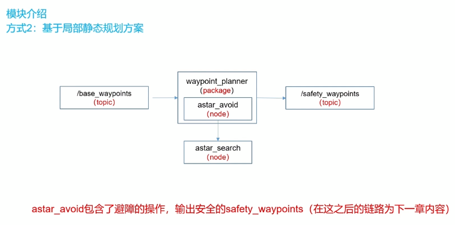

方式2其实是基于上一节讲的`lane_planner`模块，只不过相比于方式1，增加了一个A*避障

- 其实已经包括astar_avoid，只是把一个标志位置成true即可

由上图可知，方式2的输入就是`lane_planner`模块输出的`/base_waypoints`；

利用A*模块中的astar_avoid节点，规划出避障路径，即输出安全的路径点：`/safety_waypoints`

- 对`/safety_waypoints`后续的处理，是下一章控制模块的内容


### 方式3：基于手动指定终点的全局路径规划

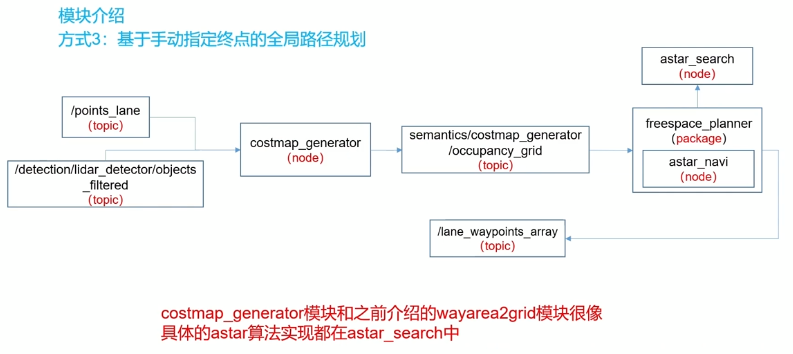

输出为`lane_waypoints_array`，和上一章`lane_planner`模块的`lane_navi`节点的输出完全一致，只不过这里的节点是`astar_navi`，并且是通过手动指定终点来规划；

总结到这里，现在能有三种方式得到`lane_waypoints_array`，除了方式1中`lane_planner`模块可以读取`/vector_map_info`和.txt文件，还可以像方式3中基于A*算法（或其他算法）的一个实时规划

A*算法需要基于栅格图，栅格的生成由`costmap_generator`节点完成，具体操作和感知模块中`wayarea2grid`模块类似，只不过这里是由`/points_lane`和`/objects_filtered`来转换成grid 

- 由上图可以看出，`costmap_generator`节点的输入之一就是：之前感知模块中介绍过的roi过滤模块的输出 - `detection/lidar_detector/objects_filtered`，roi过滤模块是只留下在wayarea范围内的障碍物，所以可知方式3的规划避障也是和wayarea相关

- `costmap_generator`节点最后输出`occupancy_grid`，即A*算法需要的栅格图，astar算法也会对栅格图做一个解析

`astar_navi`节点会接收我们手动给的一个终点信息，之后具体调用`astar_search`节点，完成避障路径的规划


### 源码解析

#### astar_avoid.cpp(重点解析方式2)

方式2相较于方式1，就是多了一个避障

**从启动方式来看**，除了多启动一个costmap的线程（`roslaunch costmap_generator costmap_generator.launch`），其他两个mission（`new_mission_planning.launch`）和motion（`new_avoid_motion_planning.launch`）的线程基本一样

- mission线程，两种方式是同一个launch文件启动，也是经过`lane_navi`、`lane_rule`、`lane_stop`、`lane_select`四个节点；

- **唯一的不同就是在motion的启动线程中，方式2中将标志位`enable_avoidance`置成true了，增加了`astar_avoid`节点：**

  ```
  // new_avoid_motion_planning.launch
  <arg name="enable_avoidance" value="true" />
  ...
    <!-- obstacle_avoid -->
    <include file="$(find waypoint_planner)/launch/astar_avoid.launch">
      <arg name="enable_avoidance" value="$(arg enable_avoidance)" />
    </include>
  ```

  `new_avoid_motion_planning.launch`相较于方式1中的motion启动文件`new_motion_planning.launch`就是多了`astar_avoid`

##### astar_avoid.launch

路径为`src/autoware/core_planning/waypoint_planner/launch/`

其中就是几部分内容：`occupancy_grid`等关于栅格图节点的参数设置、`astar_avoid`节点启动、以及一些A*搜索的参数设置


##### 基于astar_avoid.cpp了解A*决策过程

路径为`src/autoware/core_planning/waypoint_planner/src/astar_avoid/`

开头是一些`private_nh_.param `语句，用于读取launch文件中用param方式设置的参数

- 输出

  ```
  safety_waypoints_pub_ = nh_.advertise<autoware_msgs::Lane>("safety_waypoints", 1, true);
  ```

  `"safety_waypoints"`，最后输出一条比较安全的路径

- 输入

  ```
   costmap_sub_ = nh_.subscribe("costmap", 1, &AstarAvoid::costmapCallback, this);
   current_pose_sub_ = nh_.subscribe("current_pose", 1, &AstarAvoid::currentPoseCallback, this);
   current_velocity_sub_ = nh_.subscribe("current_velocity", 1, &AstarAvoid::currentVelocityCallback, this);
   base_waypoints_sub_ = nh_.subscribe("base_waypoints", 1, &AstarAvoid::baseWaypointsCallback, this);
   closest_waypoint_sub_ = nh_.subscribe("closest_waypoint", 1, &AstarAvoid::closestWaypointCallback, this);
   obstacle_waypoint_sub_ = nh_.subscribe("obstacle_waypoint", 1, &AstarAvoid::obstacleWaypointCallback, this);
  ```

  - `"base_waypoints"`是lane_planner模块中lane_select节点输出的，**要注意这个不是array数组格式，`"base_waypoints"`已经是一条lane**，所以后续都是对一条路径进行分析
  - `"obstacle_waypoint"`和`"closest_waypoint"`就是反馈两个索引，主要作用是知道一下现在位置离障碍物有多远

subscribe部分的回调函数，都是一些很基本的初始化参数的操作，这里不做介绍，可以自己跳转阅读

我们直接从主函数开始阅读：


##### AstarAvoid::run()

开头利用`ros::spinOnce() `和`checkInitialized() `等函数，去等待topic，check是否所有需要的topic都已经传入；

然后对一些参数初始化，例如`obstacle_waypoint_index_ `参数先置为-1等等；

这里还**额外启动了一个publish线程**：`publish_thread_ = std::thread(&AstarAvoid::publishWaypoints, this); `，即在规划避障轨迹的过程中，即使还未规划出来，都要先发出一些路径点，否则小车的运动会有问题；

`publishWaypoints()` - publish的线程

```
    // select waypoints
    switch (state_)
    {
      case AstarAvoid::STATE::RELAYING:
        current_waypoints = base_waypoints_;
        break;
      case AstarAvoid::STATE::STOPPING:
        // do nothing, keep current waypoints
        break;
      case AstarAvoid::STATE::PLANNING:
        // do nothing, keep current waypoints
        break;
      case AstarAvoid::STATE::AVOIDING:
        current_waypoints = avoid_waypoints_;
        break;
      default:
        current_waypoints = base_waypoints_;
        break;
    }
```

如果是在正常行驶的状态，则现在的路径点`current_waypoints`就是`base_waypoints_`；

如果是在避障状态，那么现在的路径点`current_waypoints`就是`avoid_waypoints_`；

之后，参考当前点的一些pose信息，利用`getLocalClosestWaypoint()`将`current_waypoints`周围最近的index找到，再push进safety_waypoints的容器

最后`safety_waypoints_pub_.publish(safety_waypoints); `，发布safety的路径点


**接下来就是`while (ros::ok()) `的主循环**，主循环的开头对我们在launch文件中置true的标志位`enable_avoidance_ `进行判断，如果不是true，那么后续操作都continue掉，即不执行；

###### 主循环：`while (ros::ok()) `

主循环的开始，对两个bool变量进行判断赋值：

```
bool found_obstacle = (obstacle_waypoint_index_ >= 0);
bool avoid_velocity = (current_velocity_.twist.linear.x < avoid_start_velocity_ / 3.6);
```

- `found_obstacle`就是由刚刚开头默认设置-1的`obstacle_waypoint_index_`决定的，如果是大于0的数，就表示在前方不远距离处有障碍物；
- `avoid_velocity`是避障速度，通常来说避障速度要比正常行驶速度慢，这里判断一下现在速度是否已经慢于避障速度，那么就不用有减速操作；

**之后就是避让过程中的几个状态分支：**`RELAYING`、`STOPPING `、`PLANNING `、`AVOIDING `

概括这几个状态间的切换过程，就是：遇到障碍物了，能规划就去避障，不能规划就维持停车状态

- `RELAYING`就是正常行驶状态，就没有检测到障碍物时，维持正常行驶

  ```
  if (state_ == AstarAvoid::STATE::RELAYING)
      {
        avoid_waypoints_ = base_waypoints_;
  
        if (found_obstacle)
        {
          ROS_INFO("RELAYING -> STOPPING, Decelerate for stopping");
          state_ = AstarAvoid::STATE::STOPPING;
        }
      }
  ```

- `STOPPING `是遇到障碍物了，要先停车，停车后才能进行一个规划

  ```
  else if (state_ == AstarAvoid::STATE::STOPPING)
  {
   bool replan = ((ros::WallTime::now() - start_plan_time).toSec() > replan_interval_);
   if (!found_obstacle)
   {
    ROS_INFO("STOPPING -> RELAYING, Obstacle disappers");
    state_ = AstarAvoid::STATE::RELAYING;
   }
   else if (replan && avoid_velocity)
   {
    ROS_INFO("STOPPING -> PLANNING, Start A* planning");
    state_ = AstarAvoid::STATE::PLANNING;
   }
  }
  ```

  在进入`STOPPING `状态的开始，先判断了一下障碍物是否一下子消失了，如果障碍物一下没了，那也不用启动A* planning。如果障碍物一直在，那就进入到`PLANNING`状态；

- `PLANNING`状态分支，就是正式进入astar planning

  ```
  else if (state_ == AstarAvoid::STATE::PLANNING)
  {
   start_plan_time = ros::WallTime::now();
   if (planAvoidWaypoints(end_of_avoid_index))//由此进入astar planning
   {
    ROS_INFO("PLANNING -> AVOIDING, Found path"); // find
    state_ = AstarAvoid::STATE::AVOIDING;
    start_avoid_time = ros::WallTime::now();
   }
   else
   {
    ROS_INFO("PLANNING -> STOPPING, Cannot find path"); // cannot find
    state_ = AstarAvoid::STATE::STOPPING;
   }
  }
  ```

  **我们最关注的astar规划就是`planAvoidWaypoints(end_of_avoid_index)`函数的内容**（后续跳转阅读）

  `PLANNING`状态也有两种情况，分别是规划出了避让路线和没有规划出避让路线：

  如果是`Cannot find path`，那么就回到`STOPPING`状态分支；

  如果是`Found path`，那么就进入到`AVOIDING`状态分支。

- `AVOIDING`状态分支，是真正的避让过程

  ```
  else if (state_ == AstarAvoid::STATE::AVOIDING)
  {
   // check一下是否到达指定的goal
   bool reached = (getLocalClosestWaypoint(avoid_waypoints_, current_pose_global_.pose, closest_search_size_) > end_of_avoid_index);
   if (reached)
   {
    ROS_INFO("AVOIDING -> RELAYING, Reached goal"); //判断是否避让完成
    state_ = AstarAvoid::STATE::RELAYING;
   }
   else if (found_obstacle && avoid_velocity)
   {
    bool replan = ((ros::WallTime::now() - start_avoid_time).toSec() > replan_interval_);
    if (replan)
    {
     ROS_INFO("AVOIDING -> STOPPING, Abort avoiding");
     state_ = AstarAvoid::STATE::STOPPING;
    }
   }
  }
  ```

  `AVOIDING`会判断一下是否达到避让路径的目标点goal（终点）

  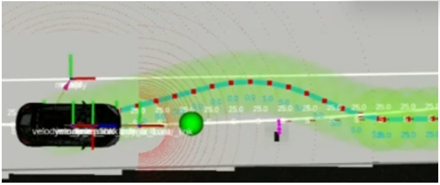

  其实避让路径就是弯曲的这么一段，走完这一段凸起的避障路径，就会回到之前正常行驶的直线路径，所以`AVOIDING`状态是判断是否走到了弯曲路径的最后一点


###### planAvoidWaypoints() - `PLANNING`

`bool AstarAvoid::planAvoidWaypoints(int& end_of_avoid_index) `，

传入的`end_of_avoid_index`参数表示避让路径的终点，即避让过程的goal，达到这个goal后就可以恢复正常行驶；

在正式进入A* search前，这个函数做了一个**小处理**，即设置多个不同的goal，有一个成功别直接return：

```
for (int i = search_waypoints_delta_; i < static_cast<int>(search_waypoints_size_); i += search_waypoints_delta_) // 对多个goal循环规划，直到至少一个成功就跳出规划
{
 // update goal index
 int goal_waypoint_index = closest_waypoint_index + obstacle_waypoint_index_ + i;
 if (goal_waypoint_index >= static_cast<int>(avoid_waypoints_.waypoints.size()))
 {
  break;
 }
 ...
 end_of_avoid_index = goal_waypoint_index
```

设置goal的方式很简单，就是obstacle的位置索引往后延申几个，作为`end_of_avoid_index`;

**这里的操作是：可能以第一个goal为目标的规划失败了，那么就再往后延伸一个，用下一个index作为第二个goal。直到有一个index作为goal可以规划出避障路径，那么就跳出循环**

之后，就是A*搜索的核心操作：（初始化栅格图，然后调用astar search）

```
 astar_.initialize(costmap_);
 // 由此调用astar search算法，进行正式的astar search
 found_path = astar_.makePlan(current_pose_local_.pose, goal_pose_local_.pose);
```

- 但是这里先不具体介绍`astar search`（**后续会重点讲解**），在这里注重规划的逻辑

`astar search`搜索后，会返回一个`found_path`，根据这个值是否为true，来继续后续的操作：**即将`avoidwaypoints`的路径merge到主路径：**

```
if (found_path)
{
 pub.publish(astar_.getPath()); // astar search中的接口，返回避障的路径点
 end_of_avoid_index = goal_waypoint_index;
 //将avoidwaypoints的路径merge到主路径
 mergeAvoidWaypoints(astar_.getPath(), end_of_avoid_index);
 if (avoid_waypoints_.waypoints.size() > 0)
 {
  ROS_INFO("Found GOAL at index = %d", goal_waypoint_index);
  astar_.reset();
  return true;
 }
 else
 {
  found_path = false;
 }
}
```

- `getPath()`是astar search提供的接口，可以获取astar规划出的避障路径点
- `mergeAvoidWaypoints(astar_.getPath(), end_of_avoid_index)`函数将避障路径merge到主路经上，跳转阅读：


###### mergeAvoidWaypoints()

就是以`end_of_avoid_index`这个索引为界，这个索引刚刚说了表示避障前定好的避障goal，

在这个index之前的waypoints使用astar规划出的路径 - `astar_.getPath()`；

在这个index之后的waypoints还是基于`"base_waypoints"` ，即lane_planner模块输出的正常行驶路径


#### astar_search.cpp - 正式学习A*搜索过程

在astar_avoid过程的`PLANNING`状态中，从`planAvoidWaypoints()`函数了解了A*搜索基本就是三部分组成

- 栅格图的初始化

  `astar_.initialize(costmap_);`

- 设置起点和终点，开始A*避障规划

  `found_path = astar_.makePlan(current_pose_local_.pose, goal_pose_local_.pose); `

- 利用`getPath()`接口，获取避障路径，再merge到正常路径中去

那么astar_search模块的学习也按照这个过程开始解析：

路径为`src/autoware/core_planning/astar_search/src/astar_search.cpp`

```
AstarSearch::AstarSearch()
{...}
```


##### AstarSearch::initialize() - costmap的初始化

对costmap进行初始化，将map信息存入定义好的 nodes_ 里面，nodes_ 中的每一个node包含了astar算法中需要用到的状态量

```
void AstarSearch::initialize(const nav_msgs::OccupancyGrid& costmap)
{
  costmap_ = costmap;
  int height = costmap_.info.height;
  int width = costmap_.info.width;
```

- 将costmap格式转换成nodes_ 的形式，即每个栅格用一个node保存。A*算法是对周围栅格进行遍历搜索，**代码中就体现为利用`nodes_[i][j]`的索引去遍历搜索**

首先，对每个栅格的基本尺寸做一个初始化，每个栅格用一个node表示；

```
  // size initialization
  nodes_.resize(height);
  for (int i = 0; i < height; i++)
  {
    nodes_[i].resize(width);
  }
  for (int i = 0; i < height; i++)
  {
    for (int j = 0; j < width; j++)
    {
      nodes_[i][j].resize(theta_size_);
    }
  }
```

- 可以看出 nodes_ 中的元素，即每个node都包含了三维的信息：除了自身`i、j`编号表示的xy位置信息，还有存储的yaw角表示姿态。`theta_size_`意为转角分辨率，但不是很精确的，只是一段范围。

之后，对每个栅格的代价（即A*算法原理介绍中提到的`F(n)=G(n)+H(n)`）做一个更新计算，除了代价外，还会根据代价值，更新每个节点保存的一些信息；

```
  // cost initialization
for (int i = 0; i < height; i++)
{
  for (int j = 0; j < width; j++)
  {
    ...
    // obstacle or unknown area
    if (cost < 0 || obstacle_threshold_ <= cost)
    {
      nodes_[i][j][0].status = STATUS::OBS;
    }
    ...
    if (use_potential_heuristic_)
    {
      nodes_[i][j][0].hc = cost * potential_weight_;
    }
```

- 例如上面代码中，如果某个栅格node的代价小于零，就判断为障碍物或者不可通行区域，将这个node的状态status设置为`STATUS::OBS`；

  同时还可以看到对node的`hc`信息（**就是A\*算法原理中的`H(n)`**）做了一个更新计算

到这里完成了costmap的初始化，之后就可以开始`makePlan()`进行搜索：


##### AstarSearch::makePlan() - 搜索过程中起点和终点的准备

规划的过程就是：利用nodes_的索引去遍历搜索

```
bool AstarSearch::makePlan(const geometry_msgs::Pose& start_pose, const geometry_msgs::Pose& goal_pose)
{
  if (!setStartNode(start_pose))
  {
    // ROS_WARN_STREAM("Invalid start pose");
    return false;
  }

  if (!setGoalNode(goal_pose))
  {
    // ROS_WARN_STREAM("Invalid goal pose");
    return false;
  }

  return search(); // 只有起点和终点都不是invalid，才能进入到search()，正式开始A*搜索
}
```

**`return search()`是A\*算法真正的搜索过程**（后续跳转阅读）

`makePlan()`开始，根据传入的起点和终点两个参数，设置了两条分支，但处理的过程基本一样：


###### setGoalNode()

```
bool AstarSearch::setGoalNode(const geometry_msgs::Pose& goal_pose)
{...}
```

a. 将`start_pose`，即起点传入进来；

b. 首先利用`poseToIndex(goal_pose_local_.pose, &index_x, &index_y, &index_theta);`函数，将转换到costmap坐标系下的pose，转换到costmap的索引。通俗来说，**就是有了终点的pose后，要得到终点在nodes_中对应的索引**；

- 跳转阅读`poseToIndex()`，可以看到就是获取了`index_x= pose2d.position.x / costmap_.info.resolution;`、`index_y = pose2d.position.y / costmap_.info.resolution;`、`index_theta = yaw/one_angle_range`

- 这和costmap的`initialize()`中定义的nodes_的索引一致，是一个三维的index

  **获得了终点的index后，相当于就知晓了终点所在位置的一些基本信息，例如之前在cost initialization过程中设置的每个node保存了一些信息**

c. 接着判断获取的终点索引是否在整个栅格图之外，或者终点设置在了障碍物上，只有都不是才能执行后续操作；

- `if (isOutOfRange(index_x, index_y) || detectCollision(start_sn))`

d. 根据参数设置`if (use_wavefront_heuristic_) `，可以启动另一种代价计算方式。但默认是false，所以暂不了解。


###### SetStartNode()

```
bool AstarSearch::setStartNode(const geometry_msgs::Pose& start_pose)
{...}
```

a. 开头也是`poseToIndex()`函数获取起点pose所对应的nodes_索引；

b. 然后判断`if (isOutOfRange(index_x, index_y) || detectCollision(start_sn))`，没有在范围外且不是落在障碍物上；

c. 然后对于起点index，把它设置为第一个node，并且设置一些它的初始信息，如代价：

```
// Set start node
  AstarNode& start_node = nodes_[index_y][index_x][index_theta];
  start_node.x = start_pose_local_.pose.position.x;
  start_node.y = start_pose_local_.pose.position.y;
  start_node.theta = 2.0 * M_PI / theta_size_ * index_theta;
  start_node.gc = 0; // G(n)对于起点一定是0，因为起点到起点的距离（代价）肯定是零
  start_node.move_distance = 0;
  start_node.back = false;
  start_node.status = STATUS::OPEN;
  // 注释位置—起点的parent为NULL
  start_node.parent = NULL;
```

d. 接着，**使用欧式距离求解起点的G(当前点到起点距离)和H(当前点到终点距离)**

```
 // 选择欧氏距离方法计算代价 
  if (!use_wavefront_heuristic_ && !use_potential_heuristic_) 
  { // hc就是H(n)
    start_node.hc = calcDistance(start_pose_local_.pose.position.x, start_pose_local_.pose.position.y,
                                 goal_pose_local_.pose.position.x, goal_pose_local_.pose.position.y) *
                    distance_heuristic_weight_;
  }
 // 这种计算代价的方法暂不介绍，因为use_potential_heuristic_默认是false
  else if (use_potential_heuristic_) 
  {
    start_node.gc += start_node.hc;
    start_node.hc += calcDistance(start_pose_local_.pose.position.x, start_pose_local_.pose.position.y,
                                  goal_pose_local_.pose.position.x, goal_pose_local_.pose.position.y) +
                     distance_heuristic_weight_;
  }
```

e. 最后将起始点放入openList中，作为openList中的第一个计算点

```
 // 计算起点的F(G+H),将起始node存放在openList之中
  start_sn.cost = start_node.gc + start_node.hc;
  openlist_.push(start_sn);
```

所以，回过头看`AstarSearch::makePlan()`，除了初始化起点和终点的index，还有一方面就是判断起点和终点设置的合理。**有时候规划失败，查看一下log，看看是不是报错`"Invalid start pose"`，起点或者终点设置成无意义的目标，那也就进入不了`search()`的过程**

当起点和终点都没报错invalid后，在`makePlan()`的最后，`return search()`，开始进入搜索过程：


##### AstarSearch::search() - 正式A*搜索

```
bool AstarSearch::search()
{
  ros::WallTime begin = ros::WallTime::now();

  // Start A* search
  // If the openlist is empty, search failed
  // openlist为空，搜索失败
  while (!openlist_.empty())
  {...
```

主函数就是`while (!openlist_.empty())`，只要之前起点设置的没问题，那么此时openList中至少有start_node，即起点的index

主函数开头先是一个对搜索总时间的判断，即如果搜索时间已经大于设置的阈值`msec > time_limit_ `，那么直接return false。

之后就是参考A*算法原理介绍中提到的**搜索流程**，开始阅读代码

**a.** 从openlist中选择代价最小的node，然后将其从openlist中删掉；

```
// 从openlist中选择cost最小的值的序号，拿掉后就删除了
SimpleNode top_sn = openlist_.top();
openlist_.pop();
```

**b.** 将`top_sn`这个权重最小的node作为当前点，并根据index，获取一下这个node保存的基本信息；

**从这里开始对节点开始扩展搜索**

```
// Expand nodes from this node
 // 将其作为current node
 AstarNode* current_an = &nodes_[top_sn.index_y][top_sn.index_x][top_sn.index_theta];
 // current node已经走过了，所以给它打上closed标签
 current_an->status = STATUS::CLOSED;
```

- `current node`是现在的落脚点，相当于已经走过了，之后不会再到这个点。所以给它的状态记为`CLOSED`

**c.** 接着，判断一下`current node`是否已经是Goal，如果已经达到终点，那么直接`setPath()`获取路径，return true即可；

**d.** 如果还未到终点，就继续后面的搜索过程：遍历`current node`周围的相邻nodes；

```
for (const auto& state : state_update_table_[top_sn.index_theta])
{...}
```

关于**如何遍历相邻nodes**，这里稍微有点绕：

提前定义好了一个数组：`state_update_table_[top_sn.index_theta]`

关于这个数组的设置，有一个**AstarSearch::createStateUpdateTable()函数**

```
// 创建状态更新容器
void AstarSearch::createStateUpdateTable()
{
  // Vehicle moving for each angle
  state_update_table_.resize(theta_size_);
  ...
```

`createStateUpdateTable()`函数中，会**计算不同的转角分辨率`theta_size`所对应的shift**

由于方向角度的不同，在不同方向的位移（shift量）也是不同的。**搜索过程不可能简单的上下左右几个格子这样去寻找，因为每个node还包括了姿态信息。**

这个函数相当于一个几何化的过程，提前为搜索过程预设好了每种情况的shift，后续搜索过程中只要调用就好了。**根据转角分辨率，已经预设好了所有的搜索方向：**

有forward、forward right、forward left、backward、backward left、backward right几种。拿`forward left`举例：

```
 // forward left
 nu.shift_x = left_circle_center_x + minimum_turning_radius_ * std::cos(-M_PI_2 + theta + dtheta);
 nu.shift_y = left_circle_center_y + minimum_turning_radius_ * std::sin(-M_PI_2 + theta + dtheta);
 nu.rotation = dtheta;
 nu.index_theta = 1;
 nu.step = step;
 nu.curve = true;
 nu.back = false;
 state_update_table_[i].emplace_back(nu); // state_update_table_数组
```

**这六个方向都已经预设好了，每个方向上搜索的半径，多大的shift都已经算好了，所以之后搜索过程中只要调用`state_update_table_`就好了**

- 所以回到`for (const auto& state : state_update_table_[top_sn.index_theta])`这一步，遍历`state_update_table_`数组就相当于把current node的周围node都遍历一遍了

**e.** 遍历`state_update_table_`的过程中，对于每个相邻node，都做如下操作：

`pointToIndex()`获取该node的index，也就获得了这个node保存的基本信息，同时可以对这个node更新一下代价：`gc`和`hc`

```
AstarNode* next_an = &nodes_[next_sn.index_y][next_sn.index_x][next_sn.index_theta];
      double next_gc = current_an->gc + move_cost;
      double next_hc = nodes_[next_sn.index_y][next_sn.index_x][0].hc;  // wavefront or distance transform heuristic
```

如果当前遍历的node状态为`NONE`，则将其状态变成`OPEN`，**并存入到openlist_**。同时更新这个node的parent为current node（即next_an的父节点是current node）

如果当前的遍历的node状态为`OPEN` or `CLOSED` ，表示这个node之前就存在于openlist中，且已经有了非零的权重。此时做一个**判断**：现在计算的权重是否小于上次计算的，如果小于，那么就将状态变成`Open`，并更新这个node的最新权重。**同时更重要的是更改这个node的父节点为current node：`next_an->parent = current_an; `**

- 这个**判断**就是表示：next_an作为子节点，有之前某次和这次计算的父子关系。但这次找到的父子节点关系（next_an这个node和当前的current node间的距离）更优，相较于next_an和之前某个父节点的距离来说。
- **父节点关系非常重要，因为最后就是通过Goal去反找父节点，来获取最佳路径。每个node只能有一个父节点，也是最好的一个父节点**

`AstarSearch::search()`函数就是重复a-e这五步，重点是不断更新openlist。

如果在c步骤中判断已经到了Goal，那就结束搜索。

```
if (isGoal(current_an->x, current_an->y, current_an->theta))
{
  // ROS_INFO("Search time: %lf [msec]", (now - begin).toSec() * 1000.0);
  // note-tianyu check当前搜索到的位姿态是否为goal
  setPath(top_sn);
  return true;
}
```

搜索成功后，通过`setPath()`函数，来获取到规划出的路径


##### AstarSearch::setPath() - 获取规划出的路径

```
void AstarSearch::setPath(const SimpleNode& goal)
{...}
```

首先把goal对应的node找到：`AstarNode* node = &nodes_[goal.index_y][goal.index_x][goal.index_theta]`；

所有有意义的node都在openlist中，只要通过一个循环，从goal对应的node开始，不断向上查找parent node，直到`node != NULL`；

```
while (node != NULL)
  {
    // Set tf pose
    tf::Vector3 origin(node->x, node->y, 0);
    tf::Pose tf_pose;
    tf_pose.setOrigin(origin);
    tf_pose.setRotation(tf::createQuaternionFromYaw(node->theta));

    // Set path as ros message
    geometry_msgs::PoseStamped ros_pose;
    tf::poseTFToMsg(tf_pose, ros_pose.pose);
    ros_pose.header = header;
    path_.poses.push_back(ros_pose); // 将找到的parent node 都放在path_.poses中

    // To the next node
    // 依次寻找当前node的parent，以便形成轨迹（从goal到start）
    node = node->parent;
  }
```

- 找到的所有parent node都放在`path_.poses`中

由于找的过程是从goal到start一个相反的过程，所以向上搜索结束后，要有一步取反过程

```
 // Reverse the vector to be start to goal order
 std::reverse(path_.poses.begin(), path_.poses.end());
```

astar_search.cpp通读下来，**最核心的还是如何更新openlist**

astar_search.cpp中，除了上面解析的几个重点函数，还有一些内容简单的函数，一看就懂，在上面过程中也有调用提到过，这里就不再一一解析。

- 例如检测goal：`AstarSearch::isGoal()` 、检测障碍物：`AstarSearch::isObs()`、碰撞检测`AstarSearch::detectCollision()`

  **碰撞检测的目的：因为车在行驶的过程中肯定不能简单地当作质点，它也有长宽高，所以必须要做一个判断**


#### 方式3(简单介绍)

同样先从方式3的启动过程来分析

方式3的两个启动文件，`new_manual_astar_planner.launch`和`new_motion_planning.launch`

相较于方式2来说，运动控制方面，motion的启动文件没有改变

规划方面，`new_manual_astar_planner.launch`发生了一些变化：

```
<!-- new_manual_astar_planner.launch -->
  ...
 <include file="$(find costmap_generator)/launch/costmap_generator.launch" />
 <include file="$(find freespace_planner)/launch/astar_navi.launch" />

 <!-- lane_rule -->
 <node pkg="lane_planner" type="lane_rule" name="lane_rule" output="log" />
 <!-- lane_stop -->
 <node pkg="lane_planner" type="lane_stop" name="lane_stop" />
 <!-- lane_select -->
 <node pkg="lane_planner" type="lane_select" name="lane_select" />
```

- `new_manual_astar_planner.launch`的内容基本和`new_mission_planning.launch`一致，

  其中`lane_rule`、`lane_stop`、`lane_select`几个节点都还在，

  并且把方式2单独启动的costmap线程也放在这里面，

  **唯一改变的就是，用`astar_navi.launch`替换之前的`lane_navi`线程**

`astar_navi`和`lane_navi`可以说做的一件事，都是为了获取`lane_waypoints_array`这个topic（在6_2中多次提到这个array格式保存的全局路径）

- `lane_navi`**可以通过提前保存的路径点（sil_env_path.txt）或解析vector_map_info来获取全局路径点**
- `astar_navi`：**是通过调用A*算法中的astar_search.cpp的搜索过程，规划出来的一条全局路径**

方式3单纯用A*算法（astar_navi获得全局轨迹）来得到全局路径，其实在工程上基本不太可能这么简单，往往必须综合一些其他算法。但Astar通常都是最底层，最基本的


##### astar_navi.cpp

路径为`src/autoware/core_planning/freespace_planner/src/astar_navi/astar_navi.cpp`

- 输入输出为：

```
  lane_pub_ = nh_.advertise<autoware_msgs::LaneArray>("lane_waypoints_array", 1, true);
  costmap_sub_ = nh_.subscribe("costmap", 1, &AstarNavi::costmapCallback, this);
  current_pose_sub_ = nh_.subscribe("current_pose", 1, &AstarNavi::currentPoseCallback, this);
  goal_pose_sub_ = nh_.subscribe("move_base_simple/goal", 1, &AstarNavi::goalPoseCallback, this);
```

讲师在课程中演示的方式3，是经过讲师修改astar_navi.cpp这里的源码，优化过的。

而我们clone下来的源码没有被更改过，如果运行方式3，会发现手动给定一个goal后，它会不断地更新全局路径，很费算力。

**讲师修改的思路是：每给一个goal，就只规划一次全局路径。直到有新的goal被手动设定，就再规划一次**。


## op-planner规划模块源码解析及仿真

**对应于方式4：基于局部动态规划的方案**

- 之前的A*属于静态，因为规划的过程中是车遇到障碍物后，**先停车再规划**
- op-planner是整个行驶过程中一直在规划，视觉上也更自然地会避过障碍物

但是动态并不一定比静态好，**重点还是看应用的场景**，例如在一个狭窄的道路，选择静态避障会更安全

**这里其实只讲了open-planner的一部分，就是op_local_planner**

- 完整的open-planner是包括op_global_planner生成一条全局轨迹，然后op_local_planner生成多条带权重的候选轨迹

  意思是，open-planner可以单独完成整个规划任务

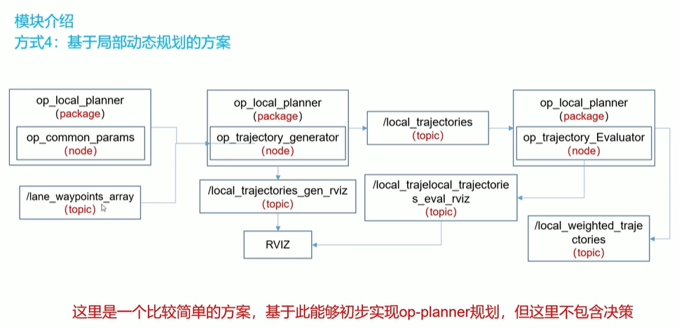

看输入端：

- `/lane_waypoints_array`这个topic已经提到过很多次，之前lane_planner中的`lane_navi`节点的输出和A*中的`astar_navi`节点的输出都是它，意为初步得到的（基本路径）全局路径（array形式，说明可以保存不止一条）；
- `op_common_params`节点其实没有干什么实事，就是负责传入一些参数

`op_trajectory_generator`节点，利用输入的基本路径，可以得到几条轨迹`/local_trajectories`，相当于这个模块初始生成的轨迹；

- 由于rviz不能直接显示生成的初始轨迹，所以将这些初始生成的轨迹新建了一个topic用于Rviz显示 - `/local_trajectories_gen_rviz`，在演示中就是几条绿色的轨迹

中间生成的初始轨迹`/local_trajectories`是还没有包括权重信息的，所以再经过`op_trajcetory_Evaluate`节点对所有轨迹的权重进行评估；

- 最后输出多条包含权重信息的轨迹`/local_weighted_trajectories`
- `/local_trajelocal_trajectories_eval_rviz`同理也是负责将输出的权重轨迹显示在Rviz中，在演示中就是几条不同颜色的轨迹，且越绿色，表示优先级越高，即代价越小


### op-planner算法原理介绍—基于采样的规划算法

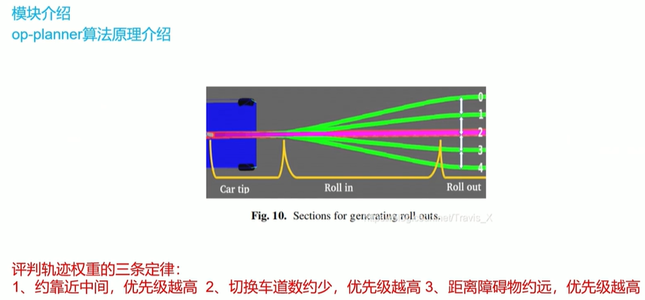

op-planner是基于采样的规划算法，A*算法是基于图搜索的规划算法

op-planner算法主要分为两个部分：轨迹的生成 + 权重计算

- 轨迹的生成对应模块的中间输出：`/local_trajectories`。其过程是分成三段，即上图中`Car tip`、`Roll in`、`Roll out`三段采样的过程，每一段的长度其实可以预设的，越长表示越平滑。

  通过每段的距离来确定点的位置，然后开始采样。最开始得到的肯定是正中间的轨迹，两旁的轨迹可以根据一些cos、sin的运算将中间位置的左右临近点也可以算出来

- 权重计算依靠三点：

  - 越靠近中间，优先级越高
  - 切换车道越少，优先级越高。（即中间的车道不能走后，肯定优先选择紧挨着的一条，而不是连跨两条）
  - 离障碍物越远，优先级越高

  之后将上面三类优先级加权以下，评选出最优的路径


### 仿真演示

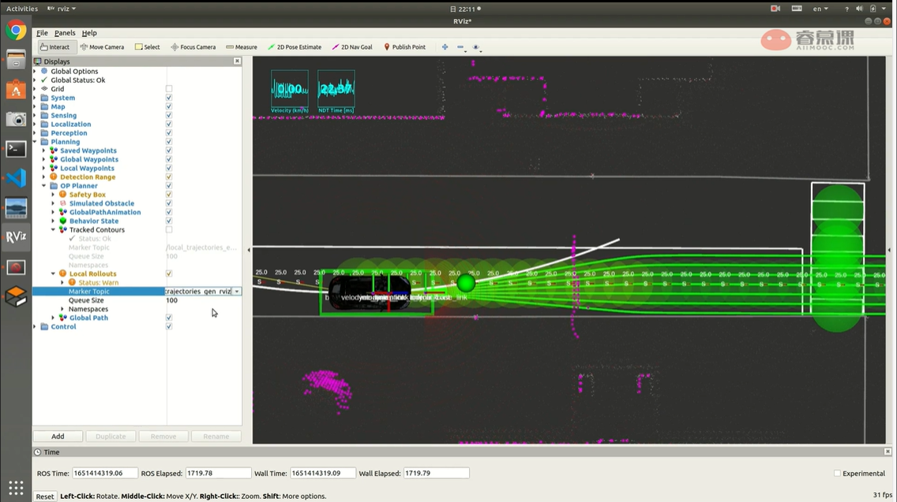

- 上图中的轨迹都是绿色的，说明是`/local_trajectories`在可视化，即`/local_trajectories_gen_rviz`被订阅显示，为**不包含权重信息的初始轨迹**

在左侧Marker Topic中更改订阅显示的Topic，改成`/local_trajelocal_trajectories_eval_rviz`，

- 并且在小车前放置一辆横在马路上的车作为障碍物，此时轨迹都变成红色，即表示路径已经会包含权重信息了，可视化的是op-planner模块最终的输出`/local_weighted_trajectories` 

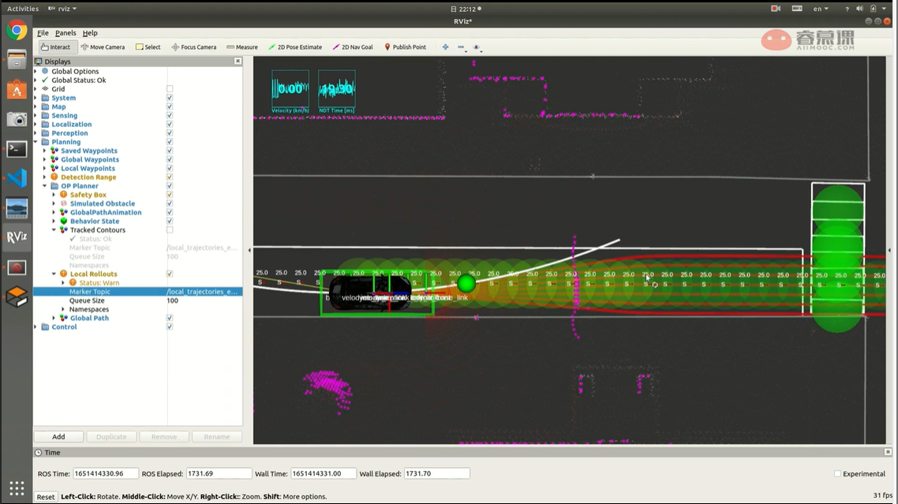


### 源码解析(generator+evaluator)

方案4启动文件：`new_op_planner.launch`

```xml
  <!-- lane_navi -->
  <include file="$(find lane_planner)/launch/lane_navi.launch" />

  <!-- lane_rule -->
  <node pkg="lane_planner" type="lane_rule" name="lane_rule" output="log" />

  <!-- lane_stop -->
  <node pkg="lane_planner" type="lane_stop" name="lane_stop" />

  <!-- lane_select -->
  <node pkg="lane_planner" type="lane_select" name="lane_select" />

  <include file="$(find op_local_planner)/launch/op_common_params.launch" />

  <include file="$(find op_local_planner)/launch/op_trajectory_generator.launch" />
  <!-- 
  <include file="$(find op_local_planner)/launch/op_motion_predictor.launch" />
  -->
  <include file="$(find op_local_planner)/launch/op_trajectory_evaluator.launch"/>
```

- 从`lane_navi`到`lane_select`节点都与之前相同（方式1的`new_mission_planning.launch`）

- **重点看后面三个节点**
  - 其中注释掉的`op_motion_predictor.launch`，即预测步骤也可以加进去，但是为了简化过程，可以注释掉
  - `op_common_params.launch`比较简单，就是负责传参
  - `op_trajectory_generator.launch`只负责生成轨迹
  - `op_trajectory_evaluator.launch`对轨迹的权重进行判断，有决策规划的感觉

依次解读`op_trajectory_generator`和`op_trajectory_evaluator`节点：


#### op_trajectory_generator_core.cpp

路径为`src/autoware/core_planning/op_local_planner/nodes/op_trajectory_generator/op_trajectory_generator_core.cpp`

把之前op-planner算法原理图放过来：

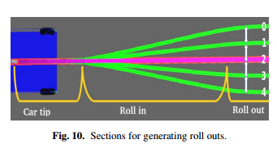

`op_trajectory_generator`节点的核心处理和上图中三个阶段对应起来

- 输入：

  ```
  sub_GlobalPlannerPaths = nh.subscribe("/lane_waypoints_array", 1, &TrajectoryGen::callbackGetGlobalPlannerPath, this);
  
  sub_initialpose = nh.subscribe("/initialpose", 1, &TrajectoryGen::callbackGetInitPose, this);
  sub_current_pose = nh.subscribe("/current_pose", 10, &TrajectoryGen::callbackGetCurrentPose, this);
  ...
  ```

  - `/lane_waypoints_array`很熟悉了，就是`op_global_planner`节点解析.txt或vector_map_info生成的
  - 还订阅了初始位姿和当前位姿
  - 其余的一些订阅，都是一些参数的设置

- 输出：

  ```
    pub_LocalTrajectories = nh.advertise<autoware_msgs::LaneArray>("local_trajectories", 1);
    pub_LocalTrajectoriesRviz = nh.advertise<visualization_msgs::MarkerArray>("local_trajectories_gen_rviz", 1);
  ```

  - 带Rviz的发布是我们在可视化演示中用到的topic，显示生成的初始轨迹
  - `pub_LocalTrajectories`是后续权重评估节点需要订阅的

在主函数之前，还有大量的参数配置`getParam()`：

- 先不直接介绍每个参数的含义，在后续解析主函数的过程中会不断学习到大部分参数

  ```
  _nh.getParam("/op_trajectory_generator/samplingTipMargin", m_PlanningParams.carTipMargin);
  _nh.getParam("/op_trajectory_generator/samplingOutMargin", m_PlanningParams.rollInMargin);
  _nh.getParam("/op_trajectory_generator/samplingSpeedFactor", m_PlanningParams.rollInSpeedFactor);
  _nh.getParam("/op_trajectory_generator/enableHeadingSmoothing", m_PlanningParams.enableHeadingSmoothing);
  ...
  ```

  - 包括一些车辆本身的配置参数，还有`Car tip`、`Roll in`的长度、车辆安全区（车框）的大小、平滑程度等等，非常多参数可以配置
  - 在之后具体阅读轨迹怎么生成的过程中，会对涉及到的各种参数越来越熟，**那么之后在更复杂的场景，就可以通过调试更多的参数去解决问题**


#### 主函数TrajectoryGen::MainLoop()

主函数真正执行轨迹操作前，必须已经执行过`/lane_waypoints_array`话题输入时的回调函数以及`/initialpose`和`/current_pose`输入时的回调函数，

拿`/lane_waypoints_array`的回调举例：


##### TrajectoryGen::callbackGetGlobalPlannerPath()

这个回调函数就是提取传入的全局lane中的waypoints

```
// 将接收到的generate的trajectories转成从lane转成vector<PlannerHNS::WayPoint>格式
PlannerHNS::ROSHelpers::ConvertFromAutowareLaneToLocalLane(msg->lanes.at(i), m_temp_path);

PlannerHNS::PlanningHelpers::CalcAngleAndCost(m_temp_path);
m_GlobalPaths.push_back(m_temp_path);
```

- `m_temp_path`已经是waypoint的格式，再通过`CalcAngleAndCost()`计算一下角度和cost，最后保存在`m_GlobalPaths`中，相当于一个嵌套的vector容器
- 回调的最后，会check一下lane有没有发生变化：`CompareTrajectories(m_temp_path, m_GlobalPaths.at(i) `，变化了的话就要重新更新一下vector的内容；没更新就结束这个回调


##### 回到主函数MainLoop()

```
void TrajectoryGen::MainLoop()
{ ...
  while (ros::ok())
  { ...
    if(bInitPos && m_GlobalPaths.size()>0)
```

- `bInitPos && m_GlobalPaths.size()`就是：pose和lane输入后执行完回调函数，才有的标志位。只有都传入进来了，才能开始轨迹生成


1. 首先，将`m_GlobalPaths`根据cur_pose的closest index来截取其中一部分，得到`m_GlobalPathSections`；（跳转阅读`ExtractPartFromPointToDistanceDirectionFast `）

   - 通俗来讲就是：完整的lane很长，我们只需要关注其中的一段。closest index表示小车当前位姿附近，从当前位姿往后延申一段，这是我们重点处理的部分：

   从下图中可以看到，在处理的绿色轨迹始终只有完整lane的一部分

   

2. `MainLoop()`中的回调函数或者截取sections的操作都相当于预处理，之后开始正式进入局部轨迹的生成，通过调用轨迹生成的接口函数：`m_Planner.GenerateRunoffTrajectory()`，跳转阅读：

`PlannerH:: GenerateRunoffTrajectory()`

这个函数本身内容不多，主要是调用了`PlanningHelpers::CalculateRollInTrajectories()`函数，这是**轨迹生成的核心代码部分**，跳转阅读：


##### PlanningHelpers::CalculateRollInTrajectories()

路径：`src/autoware/common/op_planner/src/plannerHelpers.cpp`

函数内容可和下图三阶段对照来看


其实Roll out部分比较简单，因为后面段都是和主轨迹平行的，所以只要计算相邻位置，就能生成平行轨迹

**难的阶段还是在Car tip和Roll in**；三部分都完成后，再对整体做一个平滑处理

- 思路：截取后的lane和组成它的waypoints我们已经得到，**要做的是**确定哪一截属于Car tip，多长属于Roll in段，最后是Roll out段；获取到属于每个部分的点index后，去计算一些几何运算公式就能得到结果


**这个函数就是根据提前预设的参数，去确定Car tip和Roll out这两段过渡部分有多长**

- 参数预设的位置在 `op_trajectory_generator.launch`中：

路径：`src/autoware/core_planning/op_local_planner/launch/`

```
  <arg name="samplingTipMargin"     default="4"  /> 
  <arg name="samplingOutMargin"     default="16" /> 
  <arg name="samplingSpeedFactor"   default="0.25" />    
  <arg name="enableHeadingSmoothing"   default="false" />
```

同时还会将速度因素考虑进去，所以还设置了一个速度采样因子`samplingSpeedFactor`。即速度每快一点，就将速度*0.25然后加到每段长度上去，**其实就是为了每段更加安稳地过渡**

**这个函数一定从源码中去阅读，gitee仓库中的源码，讲师对这一段函数的注释非常详细，已经将每一部分干了什么都标注出来了**

**对照上面的算法图例，很好理解**

```
//note-tianyu 轨迹生成的核心代码函数
void PlanningHelpers::CalculateRollInTrajectories(...)
{
    //note-tianyu originalCenter其实就是global_path经过cur_pos切割后的剩余路径

	//计算生成轨迹的索引个数限制
	
	//carTipMargin表示从车辆中心点到水平采样的起点的距离，这部分长度决定了车辆切换不同轨迹的平滑程度
	//rollInMargin表示从水平采样的起点到平行采样起点的距离，这部分的长度和车辆速度密切相关，车辆速度越快，rollin部分应越长，使得轨迹更加平滑
    ...
}
```

- `carTipMargin`即Car tip过渡段的长度，`rollInMargin`即Roll in过渡段的长度（即通过上面launch预设的）

**a.** 首先根据`rollInMargin`去计算`start_distance`，并且判断一下是否大于`remaining_distance `（即不超过截取lane的长度），如果大于就直接令`start_distance`等于总体长度

**b.** 然后，计算Roll in部分轨迹的起点和终点的index ；紧接着，计算Car tip的起始index和end index（由start distance所确定的end_index）

**c.** 计算需要平滑的轨迹的起点和终点索引，即Car tip段的开始 到 Roll in段的结束

**d.** 插入第一部分轨迹：将waypoints插入属于的过渡段中，即根据上一步得到的两段的起点和终点，**去填充Car tip和Roll in部分的中间点**

- 每部分的waypoints除了有位置信息，在这里插入的时候还要计算一下每个点的方向信息
- roll in段后面又插入了数个点来保证平滑

**e.** 插入第二部分轨迹：也就是长远方向的相对平行的几条路径，即Roll out段

**f.** 上面两步已经把三段都给出来了，但其实如果只可视化现在几部分轨迹，是非常不平滑的。所以最后还要统一进行一次平滑处理：`SmoothPath(rollInPaths.at(i), SmoothDataWeight, SmoothWeight, SmoothTolerance); `

- 跳转阅读`SmoothPath()`，其实就是一个迭代的作法，将相邻两个点除以2，这样不断平滑处理

**generator的这几块代码其实都可以测试的，即三段轨迹的生成和最后的平滑处理，四部分代码可以通过注释掉几块，观察剩余一块实现的效果**

- 举例：讲师将最后的平滑处理的Roll out段的代码都注释掉，重新编译`op_planner`包，再启动方案4的演示

  

  可以看到Rviz中，轨迹明显少了最后一段Roll out，且Car tip和Roll in端的衔接处相较于之前，变得很生硬，不像之前那么圆滑

**像这个基于采样的方法，都是按照预设的规律去增长、延申。op-planner的规律就是：在正中间的一条全局轨迹的基础上，设置一段缓冲区（Car tip+Roll in），之后就平行于全局轨迹分散开就好（Roll out）**


#### op_trajectory_evaluate_core.cpp

路径为：`src/autoware/core_planning/op_local_planner/nodes/op_trajectory_evaluate/op_trajectory_evaluate_core.cpp`

这个节点对每条轨迹的权重进行评估，根据权重的大小判断轨迹的优劣，最后会选择最优（最绿）的轨迹进行行驶；如果所有轨迹都因为障碍物变红了，那就表示无法规划，则停车

- 输入：

  ```
  sub_GlobalPlannerPaths = nh.subscribe("/lane_waypoints_array", 1, &TrajectoryEval::callbackGetGlobalPlannerPath, this);
    sub_LocalPlannerPaths = nh.subscribe("/local_trajectories", 1, &TrajectoryEval::callbackGetLocalPlannerPath, this);
    sub_predicted_objects = nh.subscribe("/tracked_objects", 1, &TrajectoryEval::callbackGetPredictedObjects, this); // 卡尔曼滤波track的objects在回调中进行了一下坐标变换
  
    //sub_predicted_objects = nh.subscribe("/predicted_objects", 1, &TrajectoryEval::callbackGetPredictedObjects, this);
    //sub_predicted_objects = nh.subscribe("/detection/lidar_detector/objects_filtered", 1, &TrajectoryEval::callbackGetPredictedObjects, this);
  
    sub_current_behavior = nh.subscribe("/current_behavior", 1, &TrajectoryEval::callbackGetBehaviorState, this);
  ...
  ```

  - `/lane_waypoints_array`也被订阅进来，但不是重点
  - `/local_trajectories`是上一个generator模块的输出；
  - `/tracked_objects`是感知模块中用卡尔曼滤波去track的模块输出
  - `/current_behavior`设计一些上下车的行为决策，但我们课程暂不涉及
  - 同理，也还有一些参数订阅进来

- 输出：

  ```
    pub_CollisionPointsRviz = nh.advertise<visualization_msgs::MarkerArray>("dynamic_collision_points_rviz", 1);
    pub_LocalWeightedTrajectoriesRviz = nh.advertise<visualization_msgs::MarkerArray>("local_trajectories_eval_rviz", 1);
    pub_LocalWeightedTrajectories = nh.advertise<autoware_msgs::LaneArray>("local_weighted_trajectories", 1);
    pub_TrajectoryCost = nh.advertise<autoware_msgs::Lane>("local_trajectory_cost", 1);
    pub_SafetyBorderRviz = nh.advertise<visualization_msgs::Marker>("safety_border", 1);
  ```

  - 之前说过的带Rviz和不带Rviz的所有权重路径`pub_LocalWeightedTrajectoriesRviz`和`pub_LocalWeightedTrajectories`
  - `pub_CollisionPointsRviz`发布的是动态碰撞点（不是很重要）
  - `pub_SafetyBorderRviz`发布的是一个外接的边界，来辅助规划的
  - **`pub_TrajectoryCost`发布一条权重最优的lane，可以在后续，用运动规划模块沿着这条lane去循迹**
    - `pub_LocalWeightedTrajectories`相当于所有lane都发布出来

**evaluate节点的思路**还是很清晰的，之前在算法原理中讲过，权重评估有三个标准：越靠中间的、变道数越少、离障碍物越远，越优先

从主函数开始阅读：（抓住几个重点函数分析）

##### TrajectoryEval::MainLoop()

首先类似于generator节点开始的做法，将`m_GlobalPaths`根据cur_pose的closest index来截取其中一部分，即`m_GlobalPathSections`

之后，基于动态预测或者静态障碍的轨迹权重计算：

```
// DoOneStepDynamic or DoOneStepStatic
if(m_GlobalPathSections.size()>0)
{
  if(m_bUseMoveingObjectsPrediction)
    tc = m_TrajectoryCostsCalculator.DoOneStepDynamic(m_GeneratedRollOuts, m_GlobalPathSections.at(0), m_CurrentPos,m_PlanningParams,  m_CarInfo,m_VehicleStatus, m_PredictedObjects, m_CurrentBehavior.iTrajectory);
   else 
   // 基于动态预测或者静态障碍的轨迹权重计算, 返回的tc代表当前最优轨迹
   //这里输入的m_GlobalPathSections.at(0)代表着恒定完整的全局路径
    tc = m_TrajectoryCostsCalculator.DoOneStepStatic(m_GeneratedRollOuts, m_GlobalPathSections.at(0), m_CurrentPos,  m_PlanningParams,  m_CarInfo,m_VehicleStatus, m_PredictedObjects); // m_PredictedObjects
```

`m_bUseMoveingObjectsPrediction`设置的是false，之前也说了，暂不使用评估节点中的预测部分

使用`ObjectsPrediction`将动态的运动状态考虑进去会使得权重计算更复杂一些，但核心处理和不使用predict的分支类似，所以只解读else分支

- `DoOneStepStatic()`传入的参数有：截取后的全局路径、当前pose、几个配置参数，**以及Objects**

- **`m_PredictedObjects`表示的Objects这里要说明一下：**

  `m_PredictedObjects`不是直接用卡尔曼滤波track后的objects，而是经过讲师修改源码对其处理了：

  对应在前面订阅卡尔曼滤波track的objects时候的**回调函数中`callbackGetPredictedObjects`**

  - 没修改前，可能出现障碍物和权重结果不匹配的情况，最后发现是因为障碍物信息不在地图坐标系下；

    **所以手动将其从雷达坐标系转到map坐标系下**；（frame id变了，那么对应的xyz值都要变，所以跟了一串如`convex_hull_pose.position.x =...`这样的更新位置的代码）

    原本还有一些判断的，但是讲师为了保证都通过就都注释掉。把所有变化后的objects都直接存入`m_PredictedObjects `中

**跳转阅读`DoOneStepStatic()`：**


##### DoOneStepStatic()

```
TrajectoryCost TrajectoryDynamicCosts::DoOneStepStatic(...){
 ...
 //note-tianyu 根据当前pose在vector<WayPoint>中寻找与其相关的路标点id
 PlanningHelpers::GetRelativeInfo(totalPaths, currState, obj_info); // totalPaths
 //得到了当前所在的轨迹索引
 int currIndex = params.rollOutNumber/2 + floor(obj_info.perp_distance/params.rollOutDensity);
 ...
 if(rollOuts.size()>0)   
 ...
```

- `totalPaths`表示整体的路径，因为确定id还是要放在整体下去索引

接下来，从`if(rollOuts.size()>0) `开始，**依次对三类权重的计算**（源码中讲师的注释非常清晰，将每一块都标注出来了）：

**计算priority权重**，代表中间的局部轨迹优先级是最高的，在没有障碍物的情况下，优先选择中间的局部轨迹

- `tc.priority_cost = fabs(tc.distance_from_center);`

**计算transition权重**, 根据车辆当前所处的轨迹id, 转换到临近车道代价较小，转换到较远车道代价较大

- `CalculateTransitionCosts(m_TrajectoryCosts, currIndex, params);`

**计算collision权重** 主要分为lateral_cost 和 longitudinal_cost，前者代表局部轨迹距离障碍物的水平距离，后者代表局部轨迹距离最近障碍物的垂直距离 （**障碍物权重是最重要的**）

- `CalculateLateralAndLongitudinalCostsStatic(m_TrajectoryCosts, rollOuts, totalPaths, currState, m_AllContourPoints, params, carInfo, vehicleState); `

  **跳转看一下障碍物权重计算的函数**：`CalculateLateralAndLongitudinalCostsStatic()`

  障碍物距离分成横向和纵向，分别计算即可：（逻辑上不难，所以不细讲）

  - 首先为小车设定安全边界，即Rviz中小车被一个绿色长方体框包裹；

    确定小车所处的位置，在全局路径下的位姿；

    如果计算出的车辆和障碍之间的横纵向距离，不在可能发生碰撞的范围内，则直接continue掉；

  对先前计算的各种权重进行归一化处理；

- `NormalizeCosts(m_TrajectoryCosts);`

对每条路径的权重进行一个评判（选出最优路径）；

即通过遍历每条轨迹，首先这条轨迹不能有障碍物（blocked标志位），

且判断当前轨迹的代价是否小于上一条；

最后得出代价最小且可以通行的轨迹为最优轨迹：`smallestIndex`

```
  for(unsigned int ic = 0; ic < m_TrajectoryCosts.size(); ic++)
  {
    //cout << m_TrajectoryCosts.at(ic).ToString();
    //note-tianyu 当前代价path不能有blocked标志位，并且它的代价值要小于上一次更新的smallestCost
    if(!m_TrajectoryCosts.at(ic).bBlocked && m_TrajectoryCosts.at(ic).cost < smallestCost)
    {
      smallestCost = m_TrajectoryCosts.at(ic).cost;
      smallestIndex = ic; // 最优轨迹的索引
    }

    if(m_TrajectoryCosts.at(ic).closest_obj_distance < smallestDistance)
    {
      smallestDistance = m_TrajectoryCosts.at(ic).closest_obj_distance;
      velo_of_next = m_TrajectoryCosts.at(ic).closest_obj_velocity;
    }
  }
```

- 如果最优轨迹的索引<0，表示没有找到能走的最优路径，即表示路径全部堵塞

  ```
  if(smallestIndex == -1)
    {
      bestTrajectory.bBlocked = true;
      bestTrajectory.lane_index = 0;
      bestTrajectory.index = m_PrevCostIndex;
      bestTrajectory.closest_obj_distance = smallestDistance;
      bestTrajectory.closest_obj_velocity = velo_of_next;
    }
    else if(smallestIndex >= 0)
    {
      bestTrajectory = m_TrajectoryCosts.at(smallestIndex); // 最优轨迹
    }
  
    m_PrevIndex = currIndex;
    return bestTrajectory; 
  }
  ```

**其实evaluate节点能反馈出很多信息，不仅是轨迹的位置信息，还有权重信息、是否拥堵等等**

- 可以利用这些信息做很多规划决策，而绕开障碍物只是一种很普通的处理

实际情况中，可能由于感知模块不准确等原因，轨迹会绿色、红色跳来跳去，所以不可能像本节代码中这样直接处理下去；而且有时候通过横向纵向距离算障碍物代价不是很合适，因为有的情况无法把障碍物位置聚成一个object，所以最好还是加上用特征点反射的方式，而不是仅使用objects来判断。这都是工程化的建议

本章规划模块重点介绍了两种非常优先的算法：基于图搜索的A*和基于采样的op-planner


