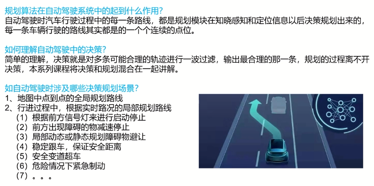
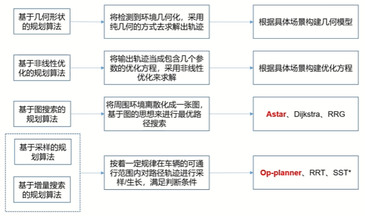

# 规划模块

## 自动驾驶规划算法概述

### 规划算法总结

**最常见的规划算法就是基于图搜索和基于采样的算法**

- 其中，用的最多的可能就是大名鼎鼎的A-star算法，它是在栅格地图中具体操作，所以属于图搜索算法

## 本章所涉及的规划决策方案介绍

为什么要分别介绍几种决策规划方案：

- 实际上自动驾驶涉及到的决策规划逻辑是比较复杂的，分别介绍几种决策规划逻辑更有助于理解，通过根据不同的实际应用场合来**选择合理**的决策规划方式（**亦或是混搭**）

### 四种方式

方式1在`lane_planner`模块种介绍；方式2、3在`astar`模块中进行介绍；方式4在`op-planner`模块中介绍

**方式1：最基本的决策规划方案**

- 基于vector map的lane信息作为行车轨迹，**障碍物停止（不避让），支持信号灯**

**方式2：基于局部静态规划方案**

- 方式1的基础上，添加了基于`astar`的局部避让算法，**遇障避让**（保证安全前提下）。

**方式3：基于手动指定终点的全局路径规划**

- 方式3更强调的是同仿真环境的互动操作，**手动选取**区域内的终点，**自主规划全局路径**，同时支持**局部避让**

**方式4：基于局部动态规划的方案**

- 方式4基于`op-planner`算法，也是以vector map的lane信息来作为基础轨迹，**实时规划多条可选权重轨迹**