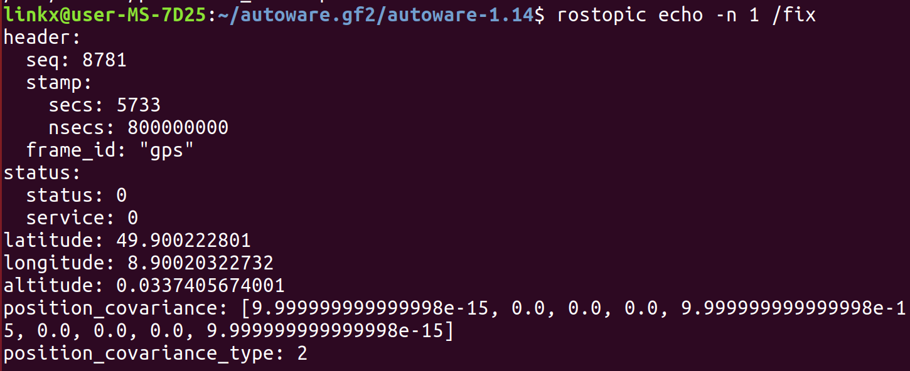
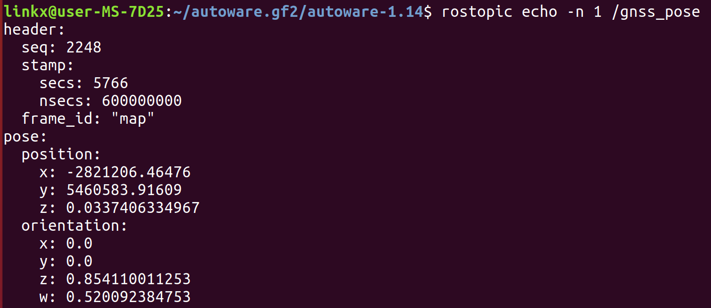
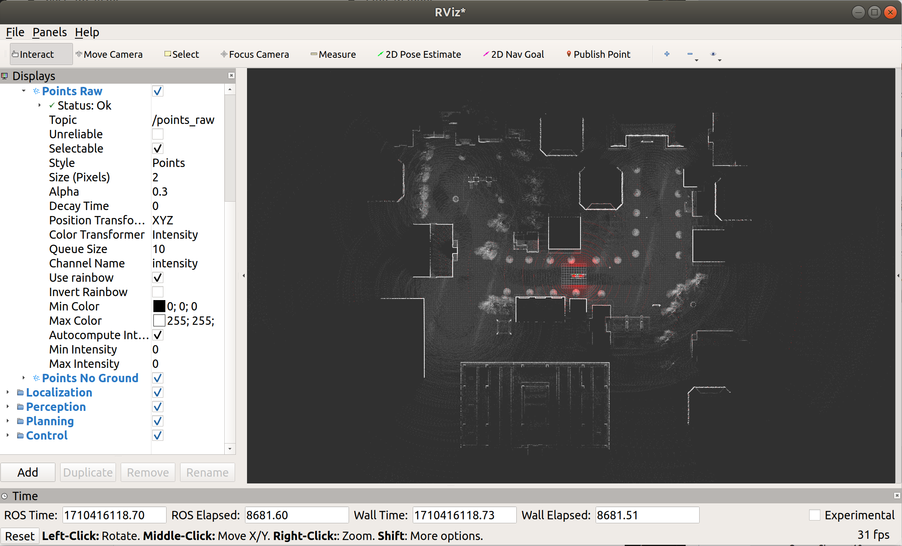
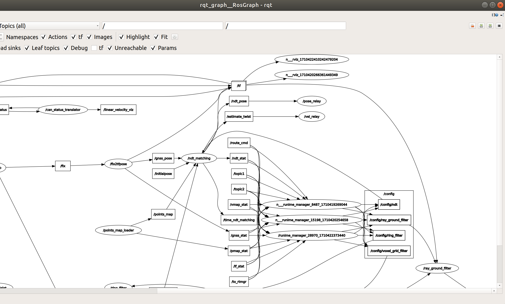

# 在Autoware中使用A*算法进行路径规划

> 使用实验室龙马清扫车下的autoware1.14环境


## 一、使用autoware进行ndt建图

### 1.打开初始仿真环境

```
. install/setup.bash
roslaunch vehicle_gazebo_simulation_launcher world_test.launch
```

环境显示如下：


## 2.使用runtime manage进行建图

先使用UI界面进行建图

```
. install/setup.bash
roslaunch runtime_manager runtime_manager.launch
```

- （**传感器这一步可能不是必须的！！**）加载传感器：先在 `Sensing->Drivers-> LIDARS->Velodyne VLP-16` 的配置文件中选择雷达的配置，path 为`/home/linkx/autoware-1.13/src/autoware/utilities/autoware_launcher/plugins/driver/lidar/vlp16.yaml`， 然后勾选雷达。

- 选择建图方法：然后在 `Computing -> Localization->lidar_localizer->ndt_mapping` 中进行配置，选中需要输出的path，确定后勾选前面的小框。

  **app中不要勾选ndt_gpu（pcl_anh_gpu），即使你的电脑配置了CUDA。因为本人多次尝试，发现ndt_gpu太吃配置，本人3070的电脑都会卡住**

  **勾选ndt_cpu即可（pcl_generic和pcl_anh）**

- 打开Rviz，这里选择 runtime_manager 界面中的Rviz进行打开，并选择 Fixed Frame为 map，于是可以看到雷达扫描得到的点云。

  **在Rviz中订阅`/ndt_map`话题，可以可视化形成的点云地图**

- 使用 rqt_robot_steering 控制车辆（前、后、左、右）在环境中运动然后建图。

  

- 建图完成后在 `ndt_mapping-> app` 中点击 PCD_OUTPUT后保存点云，然后关闭。

  这里可以用 `pcl_viewer map.pcd` 查看建立的地图

  


## 二、使用ndt_matching进行定位并使用A*算法进行路径规划

### 前提

**如果要进行后续的规划仿真，必须还得有矢量信息，即xxx.csv。参考睿慕课中Autoware Tools的使用！**


### 1.加载点云地图

在autoware环境下打开UI界面

```
source install/setup.bash
roslaunch runtime_manager runtime_manager.launch
```

打开gazebo仿真环境**（必要）**

```
source install/setup.bash
roslaunch vehicle_gazebo_simulation_launcher  world_test.launch
```

- 在 `Map->PointCloud` 中加载创建好的点云地图，打开 `RViz` ，在左侧面板的 `Global Options->Fixed Frame` 中将坐标系改为 `map`，勾选 `Grid` 选项。然后在控制面板中将地图取消后再勾选，然后在 RViz 中便可以看到加载的地图**（此处为autoware 中UI界面的 bug，按照这个步骤就会看到地图)**


### 2.使用A*算法进行路径规划

- 加载传感器：跟ndt建图中的配置相同**（这里本电脑对加载vlp16.yaml操作报错，但并不影响后续操作，所以这一步未必需要）**

- 对激光雷达生成的点云进行**降采样**和**预处理**：
  1. 勾选 `Points Downsampler->voxel_grid_filter`，注意在其 `app` 中选择话题为 `/points_raw` 
  
  2. 勾选 `Points Preprocessor->ray_ground_filter` ， 注意在其 `app` 中选择话题为 `/points_raw` （也可以选择voxel_grid_filter节点输出的`/filtered_points`，但这样生成的`/points_no_ground`会非常稀疏！）
  
     **解析：对降采样后的点云进行点云地面过滤，将地面点和非地面点进行过滤**
  
  3. 勾选 `Points Preprocessor->ring_ground_filter` ， 注意在其 `app` 中选择话题为 `/points_raw` ，并且**传感器模型选择与前面加载的相同，这里选择 16**
  
     - **注意：**如果使用该滤除地面的节点`ring_ground_filter`，那么必须勾选上`Points Downsampler->ring_filter`。**否则直接勾选`ring_ground_filter`不仅会报错，而且不会产生有效的`/points_no_ground`话题，那么进而影响到后续costmap生成的节点，进而无法利用A*规划路径**
  
- 使用 ndt_matching 进行点云匹配定位：

  - 勾选`Computing -> Localization -> gnss_localizer -> fix2tfpose` 。这个节点将小车带的GPS传感器发布的/fix话题发布成`gnss_pose`，这个可以作为ndt_matching定位必须参考的初始位置
  
    -  **fix2tfpose节点要点击app，选择20号参考点，这样解析出的xyz可以比较小**
  
      
  
    - **这里使用GPS，需要做好配置，参考[配置带GPS的小车用于仿真](在Autoware中使用带GPS的仿真模型.md)**
  
    可以先检查/fix这个话题是否有发布，即车子的GPS是否配置成功：
  
    
  
    启动`fix2tfpose`节点后，可以再查看`gnss_pose`这个话题是否有数据，看节点是否其作用：
  
    
  
  - 勾选 `Computing -> Localization -> lidar_localizer -> ndt_matching` 。此时 RViz 中可以接收到话题 `\points_raw` 的数据，可以显示出传感器的扫描结果。
  
    **注意：若小车配置好了gps，也启动了fix2tfpose节点，`gnss_pose`也有数据输出，则可以勾选GNSS；**
  
    **否则，（若未加载gnss），必须使用init_pose指定初始位置，否则无法显示扫描的点云；或者在rviz中利用2D Pose Estimate 去指定一个初始位置**
  
    

- 构建代价地图：
  1. 首先勾选 `Computing -> Localization -> autoware_connector -> vel_pose_connect` 节点
  
     **注意：vel_pose_connect节点的设置，`app`中的Simulation Mode 一定不能点，无论是实车还是仿真，否则卡尔曼预测模块的结果会丢失**
  
     设置位姿和速度的输出，这样可以启动节点`/pose_relay`和`/vel_relay`，并订阅`/ndt_matching`节点发布的速度和位姿消息，然后缓存在节点内，之后如果运行了其他节点可以把轨迹速度信息写入文件
  
     
  
  2. 在 `Computing -> Detection -> Semantics -> costmap_generator ` 的 `app` 中按如下设置
  
     **注意 `points_input` 中选择 `/points_no_ground`**，此时 RViz 中显示代价地图；
  
     **`costmap_generator`节点的参数：** `grid_length_x`表示栅格地图的纵向长度，`grid_length_y`表示栅格地图的横向长度，这两个值设置为30或者50都可； `grid_position_x`是栅格地图中心点的x位置(纵向)，`grid_position_y`是栅格地图中心点的y位置(横向)，这两个值设置为0即可；

- 选择规划方法：

  - 勾选 `Computing -> Mission Planning -> lane_planner -> lane_rule` ；
  - 勾选 `Computing -> Mission Planning -> lane_planner -> lane_select` ；
  - 勾选 `Computing -> Mission Planning -> freespace_planner -> astar_navi` ；
  - 勾选 `Computing -> Motion Planning -> waypoint_planner -> astar_avoid && velocity_set` ；
  - 勾选 `Computing -> Motion Planning -> waypoint_follower -> pure_pursuit && twist_filter`


