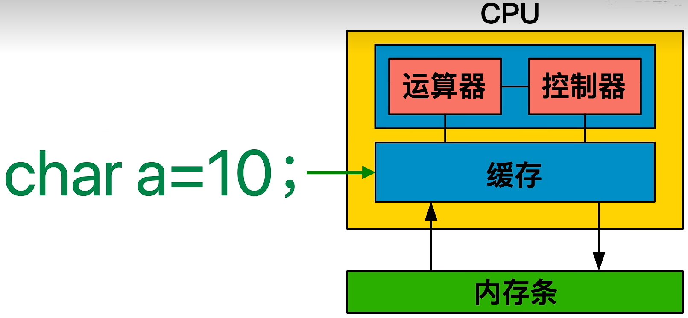
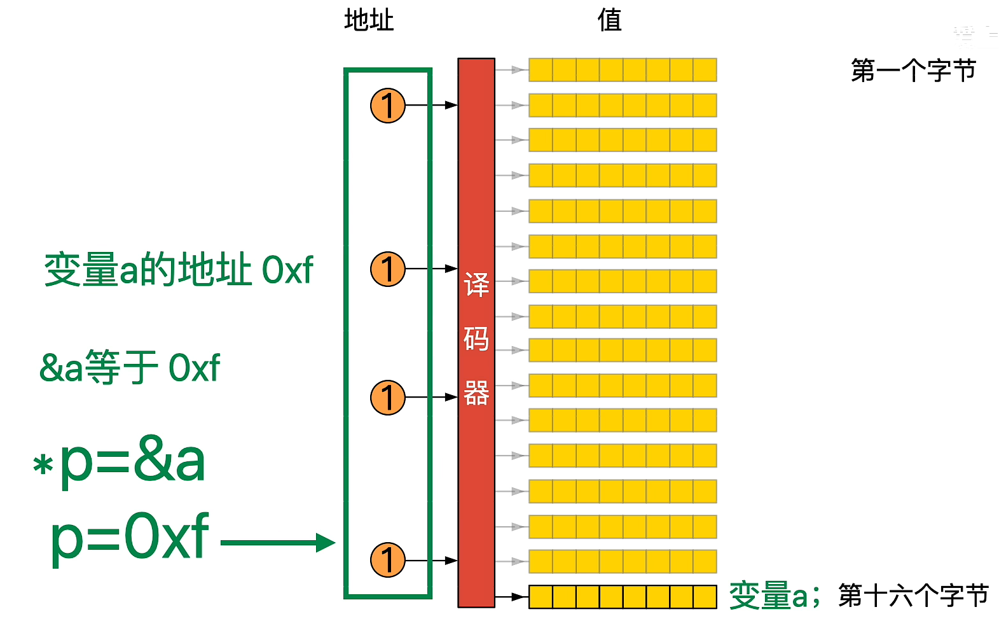
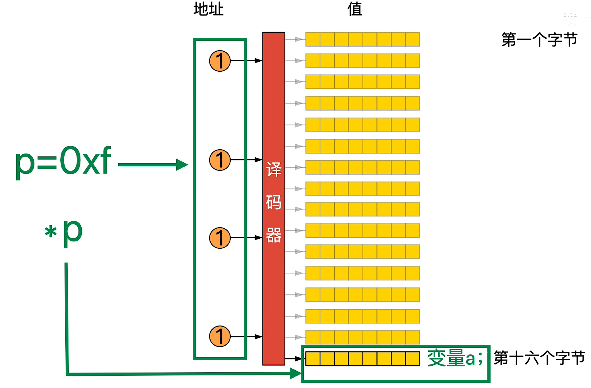

# C＋＋语言编译（结合[google代码规范](https://zh-google-styleguide.readthedocs.io/en/stable/google-cpp-styleguide/contents/)）

##命名约定

### 通用命名规则

尽可能使用描述性的命名，让代码易于新读者理解更重要。不要用只有项目开发者能理解的缩写， 也不要通过砍掉几个字母来缩写单词。

```c++
int price_count_reader;    // 无缩写
int num_errors;            // "num" 是一个常见的写法
int num_dns_connections;   // 人人都知道 "DNS" 是什么

int n;                     // 毫无意义.
int nerr;                  // 含糊不清的缩写.
int n_comp_conns;          // 含糊不清的缩写.
int wgc_connections;       // 只有贵团队知道是什么意思.
int pc_reader;             // "pc" 有太多可能的解释了.
int cstmr_id;              // 删减了若干字母.
```

### 文件命名

一般全部以小写为主，可以包含下划线（__）或连字符（-）

```cc
my_useful_class.cc
my-useful-class.cc
myusefulclass.cc

myusefulclass_test.cc // _unittest 和 _regtest 已弃用.
```

### 类型命名

类型名称的每个单词首字母均大写， 不包含下划线：MyExcitingClass，MyExcitingEnum。

所有类型命名 —— 类，结构体，类型定义 (typedef)，枚举，类型模板参数 —— 均使用相同约定，即**以大写字母开始**，每个单词首字母均大写，不包含下划线。例如:

```c++
// 类和结构体
class UrlTable { ...
class UrlTableTester { ...
struct UrlTableProperties { ...

// 类型定义——给数据类型取别名
typedef hash_map<UrlTableProperties *, string> PropertiesMap;

// using 别名
using PropertiesMap = hash_map<UrlTableProperties *, string>;

// 枚举
enum UrlTableErrors { ...
```

### 变量命名

- 变量 (包括函数参数) 和数据成员名**一律小写**，单词之间**用下划线连接**。

```c++
string table_name;  // 好 - 用下划线.
string tablename;   // 好 - 全小写.
string tableName;  // 差 - 混合大小写
```

- **类**的成员变量**以下划线结尾**，但结构体的就不用。

```c++
class TableInfo //类
{
...
private:
string table_name_;  // 好 - 后加下划线.
string tablename_;   // 好.
static Pool<TableInfo>* pool_;  // 好.
};
```

```c++
struct UrlTableProperties //结构体
{
string name;
int num_entries;
static Pool<UrlTableProperties>* pool;
};
```

### 函数命名

#### 总述

常规函数使用**大小写混合**，取值和设值函数则要求**与变量名匹配**：MyExcitingFunction()，MyExcitingMethod()，my_exciting_member_variable()，set_my_exciting_member_variable()。

#### 说明

一般来说，函数名的**每个单词首字母大写** (即 “驼峰变量名” 或 “帕斯卡变量名”)，**没有下划线**。对于首字母缩写的单词，更倾向于将它们视作一个单词进行首字母大写（例如，写作 StartRpc（）而非 StartRPC（））。


## 注释约定

### 注释风格

**统一风格**，使用**//**或者**/* */**均可，但**//更常用**

### 类注释

每个类的定义都要附带一份注释， 描述类的功能和用法，除非它的功能相当明显。

### 函数注释

函数声明处的注释描述函数功能；定义处的注释描述函数实现。


## 头文件中的#define保护（用的不多）

- 目的：防止头文件被多次包含而造成编译错误

- Include guards方法：标准化方法，所有标准兼容的编译器都支持

  举例——头文件名称为：my_header.h
  
  ```c++
  #ifndef MY_HEADER_H
  #define MY_HEADER_H
  
  // 头文件内容
  
  #endif // MY_HEADER_H
  ```
  
  问题：存在略显繁琐，需要三行代码，并且需要确保宏名的唯一性
  
  如果需要最大程度的可移植性和兼容性，使用 include guards 是更安全的选择
  
- 现常用如下方法，该方法非标准，但被大多数现代编译器支持

  ```
  #pragma once
  ```

​	简单，只有一行代码，在某些编译器上可能有性能优势


## 预处理include

- 基于google规范的**顺序**： 相关头文件，C 库， C++ 库， 其他库的.h， 本项目内的.h

- ROS中C++常用的include

  - `import rospy = #include "ros/ros.h"`

  - `from pix_driver_msgs.msg import GearCommand = #include "pix_driver_msgs/GearCommand.h"`

  - `from autoware_msgs.msg import VehicleCmd = #include ''autoware_msgs/VehicleCmd.h''`

  - `import math = #include<cmath>`

  - `import time  = #include<ctime>`

  - class ×× **：** = class ××  **{}**


## 基础数据类型

- 基本分类：

  - bool型
  - 整型 （char型从本质上说，也是种整型类型，它是长度为1的整数，通常用来存放字符的ASCII码）
  - 浮点型

- int_t同类

  是typedef定义的**表示标志**，是一种表示规范，是通过typedef给类型起的别名，而不是一种新的数据类型。

  举例：

  ```c++
  typedef signed char             int8_t;
  typedef short int               int16_t;
  typedef int                     int32_t;
  typedef long int                int64_t;
  
  typedef unsigned char           uint8_t;
  typedef unsigned short int      uint16_t;
  typedef unsigned int            uint32_t;
  typedef unsigned long int       uint64_t;
  ```

  - 注意：**uint8_t实际是一个char**，输出uin8_t类型的变量**实际输出**的是其**对应的字符**，而不是真实数字。


## ==指针！==

- 目的：用来存储变量在内存中的地址

  - 一般变量的存储地点：CPU中的**缓存**，即属于RAM中的SRAM（静态RAM），而内存条为DRAM（动态RAM）

  

- 声明格式：变量类型   * 变量名（多用于C）   或     **变量类型 *  变量名（多用于C＋＋）**

  - **注意：声明处的‘*’仅仅是声明，不作为间接运算符** 

  - &：取地址运算符，**获取变量地址**

  - *：间接运算符/解除引用运算符，**获取某地址对应的值**

举例：

```c++
int a=5;//设a的地址为EE，b的地址为FF
int* b=&a;//将b指向a，赋值为a的地址（等于指针指向该变量）
此时：
&b=FF；
b=EE；
*b=5;

若此时有：*b=100；
则：a=100；
```





- 数组名：多数情况下，C++将数据名视为数组的**第1个元素的地址**

- 指针算术：C++允许将指针与整数相加，加1的结果等于**原来的地址值加上指向的对象占用的总字节数**


## 类和对象

一般形式为：

```c++
class 类名
{
  public:
    <公有数据和函数>
  private:
    <私有数据和函数>
  protected:
    <保护数据和函数>
}；
```


### 对象成员的访问

- **圆点访问**方式：
  - 对象名.成员名 
  - (*指向对象的指针).成员名  
- **指针访问**方式：
  - 对象指针变量名->成员名
  - (&对象名)->成员名  


### 构造函数

- 格式： 

  ```c++
  <类名>：：<类名>（<形参表>）
  {
      <函数体>
  }
  ```

- 特点：

  - 必须为**公有**
  - **函数名与类名相同**
  - 可以重载
  - 不仅指定返回类型
  - 不能被显式调用

- **无定义任何构造函数**时，系统会**自动生成一个无参数、空函数体的默认构造函数**


### class中的拷贝构造函数（构造函数后）

- 拷贝构造函数：

  如果类中没有定义拷贝构造函数，编译器将提供一个拷贝构造函数，功能是把**已存在对象的成员变量赋值给新对象的成员变量**。

  - **用一个已存在的对象创建新的对象**格式：

  ```c++
  类名 新对象名（已存在的对象名）;
  类名 新对象名 = 已存在的对象名;
  ```

  - **拷贝构造函数**格式：

  ```c++
  类名（const 类名& 对象名）{……}
  ```

  - 特点：

    - 必须为**公有**
    - 函数名必须**与类名相同**
    - 没有返回值  
    - 如果类中定义了拷贝构造函数，编译器将不提供拷贝构造函数
    - 拷贝构造函数可以重载，可以有默认参数

    ```c++
    类名（……,const 类名& 对象名,……）{……}
    ```


### 析构函数

-  格式：

  ```c++
  <类名>：：~<类名>（）
  {
    
  }
  ```

- 特点：
  - 必须为**公有**
  - 名字同类名，与构造函数名的区别在于**前面加~**，表明**功能相反**
  - 一个类中**只能定义一个析构函数**
  - 不能指定返回类型
  - 在释放一个对象时被自动调用
- **无定义任何析构函数**时，系统会**自动生成一个默认的构造函数**


### this指针

- 用途：
  - 为了区分成员和非成员，可通过：this-> 成员名 /（*this）.成员名
  - 类的方法需要返回当前对象的引用  
- 是一个由C＋＋编译器自动产生且较常用的一个隐含对象指针，不能被显式声明
- 是一个局部变量，局部于某个对象
- 是一个const指针，不能修改或给它赋值


### 类的静态成员

指声明为**static的成员**，在类的范围内**所有对象共享该数据**

- 引用格式：
  - <类名>：：<静态成员>
  - 对象名.共有静态成员
  - 对象指针->静态成员
  
- 静态数据成员：
  - 格式：<数据类型> <类名>：：<静态数据成员名>=<初始值> 
  
- 静态成员函数：
  - 定义：在一般函数**定义前加上static关键字** 
  
  - 不访问类中的非静态成员
  
    

### const

保护即需要共享、又需要防止改变的数据，应该声明为常量进行保护

- 常数据成员————const修饰数据成员
- 常成员函数————const修饰成员函数
  - 声明格式：类型 函数名（参数表） const； 
- 常对象————const修饰类的对象
  - 定义格式：const 类名 对象名； / 类名 const 对象名；
    - 如：const int foo


## 类型转换

尽量使用如**static_cast<>（）**这种显式类型转换，而不要使用 int y = (int)x 或 int y = int(x) 等转换方式


##ros::NodeHandle类

`ros::NodeHandle`是一个重要的类，它允许你与ROS系统进行通信。它提供了一个接口，用于**访问ROS的功能，例如创建发布者、订阅者、服务、参数等**。在C++中，可以通过创建 `ros::NodeHandle`对象来访问ROS的各种功能。

`ros::NodeHandle` 的对象通常在ROS节点的构造函数中创建，然后在整个节点的生命周期中被用于与ROS系统进行通信。通过使用 `ros::NodeHandle` 对象，你的程序可以方便地与其他ROS节点进行消息交换和服务调用。


## 动态数组vector

- 初始化

  ```C++
  #include <vector>
  
  std::vector<int> vec1;                  // 空的 vector
  std::vector<int> vec2(10);              // 包含 10 个元素的 vector，初始值为默认值（int 为 0）
  std::vector<int> vec3(10, 5);           // 包含 10 个元素的 vector，初始值为 5
  std::vector<int> vec4 = {1, 2, 3, 4};   // 使用初始化列表
  ```

- 访问元素

  ```C++
  std::vector<int> vec = {1, 2, 3, 4};
  
  // 获取第一个（front）和最后一个元素（back）
  int first = vec.front();
  int last = vec.back();
  ```

- 修改元素

  ```c++
  vec.push_back(1);// 在末尾添加元素1
  vec.push_back(2);// 在末尾添加元素2
  
  // 在特定位置插入元素
  vec.insert(vec.begin(), 0);    // 在开头插入 0
  vec.insert(vec.begin() + 1, 5); // 在第二个位置插入 5
  ```

- 删除元素

  ```c++
  // 删除最后一个元素
  vec.pop_back();
  
  // 删除特定位置的元素
  vec.erase(vec.begin() + 1); // 删除第二个元素，vec.end()
  
  // 清空所有元素
  vec.clear();
  ```

- 大小和容量

  ```c++
  std::vector<int> vec = {1, 2, 3, 4};
  size_t size = vec.size();       // 当前元素数量
  size_t capacity = vec.capacity(); // 当前分配的存储容量
  bool is_empty = vec.empty();    // 检查 vector 是否为空
  
  // 改变大小
  vec.resize(6, 0); // 现在 vec 包含 6 个元素，多出来的用 0 填充
  ```

- 交换

  ```c++
  std::vector<int> vec1 = {1, 2, 3};
  std::vector<int> vec2 = {4, 5, 6};
  
  // 交换 vec1 和 vec2 的内容
  vec1.swap(vec2);
  ```

  

## map键值对

- 声明和初始化

  ```C++
  #include <map>
  #include <string>
  
  std::map<int, std::string> map1;            // 空的 map
  std::map<int, std::string> map2 = {         // 使用初始化列表初始化
      {1, "one"},
      {2, "two"},
      {3, "three"}
  };
  ```

- 修改元素

  ```c++
  std::map<int, std::string> map; //举例
  
  // 插入单个元素
  map.insert({1, "one"});
  
  // 删除特定键的元素
  map.erase(2); // 删除键为 2 的元素
  
  // 清空所有元素
  map.clear();
  ```

- 大小和容量

  ```c++
  size_t size = map.size();       // 当前元素数量
  bool is_empty = map.empty();    // 检查 map 是否为空
  ```

- **make_pair()函数（创建键值对）**

  ```c++
  // 创建一个 std::map
  std::map<int, std::string> myMap;
  
  // 使用 std::make_pair 插入元素
  myMap.insert(std::make_pair(1, "one"));
  myMap.insert(std::make_pair(2, "two"));
  myMap.insert(std::make_pair(3, "three"));
  ```

  - `std::pair`的访问

    ```c++
    // 通过first和second成员来访问
    std::pair<int, std::string> p = std::make_pair(1, "one");
    std::cout << p.first << ": " << p.second << std::endl;
    ```


## 与时间相关

### `chrono`库

```c++
// 获取当前时间
auto start = std::chrono::steady_clock::now();
auto end = std::chrono::steady_clock::now();

// 系统休眠
std::this_shread::sleep_for(std::chrono::seconds(90));

// 获取等待时间
auto duration = std::chrono::duration_cast<std::chrono::minutes>(end-start).count()

```


### `std::tm`结构体

- 结构体定义

```c++
struct tm {
    int tm_sec;    // 秒，范围从 0 到 59
    int tm_min;    // 分，范围从 0 到 59
    int tm_hour;   // 小时，范围从 0 到 23
    int tm_mday;   // 一月中的第几天，范围从 1 到 31
    int tm_mon;    // 月份，范围从 0 到 11（0 表示一月）
    int tm_year;   // 自 1900 年以来的年数
    int tm_wday;   // 一周中的第几天，范围从 0 到 6（0 表示星期天）
    int tm_yday;   // 一年中的第几天，范围从 0 到 365（0 表示一月一日）
    int tm_isdst;  // 夏令时标识符，正值表示采用夏令时，零表示不采用夏令时，负值表示信息不可用
};
```

- 具体使用

```c++
//获取当前时间
std::time_t t = std::time(nullptr); // 获取当前时间点
std::tm* now = std::localtime(&t);  // 分解为本地时间

std::cout << "Year: " << (now->tm_year + 1900) << '\n';
std::cout << "Month: " << (now->tm_mon + 1) << '\n';
std::cout << "Day: " << now->tm_mday << '\n';
std::cout << "Hour: " << now->tm_hour << '\n';
std::cout << "Minute: " << now->tm_min << '\n';
std::cout << "Second: " << now->tm_sec << '\n';
```


## to_string()函数

- 用法：用于将数值转换为字符串

```c++
#include <iostream>
#include <string>

int num = 42;
std::string str = std::to_string(num);
```


## printf()函数

- 用法：用于进行格式化输出
  - `%d`：十进制整数
  - `%f`：浮点数（小数）
  - `%c`：单个字符
  - `%s`：字符串
  - `%x`：十六进制整数

```c
int a = 10;
float b = 3.14;
char c = 'A';
const char* str = "Hello, World!";

printf("Integer: %d", a);        // 输出十进制整数
printf("Float: %f", b);          // 输出浮点数
printf("Character: %c", c);      // 输出字符
printf("String: %s", str);       // 输出字符串
printf("Hexadecimal: %x", a);    // 输出十六进制整数
```


## scanf()函数

- 用法：用于进行格式化输入
  - `%d`：读取十进制整数
  - `%f`：读取浮点数
  - `%c`：读取单个字符
  - `%s`：读取字符串

```C
int a;
float b;
char c;
char str[100];

scanf("%d", &a);         // 读取整数
printf("You entered: %d", a);

scanf("%f", &b);         // 读取浮点数
printf("You entered: %f", b);

scanf("%c", &c);        // 读取字符
printf("You entered: %c", c);

scanf("%s", str);        // 读取字符串
printf("You entered: %s", str);
```

