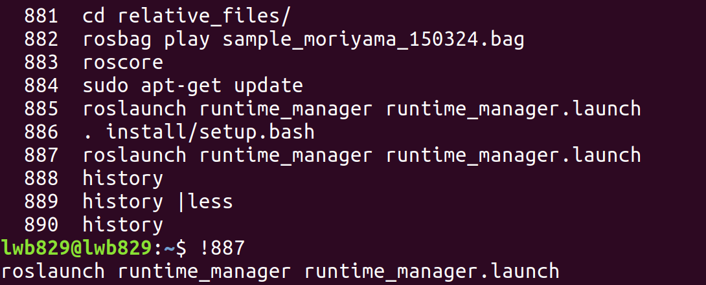
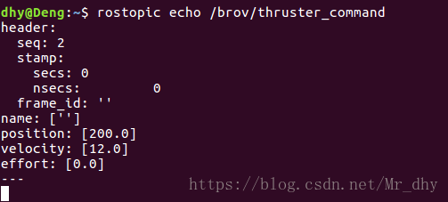

# ubuntu系统学习

## ubuntu常用命令

- sudo：临时以root权限运行
- cd：切换目录
- pwd：打印当前目录
- mkdir：创建路径（目录）
- ls：打印当前路径下文件
- touch：创建新文件
- cp：复制粘贴
- mv：移动/重命名
- rm：删除


## 解决ubuntu中各文件操作权限的巧妙方法

类似于以**管理员身份**（root用户）打开文件

```
$ sudo nautilus
```


## rospack用法（=ros+pack(age)）

rospack允许你获取软件包的有关信息。在本教程中，我们只涉及到`find`参数选项，**该选项可以返回软件包的所在路径**。

用法：

```
$ rospack find [package_name] 
    
例如: $ rospack find roscpp
将会输出：/opt/ros/<distro>/share/roscpp
```


## roscd用法(=ros+cd)

roscd是rosbash命令集的一部分，它允许你**直接切换目录（cd）到某个软件包或者软件包集**当中。

用法：

```
$ roscd [locationname[/subdir]]
```

注意，就像ROS中的其它工具一样，roscd只能切换到那些路径已经包含在ROS_PACKAGE_PATH环境变量中的软件包。要查看ROS_PACKAGE_PATH中包含的路径，可以输入：

```c++
$ echo $ROS_PACKAGE_PATH //非常好用,可以用来检查环境变量
```

你的ROS_PACKAGE_PATH环境变量应该包含那些保存有ROS软件包的路径，并且每个路径之间用冒号（:）分隔开来。一个典型的ROS_PACKAGE_PATH环境变量如下：

```c++
/opt/ros/<distro>/base/install/share
```

跟其他环境变量路径类似，你可以在ROS_PACKAGE_PATH中添加更多的目录，每条路径使用冒号（:）分隔。


roscd也可以**切换到一个软件包或软件包集的子目录**中。

执行：

```c++
$ roscd roscpp/cmake
$ pwd
```

应该会看到：

```c++
YOUR_INSTALL_PATH/share/roscpp/cmake
```


## rosls用法(=ros+ls)

rosls是rosbash命令集的一部分，它允许你直接**按软件包的名称执行ls命令**（而不必输入绝对路径）。

用法：

```c++
$ rosls [locationname[/subdir]]
```

示例：

```c++
$ rosls roscpp_tutorials
```

应输出:

```c++
cmake  launch package.xml   srv
```


## 快速查看/使用终端历史命令

```
history
```

- 快速执行某支令，将查找到的指令复制粘贴执行，或者通过**!+命令编号**的形式执行



- 如果只是想重复使用最后一个使用的命令，只要使用两个感叹号就能快速执行之。


- **使用ctrl+r可快速搜索想要的历史命令，且终端会自动补齐**


## rostopic用法

用于查询话题具体内容

- 查看ROS正在发布的话题

  ```
  rostopic list
  ```

结果示例：

- 打印发布的消息内容

  ```
  rostopic echo +话题
  ```

结果示例：


## Tab键补全功能

