# Transformer

> 参考 [Ketan Doshi](https://ketanhdoshi.medium.com/) 博客中关于Transformer的四篇文章

- [Transformers Explained Visually (Part 1): Overview of Functionality](https://towardsdatascience.com/transformers-explained-visually-part-1-overview-of-functionality-95a6dd460452)
- [Transformers Explained Visually (Part 2): How it works, step-by-step](https://towardsdatascience.com/transformers-explained-visually-part-2-how-it-works-step-by-step-b49fa4a64f34)
- [Transformers Explained Visually (Part 3): Multi-head Attention, deep dive](https://towardsdatascience.com/transformers-explained-visually-part-3-multi-head-attention-deep-dive-1c1ff1024853)
- [Transformers Explained Visually — Not Just How, but Why They Work So Well](https://towardsdatascience.com/transformers-explained-visually-not-just-how-but-why-they-work-so-well-d840bd61a9d3)


## Part 1: Overview of Functionality

### 一、引言

 关于 Transformer 的研究已有许多，在过去几年中, Transformer 及其变体在 NLP 的世界里掀起了巨大风暴。 Transformer 是一种架构，它使用注意力来显著提高深度学习 NLP 翻译模型的性能，其首次在论文 [Attention is all you need](https://proceedings.neurips.cc/paper/2017/file/3f5ee243547dee91fbd053c1c4a845aa-Paper.pdf) 中出现，并很快被却认为大多数文本数据应用的领先架构。从那时起，包括谷歌的 BERT, OpenAI 的 GPT 系列在内的众多项目都建立在这个基础上，并发表了轻松击败现有最新基准的性能结果。
本文将具体介绍 Transformer 的基本知识，架构，及其内部工作方式。我们将以自上而下的方式介绍其功能。同时，本文将深入剖析 Transformer 内部的细节，以了解其系统的运作。我们还将深入探讨多头注意力的工作原理。


### 二、何为Transformer？

Transformer 架构擅长处理文本数据，这些数据本身是有顺序的。它们将一个文本序列作为输入，并产生另一个文本序列作为输出。例如，将一个输入的英语句子翻译成西班牙语。


Transformer的核心部分，包含一个编码器层和解码器层的堆栈。为了避免混淆，我们将把**单个层称为编码器或解码器，并使用编码器堆栈或解码器堆栈分别表示一组编码器与一组解码器。**（原文为 Encoder stack 和 Decoder stack）。

在编码器堆栈和解码器堆栈之前，都有对应的嵌入层。而在解码器堆栈后，有一个输出层来生成最终的输出。


编码器堆栈中的每个编码器的结构相同。解码器亦然，其各自结构如下：


- **编码器一般有两个子层**：包含自注意力层 (self-attention)，用于计算序列中不同词之间的关系；同时包含一个前馈层 (feed-forward)
- **解码器一般有三个子层**：包含自注意力层 (self-attention)，前馈层 (feed-forward)，编码器-解码器注意力层 (Decoder-Encoder self attention)
- **每个编码器和解码器都有独属于本层的一组权重**

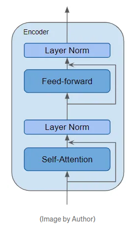

需要注意的是，编码器的自注意力层及前馈层均有残差连接以及正则化层

基于 Transformer 的变体有许多，一些 Transformer 架构甚至没有 Decoder 结构，而仅仅依赖 Encoder


### 三、Attention在做什么？

Transformer 的突破性表现关键在于其对注意力的使用。在处理一个单词时，注意力使模型能够关注输入中与该单词密切相关的其他单词

例如，下图中 ball 与 blue 、 hold 密切相关。另一方面, boy 与 blue 没有关系


Transformer 通过将输入序列中的**每个词与其他词**关联起来（同一序列中），形成 self-attention 机制

考虑以下两个句子：

- The cat drank the milk because **it** was hungry.
- The cat drank the milk because **it** was sweet.

**第一个句子中，单词 it 指 cat; 第二个句子中, it 指 milk。当模型处理 it 这个词时, self-attention 给了模型更多关于 it 意义的信息，这样就能把 it 与正确的词联系起来**


为了使模型能够处理有关于句子意图和语义的更多细微差别，Transformer 对每个单词都进行注意力打分

在处理 "it "这个词时，第一个分数突出 "cat"，而第二个分数突出 "hungry"。因此，当模型解码'it'这个词时，即把它翻译成另一种语言的单词时，将会把 'cat' 和 'hungry' 某些语义方面的性质纳入到目标语言中


### 四、Transformer训练过程

Transformer 的训练和推理有一些细微差别

首先来看训练。训练数据包括两部分内容：

- The source or input sequence (eg. “You are welcome” in English, for a translation problem)
- The destination or target sequence (eg. “De nada” in Spanish)
  Transformer

**训练的目标是通过对源序列 (source sequence) 与目标序列 (target sequence) 的学习，生成目标序列**


训练过程中，模型对数据的处理过程如下，大体可分为 6 个步骤：

1. 在送入第一个编码器之前，输入序列 (src_seq) 首先被转换为嵌入 (Embed), 并且带有位置编码 (Pos Enc)，产生词嵌入表示(src_position_embed)，之后送入第一个编码器。
2. 由各编码器组成的编码器堆栈按照顺序对第一步中的输出进行处理，产生输入序列的编码表示(enc_outputs)。
3. 在右侧的解码器堆栈中，目标序列首先加一个句首标记，被转换成嵌入（带位置编码），产生词嵌入表示(tgt_position_embed)，之后送入第一个解码器。
4. 由各解码器组成的解码器堆栈，将第三步的词嵌入表示(tgt_position_embed)，与编码器堆栈的编码表示(enc_outputs)一起处理，送入第二个解码器，产生目标序列的解码表示(dec_outputs)。
5. 输出层将上一步的解码表示(dec_outputs)转换为词概率和最终的输出序列(out_seq)。
6. 损失函数将这个输出序列(out_seq)与训练数据中的目标序列(tgt_seq)进行比较。这个损失被用来产生梯度，在反向传播过程中训练模型。


### 五、Transformer推理过程

在推理过程中，我们只有输入序列，而没有目标序列作为输入传递给解码器，**Transformer 推理的目标是仅通过输入序列产生目标序列**

因此，与 `Seq2Seq` 模型类似，我们**在一个时间步的完整循环中生成当前时间步的输出，并在下一个时间段将前一个时间段的输出序列传给解码器作为其输入**，直到我们遇到句末标记

但与 `Seq2Seq` 模型的不同之处在于，**在每个时间步，我们输入直到当前时间步所产生的整个输出序列，而不是只输入上一个时间步产生的词**

这非常重要，把原文粘过来: `The difference from the Seq2Seq model is that, at each timestep, we re-feed the entire output sequence generated thus far, rather than just the last word.`


推理过程中的数据流转如下：

1. 第一步与训练过程相同：输入序列 (src_seq) 首先被转换为嵌入 (Embed), 并且带有位置编码 (Pos Enc)，产生词嵌入表示(src_position_embed)，之后送入第一个编码器。
2. 第二步也与训练过程相同：由各编码器组成的编码器堆栈按照顺序对第一步中的输出进行处理，产生输入序列的编码表示(enc_outputs)。
3. **从第三步开始一切变得不一样了**：在第一个时间步，使用一个只有句首符号的**空序列**来代替训练过程中使用的目标序列。空序列转换为嵌入带有位置编码的嵌入(start_position_embed)，并被送入解码器。
4. 由各解码器组成的解码器堆栈，将第三步的空序列嵌入表示(start_position_embed)，与编码器堆栈的编码表示(enc_outputs)一起处理，产生目标序列第一个词的解码表示(step1_dec_outputs)。
5. 输出层将其(step1_dec_outputs)转换为词概率和第一个目标单词(step1_tgt_seq)。
6. **将这一步产生的目标单词填入解码器输入的序列中的第二个时间步位置。在第二个时间步，解码器输入序列包含句首符号产生的 token 和第一个时间步产生的目标单词。**
7. 回到第3个步骤，与之前一样，将新的解码器序列输入模型。然后取输出的第二个词并将其附加到解码器序列中。重复这个步骤，直到它预测出一个句末标记。需要明确的是，由于编码器序列在每次迭代中都不会改变，我们不必每次都重复第1和第2步。


### 六、Teaching Forcing

**训练时向解码器输入整个目标序列的方法被称为 Teacher Forcing**

训练时，我们本可以使用与推理时相同的方法。即在一个时间步运行 Transformer, 从输出序列中取出最后一个词，将其附加到解码器的输入中，并将其送入解码器进行下一次迭代。最后，当预测到句末标记时, Loss 函数将比较生成的输出序列和目标序列，以训练网络。

**但这种训练机制不仅会导致训练时间更长，而且还会增加模型训练难度：若模型预测的第一个词错误，则会根据第一个错误的预测词来预测第二个词，以此类推。**

相反，通过向解码器提供目标序列，实际上是给了一个提示。即使第一个词预测错误，在下一时间步，它也可以用正确的第一个词来预测第二个词，避免了错误的持续累加。

**此外，这种机制保证了 Transformer 在训练阶段并行地输出所有的词，而不需要循环，这大大加快了训练速度。**


### 七、Transformer应用场景

Transformer 的用途非常广泛，可用于大多数 NLP 任务，如语言模型和文本分类。它们经常被用于 Seq2Seq 的模型，如机器翻译、文本总结、问题回答、命名实体识别和语音识别等应用。

对于不同的问题，有不同的 Transformer 架构。基本的编码器层被用作这些架构的通用构件，根据所解决的问题，有不同的特定应用 头 (Head)


#### 1、Transformer 分类器架构

如下所示，一个情感分析程序，把一个文本文件作为输入。一个**分类头**接收 Transformer 的输出，并生成预测的类别标签，如正面或负面情绪。


#### 2、Transformer Language Model architecture

Language Model architecture 架构将把输入序列的初始部分，如一个文本句子作为输入，并通过预测后面的句子来生成新的文本。一个 Language Model architecture 头接受 Transformer 的输出作为 head 的输入，产生关于词表中每个词的概率输出。概率最高的词成为句子中下一个词的预测输出。


### 八、与 RNN 类型的架构相比，为什么 Transformer 的效果要好？

RNN, LSTM, GRU 也是之前 NLP 常用的架构，直到 Transformer 的出现。

然而，这有两个限制：

- 对于长句中相距较远的单词，其间的长距离依赖关系是一个挑战。
- RNNs 每个时间步值处理输入序列的一个词。这意味着在完成时间步 T-1 计算之前，它无法进行时间步骤 T 的计算。（即无法进行并行计算）这降低了训练和推理速度。

对于 CNN 来说，所有的输出都可以并行计算，这使得卷积速度大大加快。然而，它们在处理长距离的依赖关系方面也有限制：

- 卷积层中，只有图像（或文字，如果应用于文本数据）中足够接近于核大小的部分可以相互作用。对于相距较远的项目，你需要一个有许多层的更深的网络。


Transformer 架构解决了这两个限制。它摆脱了 RNNs, 完全依靠 Attention 的优势：

并行地处理序列中的所有单词，从而大大加快了计算速度。（**只是在训练阶段与推理阶段的 Encoder 中吧。推理过程的 Decoder 也不是并行的**）


## Part 2: How it works, step-by-step

### 一、overview


在第一部分，已经介绍过 Transformer 的整体架构: 

- 数据在输入编码器和解码器之前，都要经过：
  - 词嵌入层 (Embedding layer)
  - 位置编码层 (Positional Encoding layer)
- 编码器堆栈包含若干个编码器，每个编码器都包含两个子层：
  - 自注意力层 (Self-Attention layer)
  - 前馈层 (Feed-Forward layer)
- 解码器堆栈包含若干个解码器，每个解码器都包含三个子层：
  - 自注意力层 (Self-Attention layer)
  - 前馈层 (Feed-Forward layer)
  - 编码器-解码器注意力层 (Decoder-Encoder Attention layer)
- 解码器堆栈后面是输出层，包含：
  - 线性层 (Linear layer)
  - Softmax 层

为了深入理解每个组件的作用，在翻译任务中 step-by-step 地训练 Transformer, 使用只有一个样本的训练数据作为例子：其中包含一个输入序列（英语的 “You are welcome”）和一个目标序列（西班牙语的 “De nada”）。


### 二、词嵌入层与位置编码 (Embedding and position Encoding)

像其他 NLP 模型一样, Transformer 的输入需要关注每个词的两个信息：该词的含义和它在序列中的位置：

- 第一个信息，可通过嵌入层对词的含义进行编码
- 第二个信息，可通过位置编码层对词的位置进行编码 Transformer 通过添加这两个层来完成两种不同的信息编码


#### 1.嵌入层 (Embedding layer)

Transformer 的编码器和解码器各有一个嵌入层 (Embedding). 输入序列被送入编码器的嵌入层，被称为输入嵌入 (Input Embedding)。


**目标序列右移一个位置，并在第一个位置插入一个 Start token 后**被送入解码器的嵌入层。

- 注意，在推理过程中，我们没有目标序列，我们在一个循环中把输出序列送入解码器的嵌入层，正如第一部分中所提到的，这就是为什么它被称为输出嵌入 (Output Embedding)。

**文本序列被映射成词汇表的单词 ID 的数字序列，嵌入层再将每个数字序列射映射成一个嵌入向量，这是该词含义的一个更丰富的表示**


#### 2. 位置编码 (Positional Encoding)

RNN 在循环过程中，每个词按顺序输入，因此隐含地知道每个词的位置。**然而, Transformer 一个序列中的所有词都是并行输入的，这是其相对于 RNN 架构的主要优势；但同时也意味着位置信息会丢失，必须单独添加回来**

解码器堆栈和编码器堆栈各有一个位置编码层，位置编码的计算是独立于输入序列的，是固定值，只取决于序列的最大长度。

- 第一项是一个常数代码，表示第一个位置
- 第二项是一个表示第二个位置的常数代码

$$
\begin{aligned}
PE(pos, 2i) &= sin(pos / 10000^{2i / d_{model}}) \\
PE(pos, 2i+1) &= cos(pos / 10000^{2i / d_{model}}), 
\end{aligned}
$$

其中, `pos` 是该词在序列中的位置，`d_model` 是编码向量（与嵌入向量相同）的长度，`i` 是这个位置编码向量中的索引。公式表示的是矩阵第 `pos` 行, 第 `2i` 列和第 `2i+1` 列上的元素。

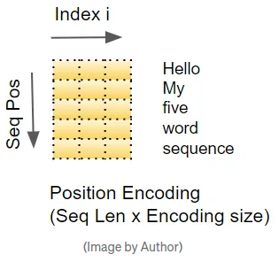

换句话说，位置编码交织了一条正弦曲线和一条余弦曲线，所有偶数索引都有正弦值，所有奇数索引都有余弦值。举个例子，如果我们对一个40个单词的序列进行编码，我们可以看到下面几个（单词位置，编码索引）组合的编码值：

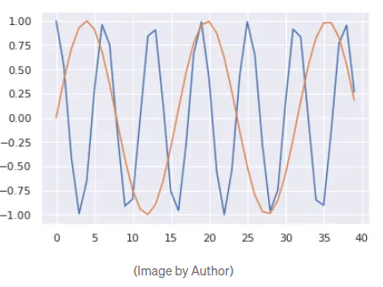

### 三、矩阵纬度 (Matrix Dimensions)

深度学习模型一次处理一批训练样本。嵌入层和位置编码层对一批序列样本的矩阵进行操作，嵌入层接受一个形状为 (samples, sequence_length) 的二维单词 ID 矩阵 (samples 可以理解为 batch_size)，将每个单词 ID 编码成一个单词向量，其大小为 embedding_size, 从而得到一个 (samples, sequence_length, embedding_size) 的三维输出矩阵。**位置编码使用的编码尺寸等于嵌入尺寸，所以它产生一个类似形状的矩阵，可以直接与嵌入层的输出相加**。


由嵌入层和位置编码层产生的 (samples, sequence_length, embedding_size) 形状在模型中被保留下来，随数据在编码器和解码器堆栈中流动，知道它被最终的输出层改变形状 (实际上变成了(samples, sequence_length, vocab_size))。

以上对 Transformer 中的矩阵维度有了一个形象的认识。为了简化可视化，从这里开始，暂时放弃第一个维度 (samples 维度), 并使用单个样本的二维表示。


### 四、Encoder

编码器和解码器堆栈分别由几个（通常是6个）编码器和解码器组成，按顺序连接。


1. 堆栈中的第一个编码器从嵌入层和位置编码层接受其输入，堆栈中的其他编码器从前一个编码器接收它们的输入。
2. 当前编码器接受上一个编码器的输入，并将其传入当前编码器的自注意力层。当前自注意力层的输出被传入前馈层，然后将其输出至下一个编码器。


1. 自注意力层和前馈网络都会接入一个残差连接，之后再送入正则化层
2. 编码器堆栈中的**最后一个编码器的输出，会送入解码器堆栈的每一个解码器**


### 五、Decoder

解码器的结构与编码器的结构非常类似，但有一些区别。

1. 像编码器一样，堆栈中的第一个解码器从嵌入层（词嵌入+位置编码）中接受输入；堆栈中的其他解码器从上一个解码器接受输入。
2. 在一个解码器内部，输入首先进入自注意力层，这一层的运行方式与编码器相应层的区别在于：
   - 训练过程中，每个时间步的输入，是直到当前时间步所对应的目标序列，而不仅是前一个时间步对应的目标序列（即输入的是 $step_0$ ~ $step_{N-1}$ 的目标序列，而不仅仅是 $step_{N-1}$ 的目标序列）
   - 推理过程中，每个时间步的输入，是直到当前时间步所产生的整个输出序列。
   - 解码器的上述功能主要是通过 mask 方法进行实现得到的，下面会详细介绍。
3. **解码器与编码器的另一个不同在于，解码器有第二个注意力层，即编码器-解码器注意力层 (Encoder-Decoder-attention)。其工作方式与自注意力层类似，只是其输入来源有两处：位于其前的自注意力层及解码器堆栈的输出。**
4. Encoder-Decoder attention 的输出被传入前馈层，然后将其向上输出送至下一个 Decoder.
5. Decoder 中的每一个子层，即 Multi-Head-Self-Attention, Encoder-Decoder-attention, Feed-forward 层，均由一个残差连接，并进行层规范化。


### ==六、注意力 - Attention==

在第一部分中，我们谈到了为什么在处理序列时注意力是如此重要. Transformer 中，注意力被用在三个地方：

- Encoder 中的 Self-attention: 输入序列对自身的注意力计算；
- Decoder 中的 Self-attention: 目标序列对自身的注意力计算；
- Decoder 中的 Encoder-Decoder-attention: 目标序列对输入序列的注意力计算。

**注意力层 (Self-attention layer 及 Encoder-Decoder-attention layer) 以三个参数的形式接受其输入，称为查询 (Query), 键 (Key) 和 值 (Value):**

- 在 Encoder 中的 Self-attention, 编码器的输入被传递给所有三个参数: Query, Key, Value (**即输入经过词嵌入和位置编码后，分别与 Query, Key 和 Value 的参数矩阵相乘**)
  
- 在 Decoder 中的 Self-attention, 解码器的输入同样被传递给所有三个参数: Query, Key 和 Value.
- **在 Encoder-Decoder-attention 中, 编码器堆栈中最后一个编码器的输出被传递给 Value 和 Key 参数。位于其前的 Self-attention 和 Layer Norm 模块的输出被传递给 Query 参数。**


### 七、多头注意力 (Multi-Head Attention)

Transformer 将每个注意力计算单元称为注意力头 (Attention Head)。多个注意力头并行运算，即所谓的多头注意力 (Multi-head Attention)。它通过融合几个相同的注意力计算单元，使注意力计算具有更强大的分辨能力。


通过每个独立线性层自己的权重参数，即 Query, Key 和 Value, 与输入进行矩阵乘法运算，得到 Q, K, V. 这些结果通过如下所示的注意力公式组合在一起，产生注意力分数 (Attention Score)


需要注意的重要一点是, Q, K, V 的值是对序列中每个词的编码表示。**注意力计算将每个词与序列中的其他词联系起来，这样注意力分数就为序列中的每个词编码了一个分数**


### 八、注意力掩码 (Attention Mask)

在计算 Attention Score 的同时, Attention 模块应用了一个屏蔽操作。屏蔽操作有两个目的：

- 在 Encoder Self-attention 和 Encoder-Decoder-attention 中：屏蔽的作用是，在输入序列 padding 对应的位置，将输出的注意力分数 (Attention Score) 归零，**以确保 padding 对 Self-attention 的计算没有贡献**。
  - padding 的作用：由于输入序列可能有不同的长度，因此会像大多数 NLP 方法一样，使用 padding 作为填充标记，以得到固定长度的向量，从而可以将一个样本的序列作为矩阵被输入到 Transform 中。
- 当计算注意力分数 (Attention Score) 时，在 Softmax 计算之前的分子上进行了掩码。被屏蔽的元素（白色方块）设置为负无穷大，这样 Softmax 就会把这些值变成零。

对 padding 掩码操作的图示：


Encoder-Decoder-attention 掩码操作的图示：


在 Decoder 中的 Self-attention 中：掩蔽的作用是，防止解码器在当前时间步预测时 ，“偷看”目标句余下几个时间步的部分。

- 个人理解：只有在训练过程才会需要使用这种掩码操作。因为在测试过程中是非并行运算，没有目标序列，预测单词是一个一个生成的。
- 解码器处理源序列 source sequence 中的单词，并利用它们来预测目标序列中的单词。训练期间，这个过程是通过 Teacher Forcing 进行的，完整的目标序列被作为解码器的输入。因此，在预测某个位置的词时，解码器可以使用该词之前的目标词以及该词之后的目标词。这使得解码器可以通过使用未来“时间步”的目标词来”作弊“。
- 举例，如下图所示，当预测 "Word3" 时，解码器应该只参考目标词的前三个输入词，而不含第四个单词 "Ketan". 因此， Decoder 中的 Self-attention 掩码操作掩盖了序列中位于当前时间步之后的目标词。

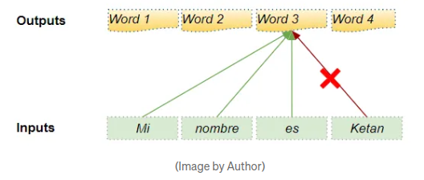

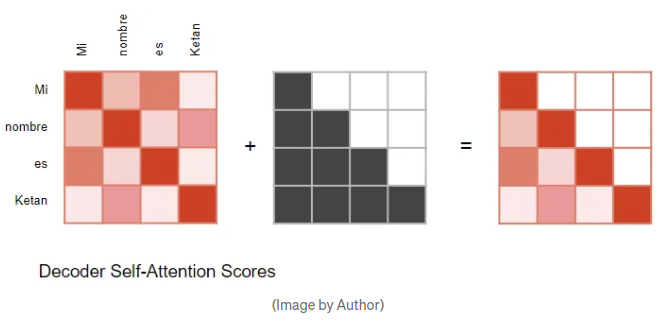


### 九、产生输出 (Generate Output)

解码器堆栈 (Decoder stack) 中的最后一个解码器 (Decoder) 将其输出传给输出组件，输出组件将其转换为最终目标句子。

- **线性层将解码器向量投射到单词分数 (Word Scores) 中**，目标词汇中的每个独特的单词在句子的每个位置都有一个分数值。例如，如果我们的最终输出句子有7个词，而目标西班牙语词汇有10000个独特的词，我们为这7个词中的每一个生成10000个分数值。分数值表示词汇中的每个词在句子的那个位置出现的可能性。
- Softmax 层将这些分数变成概率（加起来为1.0）。在每个位置，我们找到概率最高的单词索引（贪婪搜索），然后将该索引映射到词汇表中的相应单词。这些词就构成了 Transformer 的输出序列。


### 十、训练与损失函数 (Training and Loss Function)

训练中使用交叉熵作为损失函数，**比较生成的输出概率分布和目标序列**。概率分布给出了每个词在该位置出现的概率。

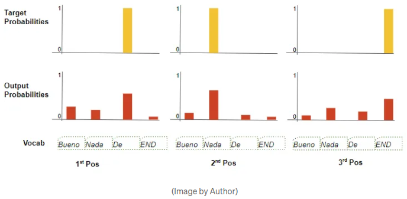

假设我们的目标词汇只包含四个词。我们的目标是产生一个与我们预期的目标序列 "De nada END" 相符的概率分布。

这意味着第一个词位的概率分布中, "De" 的概率应该是1，而词汇中所有其他词的概率都是 0。同样地，在第二和第三词位中, "nada" 和 "END" 的概率应该都是 1，而词汇表中其他词的概率都是 0 。

像往常一样，对损失计算梯度，通过反向传播来训练模型。


## Part 3: Multi-head Attention, deep dive

### 一、注意力超参数 (Attention Hyperparameters)

Transformer 的数据维度由以下的超参数决定

- **Embedding Size**: 嵌入大小。嵌入向量的大小 (Transformer 中使用的嵌入向量大小为6) 。这个维度在整个 Transformer 模型中都是向前传递的，因此有时也被称为 (model size) 模型大小等其他名称。
- **Query Size (与 Key 和 Value size 相等)**：查询大小（等于键和值大小）。分别用来产生 Query, Key 和 Value矩阵的三个线性层的权重大小（例子中使用的查询大小为3）
- **number of Attention heads**: 注意力头个数. Transformer 中使用两个注意力头。
- **batch_size**: 批量大小。


### 二、数据维度的变化

#### 1.Input Layer

经过词嵌入和位置编码后，进入编码器之前，输入的数据维度为: (batch_size, seq_length, embedding_size), 之后数据进入编码器堆栈中的第一个 Encoder, 与 Query, Key, Value 矩阵相乘。


为方便理解，以下的图示与介绍中将去掉 batch_size 维度，聚焦于剩下的维度：

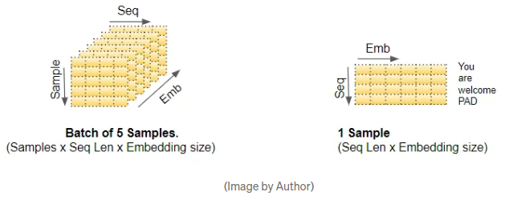

- Seq: 输入序列的长度，一个句子中的单词数
- Sample: 样本数，一个 batch 中的样本数，即有多少个句子
- Emb: 嵌入向量的大小


#### 2.Linear Layers for Query, Key, and Value

Query, Key, Value 实际上是三个独立的线性层。每个线性层都有自己独立的权重。输入数据与三个线性层分别相乘，产生 Q, K, V.

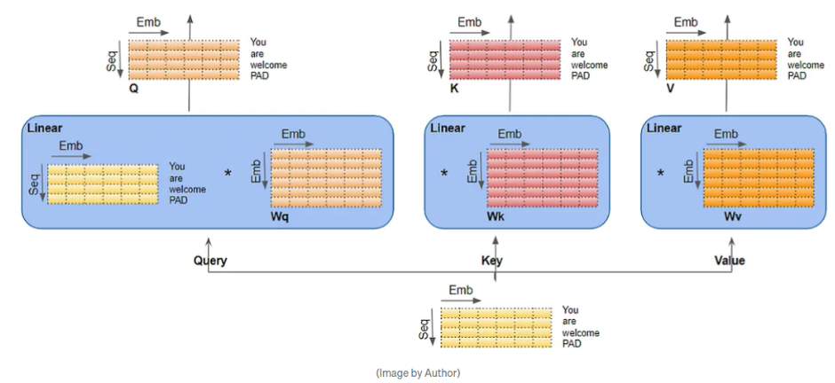

在自注意力机制中，以查询向量 Q 为基础，通过计算查询向量 Q 与所有关键向量 K 之间的相似度，得到一个权重分布，用于加权求和关联的数值向量 V.

- Q, K, V 概念来源于检索系统，其中 Q 为 Query, K 为 Key, V 为 Value. **可以简单理解为 Q 与 K 进行相似度匹配，匹配后取得的结果就是 V. 举个例子我们在某宝上搜索东西，输入的搜索关键词就是 Q, 商品对应的描述就是 K, Q 与 K 匹配成功后搜索出来的商品就是 V.**


#### 3.通过注意力头切分数据

现在，数据被分割到多个注意头中，以便每个注意头能够独立地处理它。

**需要注意的是，“切分”只是逻辑上的切分。对于参数矩阵 Query, Key, Value 而言，并没有物理切分成对应于每个注意力头的独立矩阵，仅逻辑上每个注意力头对应于 Query, Key, Value 的独立一部分。同样，各注意力头没有单独的线性层，而是所有的注意力头共用线性层，只是不同的注意力头在独属于其的逻辑部分上进行操作。**


##### a. 线性层权重矩阵的切分

这种逻辑分割，是通过将输入数据以及线性层权重，均匀划分到各注意头中来完成的。我们可以通过选择下面的 Query Size 大小来实现：
$$
\text{Query Size} = \frac{\text{Embedding Size}}{\text{Number of heads}}
$$

- head: Attention Head

  

在 Transformer 中，这就是为什么 `Query Size=6/2=3`。尽管层权重（和输入数据）均为单一矩阵，我们可以认为它是“将每个头的独立层权重‘堆叠’在一起"成为一个矩阵。

- 即输入数据经过线性层权重矩阵的乘法后，得到的 Q, K, V 矩阵，然后将每个矩阵切分成多个独立的矩阵，每个小矩阵对应于一个注意力头。

  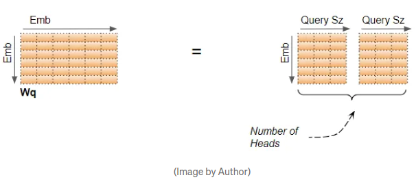

  ```
  self.W_Q = nn.Linear(embedding_size, Query_size * n_heads, bias=False) 
  
  self.W_K = nn.Linear(embedding_size, Key_size * n_heads, bias=False)
  
  self.W_V = nn.Linear(embedding_size, Value_size * n_heads, bias=False) 
  ```

  回顾前一小节的内容, input 的维度是: (batch_size, seq_length, embedding_size)

  线性层的维度是: (batch_size, embedding_size, Query_size * n_heads)

  - 因为 embedding_size = Query_size * n_heads, 实际上线性层的维度并未进行变化变化。
  - 得到的 Q, K 和 V 矩阵形状是: (batch_size, seq_length, Query_size * n_heads)
  - batch_size 维度不管，剩余维度相乘


##### b. 改变 Q、K 和 V 矩阵形状

经由线性层输出的 Q, K 和 V 矩阵要经过 Reshape 操作，以匹配上 Attention Head 维度。现在每个 "切片" 矩阵 对应于一个头。这个 “切片” 是得到 Q, K, V 之后，在用 Q, K 计算 attention score 之前才划分的多头。

通过交换 n_heads 和 seq_length 这两个维度改变 Q, K 和 V 矩阵的形状。图示中虽然未表达出 Batch 维度，但对应于每一个注意力头的 'Q' 的维度是: (batch_size, n_heads, seq_length, Query size)

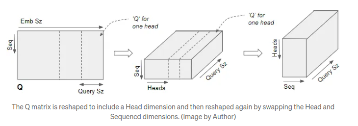

在上图中，我们可以看到从线性层出来后，分割 Q 矩阵的完整过程。

最后一个阶段只是为了形象化：实际上 Q 矩阵仍然是一个单一矩阵，但可以把它看作是每个注意力头的逻辑上独立的 Q 矩阵。


现在准备好了，可以开始计算注意力分数了。


### 三、为每个头计算注意力分数 (Compute the Attention Score for each head)

现在有分属各头的 Q, K, V 三个矩阵，每个头的 Q, K 用来计算注意力分数。

为方便理解，将只展示单头计算。使用最后两个维度 (seq_length, Query size)，跳过前两个维度 (batch_size, n_heads)。从本质上讲，我们可以想象，计算对于每个头和每个批次中的每个样本都是 “循环” 进行的。（**虽然实际上它们是作为一个单一矩阵操作进行的，而非作为一个循环**）。

**1. 第一步是在 Q 和 K 的转置矩阵做一个矩阵乘法**

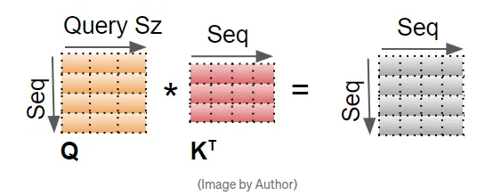

**2. 将屏蔽值被添加到结果中。在 Encoder Self-attention 中，掩码用于掩盖填充值 (padding)，这样它们就不会参与到注意分数中**

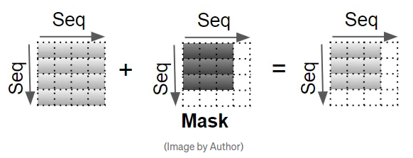

**3. 上一步的结果通过除以 Query size 的平方根进行缩放，然后对其应用 Softmax**


**4. 在 Softmax 的输出和 V 矩阵之间进行另一个矩阵乘法**


在 Encoder Self-attention 中，一个注意力头的完整注意力计算如下图所示：

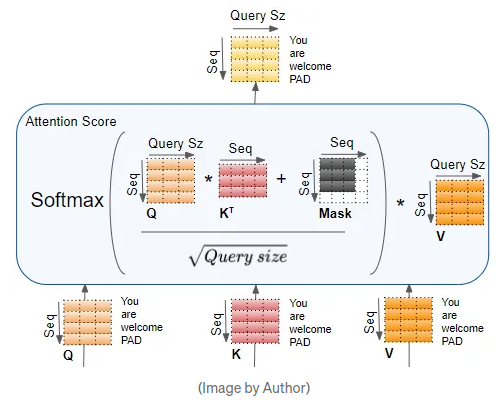

而每个注意力头的输出形状为：(batch_size, n_heads, seq_length, Query size)

- 注意：实际上此处最后一个维度的大小为 value_size, 只是在 Transformer 中的 value_size=key_size=query_size


### 四、融合每个头的注意力分数 (Merge each Head's Attention Scores together)

我们现在对每个头都有单独的注意力分数，需要将其合并为一个分数。这个合并操作本质上是与“切分”操作相反，通过重塑结果矩阵以消除 n_heads 维度来完成的。其步骤如下：

**1. 交换头部和序列维度来重塑注意力分数矩阵**

换句话说，矩阵的形状从 (batch_size, n_heads, seq_length, Query_size) 变成: (batch_size, seq_length, n_heads, Query_size)

**2. 通过重塑 (Batch, Sequence, Head * Query size) 折叠头部维度**

这就有效地将每个头的注意得分向量连接成一个合并的注意得分。
由于 embedding_size=n_heads * query_size, 合并后的分数是 (batch_size, seq_length, embedding_size)。在下面的图片中，我们可以看到分数矩阵的完整合并过程:

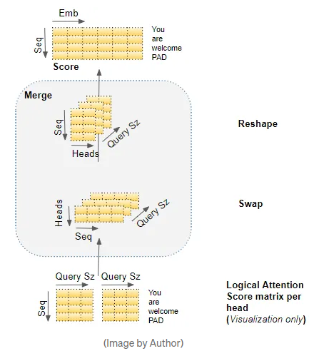

- 从代码的角度看，这一步是通过点乘一个参数矩阵的线性变换得到的

  **整体上多头注意力的计算过程如下：**

  


### 五、多头分割可以捕捉到更丰富的表示(Multi-head split captures richer interpretations)

一个嵌入向量捕捉了一个词的含义。在 Multi-head Attention 的机制下，正如我们所看到的，**输入（和目标）序列的嵌入向量在逻辑上被分割到多个头**。这意味着，**嵌入向量的不同部分可以表征每个词在不同方面的含义**，而每个词不同的含义与序列中的其他词有关。这使得 Transformer 能够捕捉到对序列更丰富的表示。

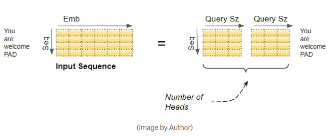

例如，嵌入向量的某一部分可以捕获一个名词的词性，而另一个部分可以捕获一个名词的单复数。这在翻译中很重要，许多语言中，动词的使用与这些因素有关。

以上虽然不是一个现实的例子，但它可能有助于建立直觉。


### 六、解码器中的“掩码操作” (Decoder Masking)

#### 1. Decoder Self-Attention and Masking

解码器自注意力的工作方式与编码器自注意力类似，不同之处在于它对目标序列的每个单词进行操作。


类似地, Masking 会屏蔽掉目标序列中的 Padding 字段。


#### 2. Decoder Encoder-Decoder Attention and Masking

“编码器-解码器注意力”从两个来源获得输入。因此，与计算输入中每个词与其他词之间相互作用的 Encoder Self-Attention 不同；也与计算每个目标词与其他目标词之间相互作用的 Decoder-Self-Attention 不同，**“编码器-解码器注意力”计算的是每个 input word 与每个 target word 之间的相互作用。**


因此，所产生的注意分数中的每一个单元都对应于一个 Q (即 target sequence word) 与所有其他 K (即 input sequence) 词和所有 V (即 input sequence) 词之间的相互作用。

同样, decoder 中的 mask 会掩盖目标输出中的后续单词，如 Part2 中详细解释的那样。


### 七、Conclusion

我们现在明白了 Transformer 到底是做什么的。但是我们还没有完全回答为什么 Transformer 的 Attention 要进行这样的计算。为什么它要使用查询、键和值的概念，为什么它要执行我们刚才看到的矩阵乘法？

我们有一个模糊的直观想法，即它 “抓住了每个词与其他词之间的关系“，但这到底是什么意思？这到底是如何让转化器的注意力有能力理解序列中每个词的细微差别的？

这是一个有趣的问题，也是本系列的最后一篇文章的主题。一旦我们了解了这一点，我们就会真正理解 Transformer 架构的优雅之处。


## Part 4: Not Just How, but Why They Work So Well

### 一、输入序列怎样传入注意力模块？ (How does the input sequence reach the Attention module)

注意力模块存在于编码器堆栈中的每个编码器中，以及解码器堆栈中的每个解码器中。我们将首先放大编码器的注意力。


举个例子，假设我们正在研究英语到西班牙语的翻译问题，其中一个示例源序列是“The ball is blue”。目标序列是“La bola es azul”。

源序列首先通过嵌入和位置编码层，该层为序列中的每个单词生成嵌入向量。嵌入被传递到编码器，首先到达注意力模块。

在注意力机制中，嵌入序列通过三个线性层，产生三个独立的矩阵——称为查询、键和值。这是用于计算注意力分数的三个矩阵。


### 二、送入注意力模块的矩阵的每一行，都是原序列中的一个词 (Each input row is a word from the sequence)

我们理解注意力机制的方式是从源序列中的单个单词开始，然后跟随它们通过 Transformer 的路径。特别是，我们希望关注注意力模块内部发生的事情。

这将帮助我们清楚地了解源序列和目标序列中的每个单词如何与源序列和目标序列中的其他单词相互作用。

因此，当我们进行解释时，请重点关注对每个单词执行的操作以及每个向量如何映射到原始输入单词。我们不需要担心许多其他细节，例如矩阵形状、算术计算的细节、多个注意力头等等，如果它们与每个单词的去向不直接相关的话。

因此，为了简化解释和可视化，我们忽略嵌入维度并仅跟踪每个单词的行。


### 三、每一行，都会经过一系列可学习的变换操作(Each word goes through a series of learnable transformations)

每个这样的行都是通过一系列转换（嵌入、位置编码和线性层）从其相应的源字生成的。

所有这些转换都是可训练的操作。这意味着这些操作中使用的权重不是预先确定的，而是由模型学习的，从而产生所需的输出预测。


关键问题是, Transformer 如何计算出哪一组权重能够带来最佳结果？请记住这一点，因为我们稍后会再讨论它。


### 四、注意力得分 (Attention Score — Dot Product between Query-Key and Value words)

#### 1.the first step — 'factor' matrix

注意力执行几个步骤，但在这里，我们将只关注线性层和注意力分数。


从公式中我们可以看出, Attention 的第一步是在 Query (Q) 矩阵和 Key (K) 矩阵的转置之间进行矩阵乘法（即点积）。观察每个单词发生了什么。

我们生成一个中间矩阵（我们称之为“因子”矩阵, factor matrix），其中每个单元格都是两个单词之间的矩阵乘法。


例如，第四行中的每一列对应于第四个 Query word 与每 Key word 之间的点积。


#### 2. produce the attention score

下一步是在这个中间 “因子矩阵“和 V 矩阵之间进行矩阵相乘，以产生由注意力模块输出的注意力分数 (attention score). 下图中，我们可以看到第四行对应的是第四个 Q 矩阵与所有其他 K 和 V 相乘：

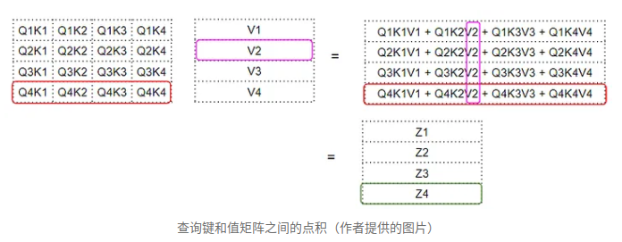

这会产生由注意力模块输出的注意力分数向量 (Z)。

考虑输出分数的方法是，对于每个单词，它是 Value 矩阵中每个单词的编码值，并由“因子”矩阵加权。因子矩阵是该特定单词的 Query value 与所有单词的 Key Value 的点积。


个人理解：若两个向量相似，如对于图示中的 Q4K2，则二者的因子值就大。再乘以V2时，得分就高。相当于把相似相进行了二次验证和放大。


### 五、查询、键、值的作用 (What is the role of the Query, Key, and Value words?)

查询词 (Query word) 可以解释为词我们正在计算注意力。键 (Key word) 和值词 (Value word) 就是我们正在关注的词，即该词与查询词的相关程度如何


例如，对于句子“The ball is blue”，单词“blue”的行将包含“blue”与其他每个单词的注意力分数。这里，“blue”是查询词，其他词是“Key/Value”。

还有其他操作正在执行，例如除法和 softmax, 但我们可以在本文中忽略它们。它们只是更改矩阵中的数值，但不会影响矩阵中每个单词行的位置。它们也不涉及任何词间交互。


### 六、点积：衡量向量之间的相似度 (Dot Product tells us the similarity between words)

因此，我们已经看到，注意力分数通过进行点积，然后将它们相加，捕获特定单词与句子中每个其他单词之间的交互。但是矩阵乘法如何帮助 Transformer 确定两个单词之间的相关性呢？

要理解这一点，请记住查询、键和值行实际上是具有嵌入维度的向量。让我们仔细看看这些向量之间的矩阵乘法是如何计算的。

当我们在两个向量之间进行点积时，我们将数字对相乘，然后将它们相加。

- 如果两个配对数字（例如上面的“a”和“d”）均为正数或均为负数，则乘积将为正数。该乘积将增加最终的总和。
- 如果一个数为正数，另一个数为负数，则乘积将为负数。该乘积将减少最终的总和。
- 如果乘积为正，则两个数字越大，对最终求和的贡献就越大。

这意味着如果两个向量中对应数字的符号对齐，则最终的和会更大。


### 七、Transformer 如何学习单词之间的相关性 (How does the Transformer learn the relevance between words?)

点积的概念也适用于注意力分数。如果两个单词的向量更加对齐，则注意力分数会更高。

那么我们想要 Transformer 的行为是什么？

我们希望句子中彼此相关的两个单词的注意力分数较高。我们希望两个彼此不相关的单词的分数较低。

例如，对于句子“黑猫喝牛奶”，“牛奶”一词与“喝”非常相关，可能与“猫”相关性稍差，与“黑”无关。我们希望“牛奶”和“饮料”产生较高的注意力分数，“牛奶”和“猫”产生稍低的分数，而“牛奶”和“黑色”产生可忽略不计的分数。

- For example, for the sentence, “The black cat drank the milk”, the word “milk” is very relevant to “drank”, perhaps slightly less relevant to “cat”, and irrelevant to “black”. We want “milk” and “drank” to produce a high attention score, for “milk” and “cat” to produce a slightly lower score, and for “milk” and “black”, to produce a negligible score.

  这是我们希望模型学习产生的输出。

为此，“牛奶”和“饮料”的词向量必须对齐。“牛奶”和“猫”的向量会有所不同。对于“牛奶”和“黑色”来说，它们会有很大不同。

**让我们回到我们一直牢记的一点——Transformer 如何计算出哪一组权重将给它带来最好的结果？**

**词向量是根据词嵌入和线性层的权重生成的。因此, Transformer 可以学习这些嵌入、线性权重等，以生成上述所需的词向量。**

换句话说，它将以这样的方式学习这些嵌入和权重：如果句子中的两个单词彼此相关，那么它们的单词向量将对齐。从而产生更高的注意力分数。对于彼此不相关的单词，单词向量将不会对齐，并且会产生较低的注意力分数。

因此，“牛奶”和“饮料”的嵌入将非常一致，并产生很高的注意力分数。对于“牛奶”和“猫”，它们会有所不同，产生稍低的分数；而对于“牛奶”和“黑色”，它们会有很大不同，产生较低的分数。

这就是注意力模块背后的原理。


### 八、Transformer 中的编码器自注意力

Transformer 中使用了 Attention 在三个地方：

- Self-attention in the Encoder — the source sequence pays attention to itself (源序列关注自身)
- Self-attention in the Decoder — the target sequence pays attention to itself (目标序列关注自身)
- Encoder-Decoder-attention in the Decoder — the target sequence pays attention to the source sequence (目标序列关注源序列)


在编码器自注意力中，我们计算源句子中每个单词与源句子中每个其他单词的相关性。这种情况发生在堆栈中的所有编码器中。


### 九、Transformer 中的解码器自注意力

我们刚刚在编码器自注意力中看到的大部分内容也适用于解码器中的注意力，但有一些微小但显着的差异。


在解码器自注意力中，我们计算目标句子中每个单词与目标句子中每个其他单词的相关性。


### 十、Transformer 中的编码器-解码器注意力

在 Encoder-Decoder Attention中, Query 是从目标句子中获取的, Key/Value 是从源句子中获取的。因此，它计算目标句子中每个单词与源句子中每个单词的相关性。

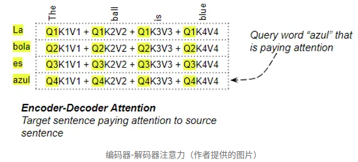

