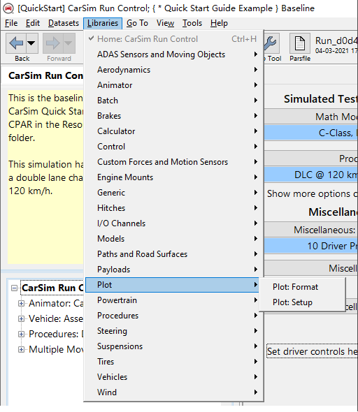
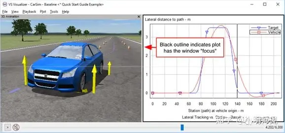

#  CarSim2019学习笔记

## 下载和安装

- 下载地址

安装包[地址](https://pan.baidu.com/s/1KKGMiEPKgn7dEdXYVXOEVw#list/path=%2F) 

提取码：cn81

- 安装教程

[文本教程](https://blog.csdn.net/Home_Wood/article/details/102890407)

[视频教程](https://www.bilibili.com/video/BV1P54y1274L/?spm_id_from=333.1007.top_right_bar_window_history.content.click&vd_source=3da170c3416f78cfe40e1a7ba3a4f5f9)

## 软件使用基础教程

参考资料：[CarSim仿真快速入门(一) - 知乎 (zhihu.com)](https://zhuanlan.zhihu.com/p/510425634?utm_id=0)

## 一些界面概念

如上图所示，软件左上角显示的几个名称的含义分别如下：

- **[QuickStart]** 是文件夹名，**存放所有数据库database的地方**，即打开模型时指定的数据库文件夹，如下：

  

- CarSim Run Control 是 library ，所谓library是一系列的dataset的集合，他们共享同一个当前的界面。CarSim Run Control就是当前界面的的library。常见的Libraries如下图，点击任一个，就跳转到相关的library界面下

  

- **{Quick Start Guide Example}** 是category，用于将相关的dataset组织到一个library中，一个category下可能存在多个不同的dataset，他们都属于这一种library

- **Baseline** 是dataset，比如：

  

## 数据库创建

Carsim启动时会弹出一个对话框来选择数据库，其默认为如下

- **现在我们创建一个包含单个车辆和测试条件的新的数据库**

1. 我们选择点击右下角的按钮，此时弹出窗口，描述从统一的parsfile创建新数据库要采取的下一步步骤，单击 Continue

2. 此时出现浏览框，可以找到统一的parsfile**（扩展名CPAR）**，我们以快速入门的指南文件`CarSim_2018.1_Quick_Start.cpar`为例

   路径为：`Resources/Import_Examples/CarSim_2018.1_Quick_Start.cpar`

3. 此时再出现一个浏览框，提示为新的数据库创建一个新的空文件夹

**注意：在此步骤后，我创建新的数据库失败，原因是本人的计算机系统==用户名在创建时为中文==，具体的解决方法可参考该链接[CarSim遇到报错：cannot unpack cpar file](https://blog.csdn.net/qq_41574137/article/details/131970449)**

## 运行控制界面

### 小技巧

- 在View中点击第一行的`Window Size ..`可以自动改变界面至合适大小

  

- 右键单击并按住按钮字段和各种控制对象，可以获取工具帮助提示

  

### 运行控制窗口布局

CarSim Run Control界面是访问CarSim中主要工具和数据集的起点

- 界面上的蓝色框是指向更多数据的链接，类似于网页上显示的链接（有时称为超链接）

- 标题为`Simulated Test Specifications`的左列具有蓝色链接，该链接指向要在模拟中使用的车辆数据，至少一个蓝色链接指向定义测试程序的数据集。

- 标题为`Run Control`的中间一栏包含用于运行CarSim数学模型的控件
- 标题为`Analyze Results`的右侧一栏提供对视频和绘图选项的访问，以可视化模拟结果

**注意：可通过键入F1来访问内置的帮助文档**

## 观看已仿真的动画

### Video

通过`Video`按钮可以使用虚拟摄像机来查看仿真的车辆运动，以下为VS Visualizer（CarSim中的动画和绘图工具）将基于虚拟摄像机显示运行的动画

#### 鼠标控件

在动画显示区域中单击并按住鼠标按钮，然后使用简单的鼠标拖动动作来移动仿真摄像机：

- 按住**鼠标右键**扫动（左，右，上，下）以在车辆周围盘旋，即**转换视角**
- 使用**鼠标中键**，以使相机靠近或远离车辆，即**放大或缩小**

- 按下**鼠标右键的同时按下Shift键**，将显示当前轴的视图，并且在查看区域的中心带有一个框，可以拖动观察坐标轴的原点和方向视图

**注意：可以在VS界面下键入F1来查看鼠标操作的提醒**

#### 时间控件

- 注意界面底部的滑块②。动画运行时，滑块从左向右移动。还显示了当前时间（例如4.097 s）③

- 在播放视频时，左右移动时间倍增器滑块⑥以调整时间刻度（显示在字段中⑧）。范围从快进（最右边）到快退（最左边）再到慢动作（刻度的中间）。如果鼠标具有中间的滚轮，则此按钮也将起作用

- 左右移动滚轮/穿梭滑⑦块以临时调整速度。当释放控件时，动画将返回到当前时间比例设置②

- 在`View`下的`Render Mode`中可以更改渲染模式；也可以单击鼠标左键以将其激活，然后反复按Ctrl + W以在几种查看模式之间循环

### Video+Plot

三个面板：虚拟摄像机的视图；显示曲线的窗口；时间控制，包含用户可以控制动画的滑块按钮

- 可以用鼠标左键左右拖动 “动画”和“绘图网格”之间的垂直分隔线来调整动画和绘图网格的大小

- 每个图中的垂直光标线也会移动，显示每个图中③与仿真时间匹配的；在时间控制面板的右侧④，仿真时间如前所示

- 双击任何一个图将其展开；如图所示，该图应具有明显的黑色轮廓

  

- **左键可以放大图像，双击右键可以还原为原图像；推荐按==Z==键，既可实现最大缩放，又可返回网格**

- **按==V==键在图例区域中的光标所指示的时间中显示图例的值，可显示横、纵坐标值**
- **按==R==键将绘图比例恢复为原始试图**

