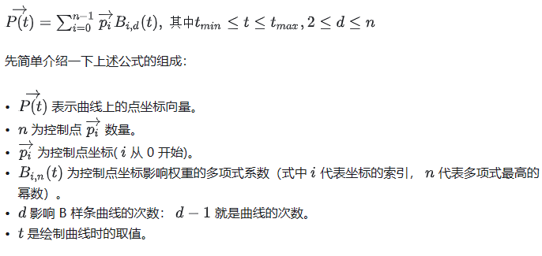
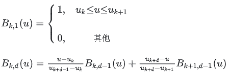

# B样条曲线法

- 参考资料：

  [【路径规划】局部路径规划算法——B样条曲线法（含python实现 | c++实现）-CSDN博客](https://blog.csdn.net/weixin_42301220/article/details/125173884)

  [深入理解B样条曲线（上） - 知乎 (zhihu.com)](https://zhuanlan.zhihu.com/p/144042470)

样条是通过一组指定点集而生成平滑曲线的柔性带

B 样条曲线就是通过控制点局部控制形状的曲线

B样条曲线是B-样条基函数（给定区间上的所有样条函数组成一个线性空间）的线性组合

## 1.1 Bezier曲线的缺点

- 确定了多边形的顶点数（n+1个），也就决定了所定义的Bezier曲线的阶次（n次），这样很不灵活
- 当顶点数（ n+1 ） 较大时， 曲线的次数较高，曲线的导数次数也会较高，因此曲线会出现较多的峰谷值
- 贝塞尔曲线无法进行局部修改

B样条曲线除了保持Bezier曲线所具有的优点外，还弥补了上述所有的缺陷： **可以指定阶次； 移动控制点仅仅改变曲线的部分形状，而不是整体**

**B样条曲线是贝塞尔曲线的一般化，贝塞尔曲线可以认为是B样条曲线的特例**

## 2. 公式原理

### 2.1 B样条曲线方程

设有 $P_0$ … $P_n$ 一共 n+1 个控制点，这些控制点用于定义样条曲线的走向、界限范围，则具有 n+1 个控制点的k阶B样条曲线的定义为

对比Bezier曲线公式：

- 相同点
  1. 都是求和公式
  2. 都有一个 $B_{i,x}(t)$ 的多项式系数（式中贝塞尔曲线 x=n，B 样条曲线 x=d）

- 不同点
  1. 贝塞尔曲线的多项式幂数与控制点数量一致，而 B 样条曲线的多项式幂数更自由
  2. 贝塞尔曲线 t 的取值为固定的 [0,1]，而 B 样条曲线是在最大和最小节点值之间

### 2.2 计算多项式

公式中其他值其实都比较清晰，问题的关键是需要搞清楚那个多项式$B_{i,n}(t)$是什么！

计算这个多项式，我们使用到了**Cox-deBoor递归公式**，公式内容如下：（需要注意一点，如果遇到分母为 0的情况时，需要特殊处理为整体值为 0）

如果遇到分母为 0的情况：如果此时分子也为0，约定这一项整体为0；如果此时分子不为0，则约定分母为1 

从这个公式可以看出，递归公式的差异主要体现在 $u_{k}$ 和 $u_{k+1}$ 的取值上。需要注意的是**节点的数量**是由参数 d 和 n 决定的，数量等于 n+d 。根据这些节点$u$​的取值，可以划分为一下三种类型

- 均匀周期性(uniform)
- 开放均匀性(open uniform)
- 非均匀性(non-uniform)