# EMPlanner

## 总述

论文原文：[Baidu Apollo EM Motion Planner](../../../书籍论文/EMPlanner.pdf)

参考资料：[Apollo EM Planner阅读笔记-CSDN博客](https://blog.csdn.net/qq_35503971/article/details/106337900?ops_request_misc=%7B%22request%5Fid%22%3A%22170831186416800222854855%22%2C%22scm%22%3A%2220140713.130102334..%22%7D&request_id=170831186416800222854855&biz_id=0&utm_medium=distribute.pc_search_result.none-task-blog-2~all~top_positive~default-1-106337900-null-null.142^v99^pc_search_result_base6&utm_term=EMplanner&spm=1018.2226.3001.4187)

该算法首先通过顶层多车道策略，选择出一条参考路径，再根据这条参考线，**在Frenet坐标系下，进行车道级的路径和速度规划，规划主要通过Dynamic Programming和基于样条的Quadratic Programming实现**

## Frenet坐标系

- 在Frenet坐标系中，$s$代表沿道路的距离，作为纵坐标；$L$表示与纵向线的横向垂直位移，作为横坐标

- Frenet坐标系的本质：就是在参考路径的每一个参考点都建立一个独立的笛卡尔坐标系

从车辆位置$(x,y)$向参考线$T$作投影，投影点为$F$，则点$F$与车辆位置$(x,y)$的距离即为横向位移$d$（方向为参考线当前的法向，称为横向，Lateral Axis）；从参考线的起始点到投影点$F$的曲线距离即为纵向位移$s$（方向沿着参考线，成为纵向，Longitudinal Axis）

- 通过Frenet坐标系可以将障碍物与轨迹投射到S纵轴和L横轴上，目标是将三维轨迹（纵向维度、横向维度和时间维度）分解成两个单独的二维问题，即通过分离轨迹的纵向和横向分量来解决
  - 一个二维轨迹是指具有时间戳的纵向轨迹（ST轨迹）
  - 另一个二维轨迹为相对于纵向轨迹的横向偏移（SL轨迹）

### ST图（纵向速度规划）

ST图可以帮助我们设计和选择速度曲线，$s$表示车辆的纵向位移，$t$表示时间。$ST$图上的曲线是对车辆运动的描述，因为它说明了车辆在不同时间的位置。

由于速度是位置变化的速率，因此可以通过曲线的斜率从$ST$上推断速度

在$ST$​​图中可以将障碍物绘制成在特定时间段内阻挡道路部分的矩形，速度曲线不得与矩形相交

#### 示例

下图为多个障碍物的情形，映射后的ST空间中有很多障碍物，需要进行避障规划，这就体现了速度规划与二维空间中的路径规划问题的相似性。映射后的图被称为ST图。

速度曲线从左边第一个障碍区域下方和右方通过，代表了车辆在障碍车辆占用道路时等待，在占用结束后征程通过；如果是上方和左方通过，代表了在障碍车辆占用车道前抢先通过该路段。

### SL图（横向位移规划）

$SL$坐标系又称为Frenet坐标系，$S$代表中心线方向，$L$代表与中心线正交的方向，在$SL$坐标系中，我们用$S$、$L$、侧向速度$dL$、侧向加速度$ddL$、侧向加加速度$dddL$，这5个量描述车辆的状态。

### 坐标系转换

对于规划，需要从笛卡尔坐标系转换到Frenet坐标系

对于控制、建图、定位等模块，需要从Frenet坐标系转换到笛卡尔坐标系

**这里的数学推导，可以参照我的另一篇笔记：**[Frenet坐标系.md](Frenet坐标系.md)

Apollo框架下的EM planner和Lattice planner算法都有用到frenet坐标系

### 参考线Smooth理论

#### 基于 Frenet 坐标系的决策规划总体概览

**已经有了全局导航路径，在行进中的决策规划流程**

1. 基于定位+导航，生成参考线；

> 参考线不必是整个全局路径，一般是基于车辆当前位置，**在全局路径上找其投影点前150m，后30m 部分轨迹点做平滑，平滑后的点的集合称为参考线**

2. 静态障碍物投影到以参考线为坐标轴的 Frenet 坐标系上
3. 决策算法对障碍物做决策（朝左 or 超右）

> 开辟凸空间，为下一步优化做准备

4. 规划算法在凸空间中搜索出最优路径
5. 后处理：例如在选择的轨迹中选择一个点，将其坐标转换为 Cardesian 坐标，输出给控制模块去跟踪

**Note:** 为什么不将整个全局路径作为参考线，而是要截取一部分？

- 过长的路径不利于坐标转换（查找匹配点，计算S）
- 过长路径，障碍物投影点可能不唯一
- 路径太长会不平滑

#### 参考线平滑指标

##### 1.平滑

##### 2.形状保持

##### 3.紧凑

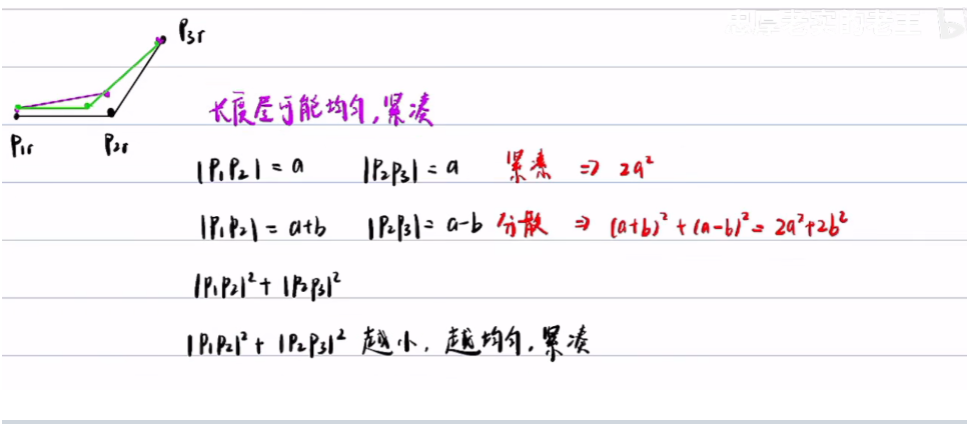

## 论文正文

### Apollo的所有模块

阿波罗其实就是在autoware的基础上发展而来，也包含定位、感知、规划、控制几个模块。

**相比于autoware，最不一样的就是多了一个`Routing`的模块，这个模块用来生成一条参考路径，即阿波罗使用的Frenet坐标系所需要的参考线。**

### 1.EMPlanner框架

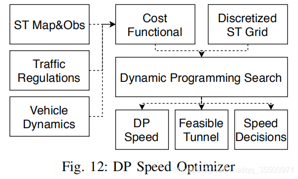

- 首先，所有信息会在`data center`层汇集和同步，并传给`EM Planner`规划器

- 然后，`Reference Line Generator`会依靠之前汇总的信息（交通规则、障碍物等）生成一些候选路径，这一步是基于阿波罗`Routing`模块的高清地图和导航信息完成的
- 在`motion planning`环节，基于一条参考线（reference line是Apollo中必须有的），建立Frenet坐标系

- Frenet坐标系的信息会传递给`lane-level optimizer`，这个优化器会执行路径和速度优化**（核心步骤）**

  - **在路径优化中，环境信息会投影到Frenet坐标系或者成为SL图（E-step）。基于Frenet坐标系中的投影信息，一条优化后的smooth路径会被生成（M-step）**
  - **在速度优化中，根据路径优化步骤中生成的smooth路径，障碍物会被投影到ST图（E-step）。然后速度优化器会进一步生成一系列速度信息（M-step）**  

  将路径优化和速度优化后的结果合起来，就得到我们需要的优化路径，但是这个时候有很多条（因为之前传入的候选路径都会被E-step和M-step规划）

- 将所有的优化后的路径传入`reference line trajectory decider`，根据车辆状态、交通规则和每条车道的cost，最终会选择出一条合适的路径

### 2.EM的核心—E-step和M-step

就是`lane-level optimizer`优化器做的事：在一次规划循环中，迭代过程包括两个E-step和两个M-step：

**图中左半部分是path optimizer，右半部分是speed optimizer**

- 在第一个E-step中，障碍物被投影到Frenet坐标系 ，障碍物包括了静态障碍物和动态障碍物
  - 静态障碍物会直接从笛卡尔坐标系转换到Frenet坐标系
  
  - 对于动态障碍物，我们可以用上一次的规划轨迹去估计动态障碍物和car在每个时间点的位置，两者的重叠部分（表示未来会相撞的时刻和地点）会被投影到Frenet坐标系

    考虑到安全性，SL投影只考虑低速行驶时迎面而来的动态障碍物
  
- 在第二个E-step中，所有的障碍物（包括高速、低速以及迎面而来的障碍物）都会在ST图中投影（基于路径优化部分生成的路径：Path Profile）。如果障碍物轨迹和规划路径重叠，那么就会在ST图中的相应部分出现阴影区域

- 在两个M-step中，路径和速度的优化都会通过动态规划和二次规划的组合来完成

因为虽然我们已经把障碍物投影在SL图和ST图，但是路径和速度的优化问题依旧是在非凸空间的。

所以，先利用动态规划去生成一个粗略的解，同时，这个解可以提供一些避障策略（跟随、超越）。论文中使用这个粗略的解去产生一个convex hull（凸包），用于二次优化中。

最后，二次优化会在convex hull中找到最优的解

#### SL and ST Mapping(E-step)

##### SL图（路径规划）

SL投影基于有连续曲率导数的（G2）长度平滑参考线

- 在笛卡尔坐标系中，障碍物或者car的位置方向用$(x,y,\theta)$表示，路径的曲率和曲率导数用$(k,dk)$表示；
- 将笛卡尔坐标系中的内容投影到Frenet坐标系后，用五元组$(s,l,dl,ddl,dddl)$，分别表示纵向、横向、横向导数（一二三阶）

静态障碍物的位置由于是时不变的，所以投影很简单；

**动态障碍物**，我们利用上一周期的规划轨迹投影到Frenet坐标系，来获取在$s$方向的速度信息，进而得到car在特定时间点的$s$坐标（论文中写作station coordinates）。估计得到的车子$s$坐标可以用来估计和障碍物的相交处。如果估计的车子$s$坐标和障碍物位置会在同一时间相交，那么就会在$SL$图中生成一块阴影区域，表示车子和障碍物的bounding box重叠了。如下图所示：

- 图中，由预测模块估计的迎面而来的动态障碍物及其对应轨迹用红色标记。小车是用蓝色标记。首先将动态障碍物的运动轨迹离散成几个随时间变化的轨迹点，然后将这些轨迹点投影到frenet坐标系中。一旦我们发现小车的$s$坐标（利用上一周期轨迹预测的）与投影的障碍点有相交，那么重叠区域(图中紫色部分)将被标记在Frenet框架中

##### ST图（速度规划）

ST投影用于帮助我们估计车辆的**速度信息**

当path optimizer在frenet坐标系（SL图）中生成了一条优化路径后，动态和静态的障碍物也相应的在frenet坐标系中投影了，之前说过障碍物和预计的小车未来位置有重叠时，会有阴影显示。同理在$ST$图中也是如此：

- 图中，一个前方出现的障碍物在$t=2s,s=40m$处出现，用红色块表示。车后的障碍物用绿色块表示。**剩下的白色区域都是小车的可行区域（速度意义下的）**

  speed optimization M-step 会在无障碍物的白色区域找到一条合适的光滑路径

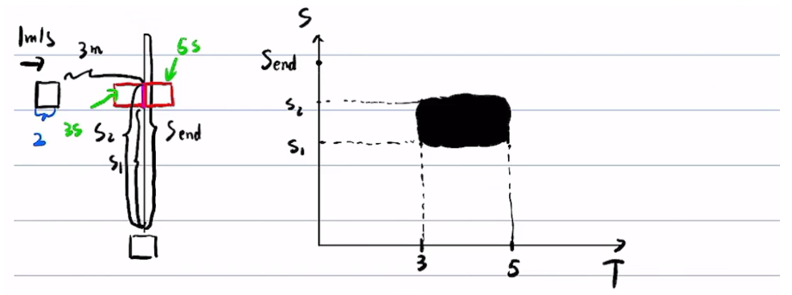

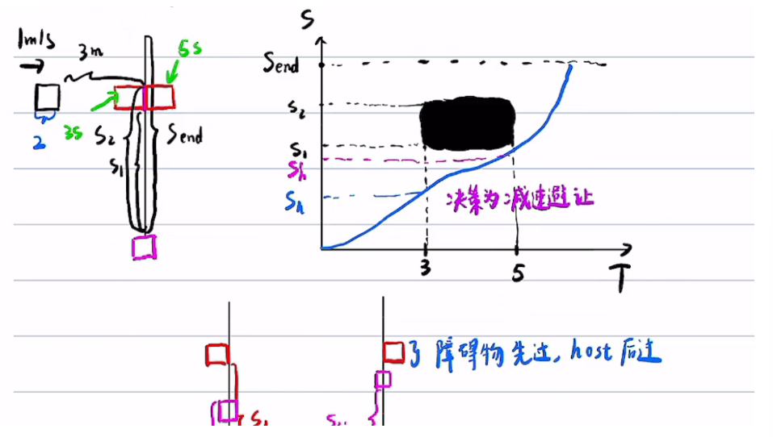

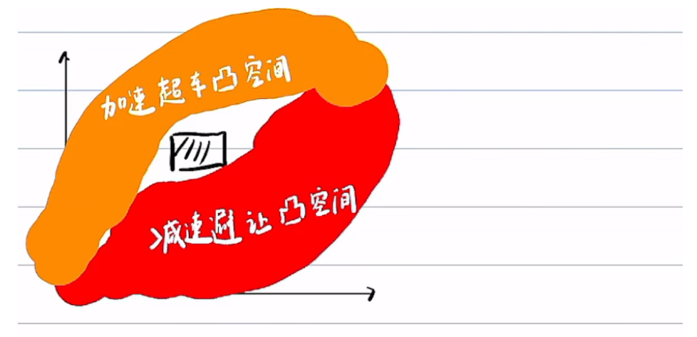

##### SL规划与ST规划总结

SL规划与ST规划相互影响，其实际是 X-Y-T 三维空间问题的降维处理，空间规划与速度规划相互耦合，直接求解难以进行，所以要解耦进行求解

**过程分析：**

1. 上一帧给出本帧的轨迹为直线，本帧按照该轨迹行驶，并感知到障碍物，得到其速度为10m/s，方向也已知

   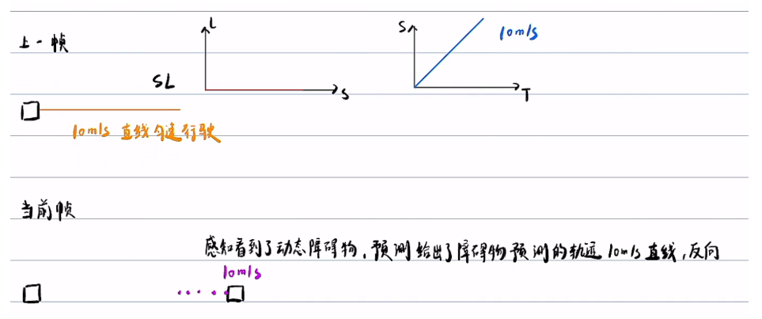

2. 本帧要进行下一帧的规划，需要预测根据障碍物速度预测其下一帧时会位于什么位置（100ms）后，然后进行路径规划，得到下一帧轨迹

   

3. 得到轨迹后进行ST图建立，依赖于障碍物的预测信息，即其100ms以后的行驶路线是否会与规划出的路径有交叉，从而建立带有障碍物的ST图，然后进行速度规划。得到最终轨迹后完成本帧的规划

   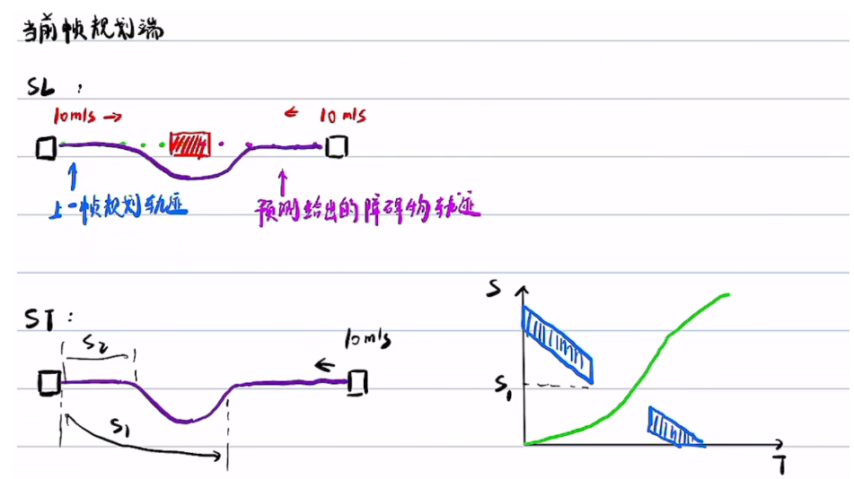

4. 然后到达下一帧，按照上一帧给出的轨迹进行行驶，同时开始下下一帧的规划。此时的障碍物速度变化，按照路径规划后得到SL，SL会发生变化，然后建立ST图，对应的ST图也会发生变化，最后完成整体规划

   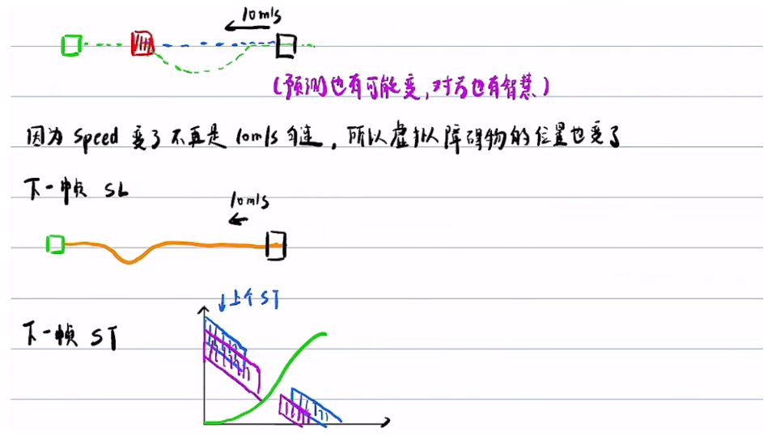

#### M-step DP（动态规划）Path

M-step path optimizer在Frenet坐标系中优化路径。其实就是设计一个关于横坐标$s$的目标函数$l=f(s)$（SL图中，以 $s$ 为自变量，偏离中心参考线的距离为因变量的函数），即在非凸空间$SL$的station coordinate。（需要注意的是，从障碍物左右侧绕开的决策是局部最优的）

DP Path包括两部分：基于动态规划的路径决策 和 基于样条的路径规划

基于Dynamic Programming的路径步骤提供一条粗略的路径信息，其可以带来可行通道和绕障决策，如下图所示，这一步包括Lattice采样、代价函数、动态规划搜索

##### DP Path的整体过程

如下图所示，lattice sampler是基于Frenet坐标系的

首先在小车的前方对多条轨迹进行采样（即每条轨迹都沿着$s$​方向离散化成一系列points），得到rows of points。每行的points都是由五次多项式平滑连接，每行points的间隔由速度、道路结构、变道决策等决定

**这样的采样方式可以根据应用的特定场景去单独制定**

- 例如，变道情况下需要点之间的采样间隔 大于 正常的行驶采样点间隔

**lattice在$s$​坐标轴方向会至少覆盖8s或者200m的距离，为了安全考虑**

在lattice采样后，利用cost function去评估每条采样路径

cost function基于SL投影的信息、交通规则和车的动力学。**总的代价函数是`smoothness`, `obstacle avoidance` 和`lane cost functionals`三部分的线性组合：**
$$
 C_{\text {total }}(f(s))=C_{\text {smooth }}(f)+C_{\text {obs }}(f)+C_{\text {guidance }}(f) 
$$

- smoothness部分可以具体表示为：
  $$
  C_{\text {obs }}(d)=\left\{\begin{array}{ll}
  0 & d>d_{n} \\
  C_{\text {nudge }}\left(d-d_{c}\right) & d_{c} \leq d \leq d_{n} \\
  C_{\text {collision }} & d<d_{c}
  \end{array}\right.
  $$
  其中，$f^{\prime}(s)$表示车道和车朝向间的偏差；$f^{\prime \prime}(s)$和路径的曲率有关；$f^{\prime \prime \prime}(s)$表示曲率的导数。利用多项式的形式，可以对上述cost function进行解析计算

- obstacle cost是在一系列固定的$s$坐标上计算的：$ \left(s_0, s_1, \ldots, s_n \right)$表示障碍物在frenet的位置。

  obstacle cost是基于（障碍物和小车）两者bounding box间的距离$d$，表示如下： 
  $$
  C_{o b s}(d)= \begin{cases}0, & d>d_n \ C_{n u d g e}\left(d-d_c\right), & d_c \leq d \leq d_n \ C_{\text {collision }} & d<d_c\end{cases}
  $$
  $C_{nugde}$是一个单调递减函数；$d_c$代表为了安全考虑的缓冲距离；$d_n$（nudge range）以我个人的理解，表示超车的瞬间，和障碍物并排时距离障碍物的横向距离；$C_{collision}$​是碰撞阈值

  

- lane cost包含两个部分：`guidance line cost`和`on-road cost`

  `guidance line cost`表示一条周围没有障碍物的理想行驶路径，这条路径是从path的中心线提取得到的。`guidance line function`记为$g(s)$，计算公式如下：
  $$
  C_{g u i d a n c e}(f)=\int(f(s)-g(s))^2 d s
  $$
  `on-road cost`由道路边沿决定，当路径点超过道路范围会受到严厉的惩罚

最后的cost由上面三部分组成， 在动态规划中利用这个cost去选择一条候选路径，这条候选路径同时也会提供避障的决策。**例如，在上面的Fig.7中，障碍物被标记为`right nudge`，表示小车会从这个障碍物的右侧超过**

- **以下为博客中对DP Path的概括：**

  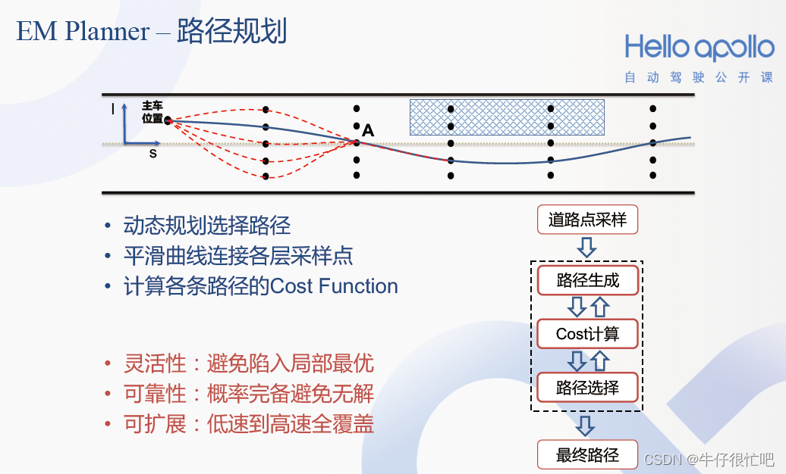

  

DP路径算法的基本思路是：基于给定的一条中心路径（称为参考线，Reference Line）和车道边界条件，每隔一定间隔的纵向距离（称为不同级（level）上的S值）对道路截面进行均匀采样（与中心点的横向偏移值称为为L值），这样会得到图中黑点所示的采样点（这些采样点称为航点，waypoint）数组

基于一定的规则，可以给出各航点迁移的代价值（cost）。航点迁移不一定需要逐级进行，可以从第一级跳到第三级甚至终点，只要迁移代价值最小化即可，这显然满足动态规划的求解思路

#### M-step Spline QP(样条二次规划) Path

这一步 DP Path后的进一步优化。在动态规划中生成了可行的路径(feasible tunnel)，然后，Spline QP Path会在这个feasible tunnel中生成一条优化路径：

- **借用网上博客对QP的直观解释**

  DP采样得到了很多points（rows of points）组成guidance line，**QP可以此为基础调整每个point在L方向的位置以实现平滑path。但调整是有可行范围的，该范围可量化为QP的约束$\left(l_{\text {low }, i},l_{h i g h, i}\right)$。另外曲率$f^{\prime \prime}(s)$和曲率变化率$f^{\prime \prime \prime}(s)$​也可以用dynamic feasibility**去约束衡量，`dynamic feasibility`的过程如下图：

  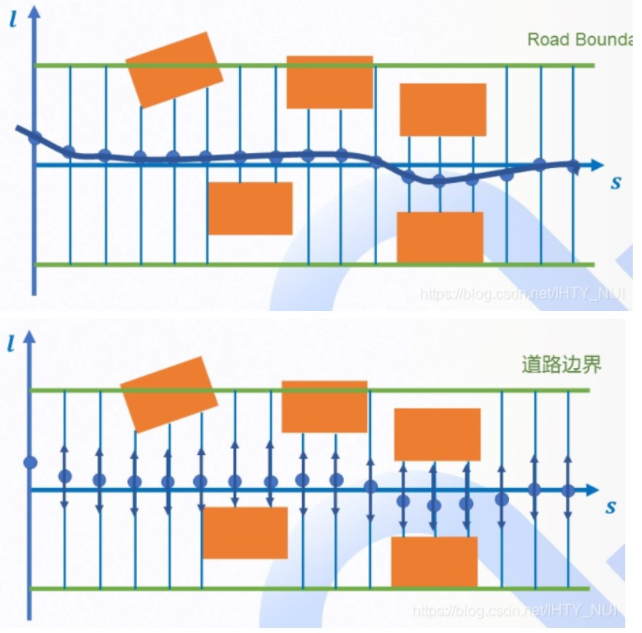

Spline QP Path这一步概括来说就是：**QP spline优化器求解具有线性约束的目标函数**。如下图所示QP Path的步骤：

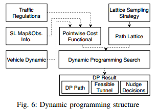

##### objective function

QP Path的目标函数是`smoothness costs`和`guidance line cost`的线性组合。这里的`guidance line`引导线是DP Path中产生的路径，这条路径可以估计将要避开障碍物的距离
$$
\begin{aligned} C_s(f) &=w_1 \int\left(f^{\prime}(s)\right)^2 d s+w_2 \int\left(f^{\prime \prime}(s)\right)^2 d s \ +w_3 \int\left(f^{\prime \prime \prime}(s)\right)^2+w_4 \int(f(s)-g(s))^2 d s \end{aligned}
$$

- 其中，$g(s)$是DP Path的结果。$f^{\prime}(s)$，$f^{\prime \prime}(s)$，$f^{\prime \prime \prime}(s)$分别代表朝向、曲率和曲率的导数。这个目标函数用于平衡路径平滑和避开障碍物

##### constraints

QP Path的约束包括边界约束和动力学上的可行性。这些约束作用于在一系列$s$坐标轴的点上的$f^{\prime}(s)$，$f^{\prime \prime}(s)$，$f^{\prime \prime \prime}(s)$

为了提取边界约束，在$s$坐标轴上的可通行区域需要被提取。每个$s$点的**可通行区域**（就是上面讲到的：每个point可以在横向截面进行调整的范围），可以描述为：$\left(l_{\text {low }, i}\leq Δl \leq l_{h i g h, i}\right)$（**$Δl$就是QP Path在横向平滑的范围**），通过限制 $l$ 来将车辆限制在车道内

在EM planner中，车子模型是基于自行车模型的，所以$l=f(s)$表示的范围是不足够的，还需要车的朝向角。

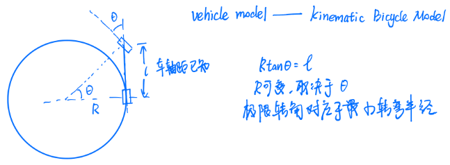

**为了保证边界约束的convex和linear性质，**论文中对car的模型进行了一些改进：在car的前后端都添加一个半圆。前后轮中心的距离是$l_f$，车辆宽度是$w$，那么左前角的横向位置（垂直于$s$）可以表示为下式，图里表示为：

$$
 l_{\text {left front corner }}=f(s)+\sin (\theta) l_f+w / 2 
$$

- 其中，$f(s)$表示car在SL图中偏移中心参考线的距离；$\theta$是车和道路$s$方向的偏离角。这个约束可以用下面的不等式进行进一步的线性化：
  $$
  \begin{aligned} f(s)+\sin (\theta) l_f+w / 2 & \leq f(s)+f^{\prime}(s) l_r+w / 2 \  \leq l_{\text {left corner bound }} \end{aligned}
  $$
   同理，线性化可以用于car的另外三个角

  这些线性约束的效果很好，因为$\theta$通常很小。对于$\theta<\pi/12$，这个估计保守讲在横向上少了2-3cm，相对于没有线性化的约束

除了边界约束，生成的路径还必须匹配车的初始位置（垂直于$s$的横向$L$）及其导数。

因为所有的约束都在spline parameters上是线性的，所以二次规划求解器可以被用来求解这个问题。

#### M-step DP Speed Optimizer（速度求解）

M-step的速度规划是在ST图中生成speed profile（翻译成速度剖面，我的理解是在ST图中的曲线，曲线上每个点的导数代表速度，所以用剖面来表示。大概意思我觉得是这个），记为$S(t)$，即$ST$图中的一条曲线

与求解最优路径相似，在ST图中求解最优速度规划也是非凸的最优化问题。同样也采用Dynamic Programming配合样条曲线Quadratic Programming来找到光滑速度规划。

DP Speed包括了cost function、ST 栅格地图和dynamic programming search，如下图所示：

DP Speed最后得到的结果有：分段线性的speed profile（$S(t)$曲线），可通行通道（feasible tunnel）和避障的速度决策，如下图所示。speed profile会在spline QP speed这一步中作为参考线，feasible tunnel会用于生成凸区域

- 上图中，蓝色分段直线是speed profile

具体来说，障碍物信息会被离散化到ST图的栅格（grids）中；$\left(t_0, t_1, \ldots, t_n\right)$作为时间轴上以$dt$为间隔的等间距的值点；分段线性的speed profile用在grids上的$S=\left(s_0, s_1, \ldots, s_n\right)$表示。此外，导数用有限差分法来近似： 
$$
\begin{array}{ccc} s_i^{\prime}=v_i \approx & \frac{s_i-s_{i-1}}{d t} \ s_i^{\prime \prime}=a_i \approx & \frac{s_i-2 s_{i-1}+s_{i-2}}{(d t)^2} \ s_i^{\prime \prime \prime}=j_i \approx & \frac{s_i-3 s_{i-1}-3 s_{i-2}+s_{i-3}}{(d t)^3} \end{array}
$$
目标是去在ST图中对带有约束的目标函数完成优化。

目标函数表示为：
$$
 \begin{aligned} C_{t o t a l}(S) &=w_1 \int_{t_0}^{t_n} g\left(S^{\prime}-V_{r e f}\right) d t \ +w_2 \int_{t_0}^{t_n}\left(S^{\prime \prime}\right)^2 d t+w_3 \int_{t_0}^{t_n}\left(S^{\prime \prime \prime}\right)^2 d t \ +w_4 C_{o b s}(S) \end{aligned} 
$$

- 其中第一项是速度保持代价（velocity keeping cost），这一项表示小车需要在没有障碍物的时候保持设计好的速度。$V_{r e f}$是参考速度，收到道路限速、路径曲率和其他交通规则影响。$g$函数被设计为对小于或大于$V_{ref}$的值具有不同的惩罚值。
- 第二三项：加速度和加速度的增速（acceleration and jerk）的平方积分用于描述speed profile的smoothness
- $C_{obs}$ 描述了所有的障碍物代价

约束Constraints需要考虑车子的动力学约束，动力学约束包括acceleration, jerk limits and a monotonicity(单调性) constraint。因为我们不希望车辆在行驶道路上会出现倒车情况。倒车只被允许在停车场和一些特殊区域。

**同样在网上博客中看到对DP Speed的概括：**

**DP速度算法的基本思路是，在DP路径算法生成一条可行驶的路径后，从起点开始，考虑避开路径中的所有障碍物，并且让加减速最为平顺，以最优的速度曲线（即t-s平面中的绿色曲线）安全抵达终点，这也可以使用动态规划的思路求解。**

#### M-step Spline QP Speed Optimizer

由于M-Step DP Speed生成的分段线性speed profile无法满足动力学的要求，那么就需要Spline QP去进一步优化，和Path的一样，这里的QP Speed也包含三个部分：cost functional（目标函数）、linearized constraints（线性优化）、spline QP solver（优化器）

- 代价函数由下面几部分组成：

$$
\begin{aligned} C_{\text {total }}(S) &=w_1 \int_{t_0}^{t_n}\left(S-S_{r e f}\right)^2 d t+w_2 \int_{t_0}^{t_n}\left(S^{\prime \prime}\right)^2 d t \ +w_3 \int_{t_0}^{t_n}\left(S^{\prime \prime \prime}\right)^2 d t \end{aligned}
$$

第一项度量的是QP Speed生成的轨迹$S$ 和 之前（DP Speed）生成的speed profile（$S_{ref}$）之间的距离；$S^{\prime \prime}, S^{\prime \prime \prime}$表示的加速度和jerk，用于描述最终速度曲线（speed profile）的平滑度。所以目标函数是为了平衡 “跟踪guidance line“ 和 ”平滑度“

- 线性约束包含一系列边界约束： 
  $$
  \begin{gathered} S\left(t_i\right) \leq S\left(t_{i+1}\right), i=0,1,2, \ldots, n-1, \ S_{l, t_i} \leq S\left(t_i\right) \leq S_{u, t_i}, \ S^{\prime}\left(t_i\right) \leq V_{u p p e r}, \ -D e c_{\max } \leq S^{\prime \prime}\left(t_i\right) \leq A c c_{\max } \ -J_{\max } \leq S^{\prime \prime \prime}\left(t_i\right) \leq J_{\max } \end{gathered}
  $$
  第一项是在计划路径点上的单调性（应该是之前说的只能向前行驶）；第二、三、四项关于位移、速度、加速度的边界条件是满足交通规则和车辆的动力学约束。除了上述五项，还有一个约束：必须匹配上初始状态的速度和加速度

- 有了上面的目标函数和约束，QP求解器可以完成二次规划问题的求解，最终生成一条可行的speed profile，如下图所示：

  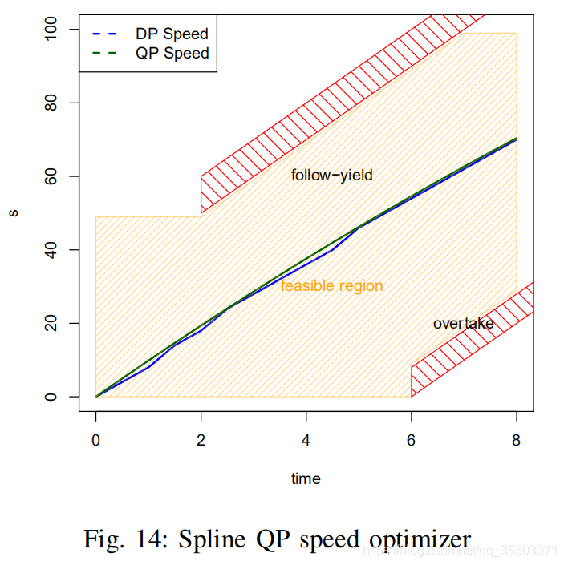

**最后，speed profile和path profile结合起来，就是EM planner最终的输出**

### 3.总结

#### 轻决策

尽管大多数最先进的规划算法都是基于”重决策“（on heavy decisions）的，但是EM planner是基于轻决策（light-decision-based）的规划器

- 基于”重决策“的算法，或者基于规则（rule-based）的算法，很容易理解和解释，但是缺点也很明显：它可能会被困在极端情况下(规划的频率与规则数量的复杂性和量级密切相关)，而且并不总是最佳的

#### DP+QP

DP和QP在非凸域都有其局限性，但是它们的组合可以吸收两者的优点并得到理想的解

- **DP**：DP算法依赖于一个采样步骤（sampling step）来生成候选解。由于处理时间的限制，采样候选样本的数量受到采样网格（sampling grid）的限制。**在有限网格区域的优化去产生一个粗略的DP。**换言之，DP在几乎所有情况下都不会提供最优解决方案。

- **QP**：相反，QP基于凸域去得到解，也就是没有DP的帮助，它是不可用的。

  例如，如果一个障碍在车辆前面，QP需要一个决策序列作为约束：例如从左边绕开、从右边绕开、跟随或超车。

  随机或基于规则的决策容易使QP失败或陷入局部极小值。

- **DP+QP**：两者结合将两者的局限性最小化：

  (1)EM规划器首先使用DP在网格内搜索，生成一个粗略的解。

  (2)利用DP的结果生成凸域，来指引QP。

  (3)利用QP算法在凸区域中寻找最优解，使凸区域中最可能包含全局最优解。

#### 计算量

由于将三维的`station-lateral-speed problem`分解为两个二维问题，即station-lateral problem（SL）和 station-speed problem（SL），使得EM规划器的计算复杂度大大降低，因此，该规划器具有很高的效率。

### 案例分析

论文在最后给出了一个实例：how EM planner iterates within and between planning cycles to achieve the optimal trajectory

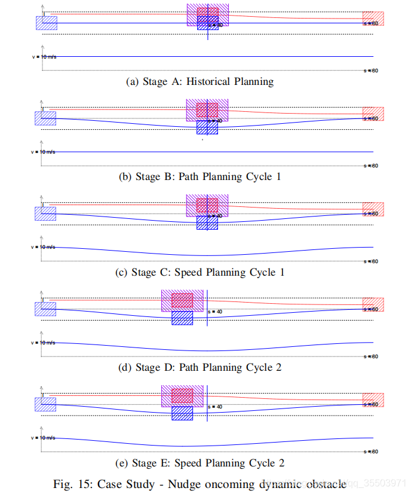

1. 历史规划（Figure 15a）：在历史规划（或者说上一轮规划）的profile中，即在动态障碍物进入之前，车正以10 m/s的恒定速度直线前进。
2. 路径规划迭代1（Figure 15b）：在此步骤中，speed profile以10米/秒的速度在历史profile中巡航。根据这个速度推测，车和动态障碍物将在S = 40m位置相遇。因此，避免这个障碍的最好方法是在S = 40m时从右侧绕开它。
3. 速度规划迭代1 (Figure 15c)：基于上一步预计的从右绕开的路径轮廓，车辆根据与障碍物未来可能的相遇调整自身速度，因此，当通过这个速度较慢的障碍时，车辆将减慢到5米/秒。
4. 路径规划迭代2 (Figure 15d)：在新的速度曲线下，车不会再在$S = 40m$处绕过动态障碍物，而是在$S = 30m$处这个新位置。因此，应将绕开障碍物的路径更新为一条新的路径，使$S = 30m$时的nudge距离（和障碍物在横向的距离）最大化。
5. 速度规划迭代2 (Figure 15e)：在新的路径曲线（path profile）下，在S = 30m处执行绕开，在S = 40m处减速不再是必要的。 新的速度曲线显示车可以在$S = 40m$时加速，并在$S = 30m$时平稳通过。

**一次planning并不一定总是只需要如上面的四个步骤（iteration）。根据场景的不同，它可能需要更少或更多的步骤。 一般来说，场景越复杂，步骤越多**
