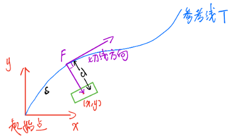
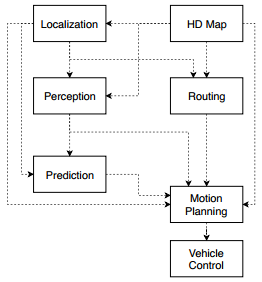
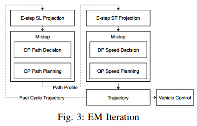
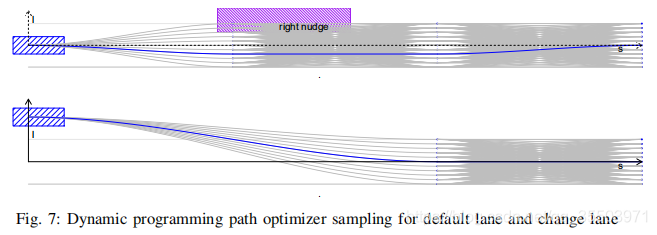

# EMPlanner

## 总述

论文原文：[Baidu Apollo EM Motion Planner](../../../书籍论文/EMPlanner.pdf)

参考资料：[Apollo EM Planner阅读笔记-CSDN博客](https://blog.csdn.net/qq_35503971/article/details/106337900?ops_request_misc=%7B%22request%5Fid%22%3A%22170831186416800222854855%22%2C%22scm%22%3A%2220140713.130102334..%22%7D&request_id=170831186416800222854855&biz_id=0&utm_medium=distribute.pc_search_result.none-task-blog-2~all~top_positive~default-1-106337900-null-null.142^v99^pc_search_result_base6&utm_term=EMplanner&spm=1018.2226.3001.4187)

该算法首先通过顶层多车道策略，选择出一条参考路径，再根据这条参考线，**在Frenet坐标系下，进行车道级的路径和速度规划，规划主要通过Dynamic Programming和基于样条的Quadratic Programming实现**

## Frenet坐标系

- 在Frenet坐标系中，$s$代表沿道路的距离，作为纵坐标；$L$表示与纵向线的横向垂直位移，作为横坐标

- Frenet坐标系的本质：就是在参考路径的每一个参考点都建立一个独立的笛卡尔坐标系

从车辆位置$(x,y)$向参考线$T$作投影，投影点为$F$，则点$F$与车辆位置$(x,y)$的距离即为横向位移$d$（方向为参考线当前的法向，称为横向，Lateral Axis）；从参考线的起始点到投影点$F$的曲线距离即为纵向位移$s$（方向沿着参考线，成为纵向，Longitudinal Axis）

- 通过Frenet坐标系可以将障碍物与轨迹投射到S纵轴和L横轴上，目标是将三维轨迹（纵向维度、横向维度和时间维度）分解成两个单独的二维问题，即通过分离轨迹的纵向和横向分量来解决
  - 一个二维轨迹是指具有时间戳的纵向轨迹（ST轨迹）
  - 另一个二维轨迹为相对于纵向轨迹的横向偏移（SL轨迹）

### ST图（纵向速度规划）

ST图可以帮助我们设计和选择速度曲线，$s$表示车辆的纵向位移，$t$表示时间。$ST$图上的曲线是对车辆运动的描述，因为它说明了车辆在不同时间的位置。

由于速度是位置变化的速率，因此可以通过曲线的斜率从$ST$上推断速度

在$ST$​​图中可以将障碍物绘制成在特定时间段内阻挡道路部分的矩形，速度曲线不得与矩形相交

#### 示例

下图为多个障碍物的情形，映射后的ST空间中有很多障碍物，需要进行避障规划，这就体现了速度规划与二维空间中的路径规划问题的相似性。映射后的图被称为ST图。

速度曲线从左边第一个障碍区域下方和右方通过，代表了车辆在障碍车辆占用道路时等待，在占用结束后征程通过；如果是上方和左方通过，代表了在障碍车辆占用车道前抢先通过该路段。

### SL图（横向位移规划）

$SL$坐标系又称为Frenet坐标系，$S$代表中心线方向，$L$代表与中心线正交的方向，在$SL$坐标系中，我们用$S$、$L$、侧向速度$dL$、侧向加速度$ddL$、侧向加加速度$dddL$，这5个量描述车辆的状态。

### 坐标系转换

对于规划，需要从笛卡尔坐标系转换到Frenet坐标系

对于控制、建图、定位等模块，需要从Frenet坐标系转换到笛卡尔坐标系

**这里的数学推导，可以参照我的另一篇笔记：**[Frenet坐标系.md](Frenet坐标系.md)

Apollo框架下的EM planner和Lattice planner算法都有用到frenet坐标系

## 论文正文

### Apollo的所有模块

阿波罗其实就是在autoware的基础上发展而来，也包含定位、感知、规划、控制几个模块。

**相比于autoware，最不一样的就是多了一个`Routing`的模块，这个模块用来生成一条参考路径，即阿波罗使用的Frenet坐标系所需要的参考线。**

### 1.EMPlanner框架

- 首先，所有信息会在`data center`层汇集和同步，并传给`EM Planner`规划器

- 然后，`Reference Line Generator`会依靠之前汇总的信息（交通规则、障碍物等）生成一些候选路径，这一步是基于阿波罗`Routing`模块的高清地图和导航信息完成的
- 在`motion planning`环节，基于一条参考线（reference line是Apollo中必须有的），建立Frenet坐标系

- Frenet坐标系的信息会传递给`lane-level optimizer`，这个优化器会执行路径和速度优化。（**核心步骤**）

  - 在路径优化中，环境信息会投影到Frenet坐标系或者成为SL图（E-step）。基于Frenet坐标系中的投影信息，一条优化后的smooth路径会被生成（M-step）。
  - 在速度优化中，根据路径优化步骤中生成的smooth路径，障碍物会被投影到ST图（E-step）。然后速度优化器会进一步生成一系列速度信息（M-step）  

  将路径优化和速度优化后的结果合起来，就得到我们需要的优化路径，但是这个时候有很多条（因为之前传入的候选路径都会被E-step和M-step规划）

- 将所有的优化后的路径传入`reference line trajectory decider`，根据车辆状态、交通规则和每条车道的cost，最终会选择出一条合适的路径

### 2.EM的核心—E-step和M-step

就是`lane-level optimizer`优化器做的事：在一次规划循环中，迭代过程包括两个E-step和两个M-step：

**图中左半部分是path optimizer，右半部分是speed optimizer**

- 在第一个E-step中，障碍物被投影到Frenet坐标系 ，障碍物包括了静态障碍物和动态障碍物：
  - 静态障碍物会直接从笛卡尔坐标系转换到Frenet坐标系
  
  - 对于动态障碍物，我们可以用上一次的规划轨迹去估计动态障碍物和car在每个时间点的位置，两者的重叠部分（表示未来会相撞的时刻和地点）会被投影到Frenet坐标系

    考虑到安全性，SL投影只考虑低速行驶时迎面而来的动态障碍物
  
- 在第二个E-step中，所有的障碍物（包括高速、低速以及迎面而来的障碍物）都会在ST图中投影（基于路径优化部分生成的路径：Path Profile）。如果障碍物轨迹和规划路径重叠，那么就会在ST图中的相应部分出现阴影区域。

- 在两个M-step中，路径和速度的优化都会通过动态规划和二次规划的组合来完成

因为虽然我们已经把障碍物投影在SL图和ST图，但是路径和速度的优化问题依旧是在非凸空间的。

所以，先利用动态规划去生成一个粗略的解，同时，这个解可以提供一些避障策略（跟随、超越）。论文中使用这个粗略的解去产生一个convex hull（凸包），用于二次优化中。

最后，二次优化会在convex hull中找到最优的解

#### SL and ST Mapping(E-step)

##### SL projection

SL投影基于有连续曲率导数的（G2）长度平滑参考线

- 在笛卡尔坐标系中，障碍物或者car的位置方向用$(x,y,\theta)$表示，路径的曲率和曲率导数用$(k,dk)$表示；
- 将笛卡尔坐标系中的内容投影到Frenet坐标系后，用五元组$(s,l,dl,ddl,dddl)$，分别表示纵向、横向、横向导数（一二三阶）

静态障碍物的位置由于是时不变的，所以投影很简单；

**动态障碍物**，我们利用上一周期的规划轨迹投影到Frenet坐标系，来获取在$s$方向的速度信息，进而得到car在特定时间点的$s$坐标（论文中写作station coordinates）。估计得到的车子$s$坐标可以用来估计和障碍物的相交处。如果估计的车子$s$坐标和障碍物位置会在同一时间相交，那么就会在$SL$图中生成一块阴影区域，表示车子和障碍物的bounding box重叠了。如下图所示：

- 图中，由预测模块估计的迎面而来的动态障碍物及其对应轨迹用红色标记。小车是用蓝色标记。首先将动态障碍物的运动轨迹离散成几个随时间变化的轨迹点，然后将这些轨迹点投影到frenet坐标系中。一旦我们发现小车的$s$坐标（利用上一周期轨迹预测的）与投影的障碍点有相交，那么重叠区域(图中紫色部分)将被标记在Frenet框架中。

##### ST projection

ST投影用于帮助我们估计车辆的速度信息

当path optimizer在frenet坐标系（SL图）中生成了一条优化路径后，动态和静态的障碍物也相应的在frenet坐标系中投影了，之前说过障碍物和预计的小车未来位置有重叠时，会有阴影显示。同理在$ST$图中也是如此：

- 图中，一个前方出现的障碍物在$t=2s,s=40m$处出现，用红色块表示。车后的障碍物用绿色块表示。**剩下的白色区域都是小车的可行区域（速度意义下的）**

  speed optimization M-step 会在无障碍物的白色区域找到一条合适的光滑路径

#### M-step DP（动态规划）Path

M-step path optimizer在Frenet坐标系中优化路径。其实就是设计一个关于横坐标$s$的目标函数$l=f(s)$（SL图中，以$s$为自变量，偏离中心参考线的距离为因变量的函数），即在非凸空间$SL$的station coordinate。（需要注意的是，从障碍物左右侧绕开的决策是局部最优的）

DP Path包括两部分：基于动态规划的路径决策 和 基于样条的路径规划

基于Dynamic Programming的路径步骤提供一条粗略的路径信息，其可以带来可行通道和绕障决策，如下图所示，这一步包括Lattice采样、代价函数、动态规划搜索

##### DP Path的整体过程

如下图所示，lattice sampler是基于Frenet坐标系的

首先在小车的前方对多条轨迹进行采样（即每条轨迹都沿着$s$​方向离散化成一系列points），得到rows of points。每行的points都是由五次多项式平滑连接，每行points的间隔由速度、道路结构、变道决策等决定

**这样的采样方式可以根据应用的特定场景去单独制定**

- 例如，变道情况下需要点之间的采样间隔 大于 正常的行驶采样点间隔

**lattice在$s$​坐标轴方向会至少覆盖8s或者200m的距离，为了安全考虑**

在lattice采样后，利用cost function去评估每条采样路径

cost function基于SL投影的信息、交通规则和车的动力学。**总的代价函数是`smoothness`, `obstacle avoidance` 和`lane cost functionals`三部分的线性组合：**
$$
 C_{\text {total }}(f(s))=C_{\text {smooth }}(f)+C_{\text {obs }}(f)+C_{\text {guidance }}(f) 
$$

- smoothness部分可以具体表示为：
  $$
  C_{\text {obs }}(d)=\left\{\begin{array}{ll}
  0 & d>d_{n} \\
  C_{\text {nudge }}\left(d-d_{c}\right) & d_{c} \leq d \leq d_{n} \\
  C_{\text {collision }} & d<d_{c}
  \end{array}\right.
  $$
  其中，$f^{\prime}(s)$表示车道和车朝向间的偏差；$f^{\prime \prime}(s)$和路径的曲率有关；$f^{\prime \prime \prime}(s)$表示曲率的导数。利用多项式的形式，可以对上述cost function进行解析计算

- obstacle cost是在一系列固定的$s$坐标上计算的：$ \left(s_0, s_1, \ldots, s_n \right)$表示障碍物在frenet的位置。

  obstacle cost是基于（障碍物和小车）两者bounding box间的距离$d$，表示如下： 
  $$
  C_{o b s}(d)= \begin{cases}0, & d>d_n \ C_{n u d g e}\left(d-d_c\right), & d_c \leq d \leq d_n \ C_{\text {collision }} & d<d_c\end{cases}
  $$
  $C_{nugde}$是一个单调递减函数；$d_c$代表为了安全考虑的缓冲距离；$d_n$（nudge range）以我个人的理解，表示超车的瞬间，和障碍物并排时距离障碍物的横向距离；$C_{collision}$​是碰撞阈值

  

- lane cost包含两个部分：`guidance line cost`和`on-road cost`

  `guidance line cost`表示一条周围没有障碍物的理想行驶路径，这条路径是从path的中心线提取得到的。`guidance line function`记为$g(s)$，计算公式如下：
  $$
  C_{g u i d a n c e}(f)=\int(f(s)-g(s))^2 d s
  $$
  `on-road cost`由道路边沿决定，当路径点超过道路范围会受到严厉的惩罚

最后的cost由上面三部分组成， 在动态规划中利用这个cost去选择一条候选路径，这条候选路径同时也会提供避障的决策。**例如，在上面的Fig.7中，障碍物被标记为`right nudge`，表示小车会从这个障碍物的右侧超过**