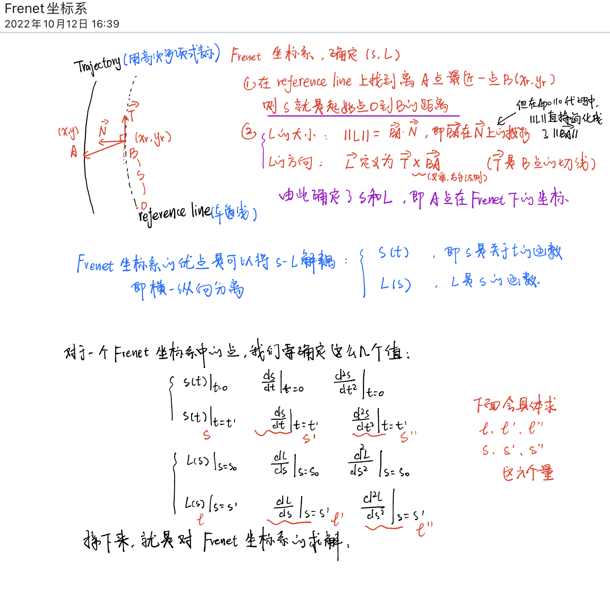
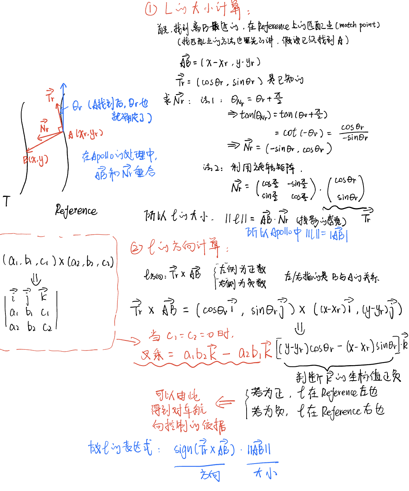
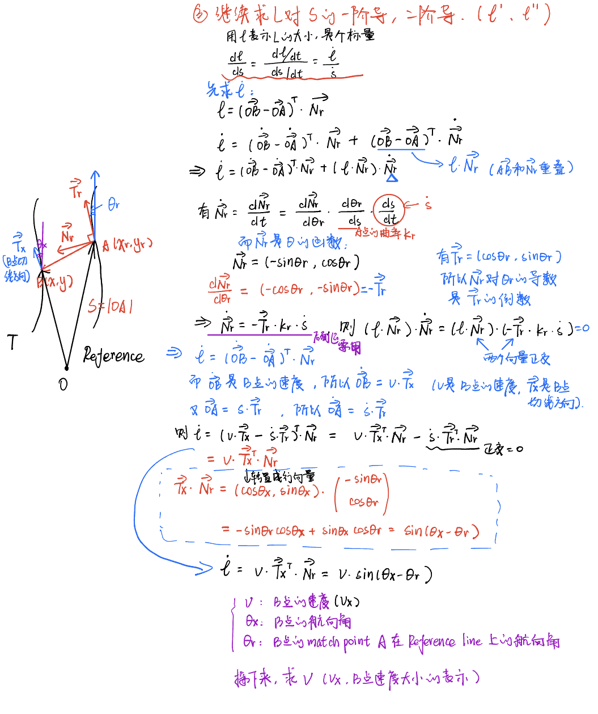
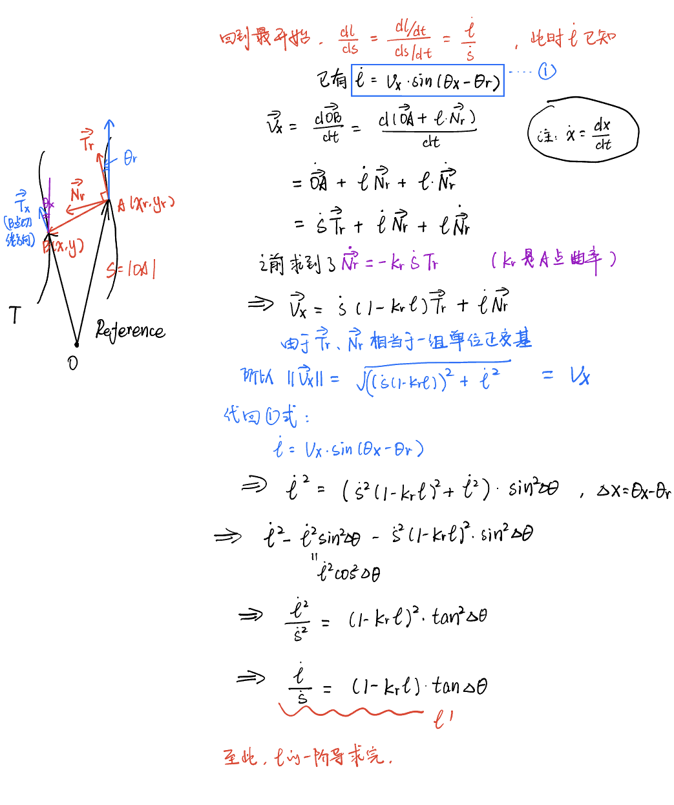
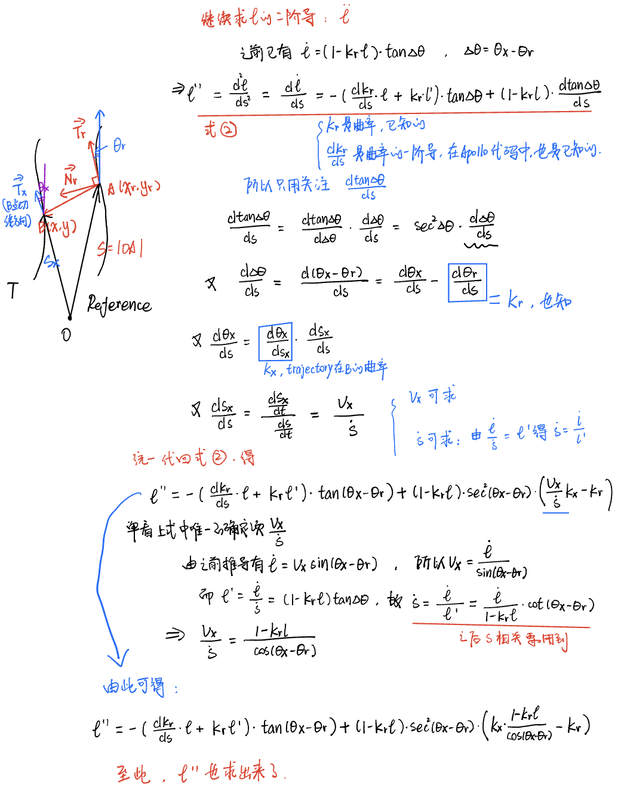
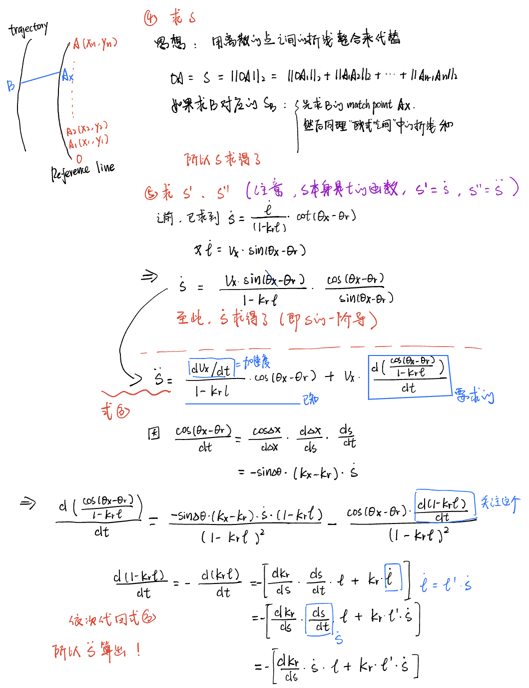
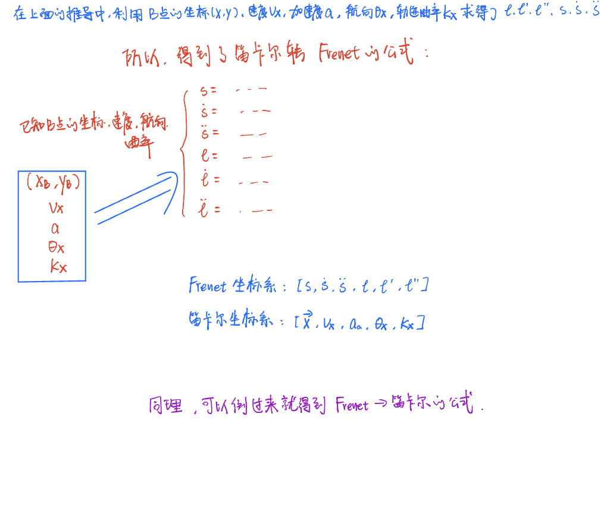
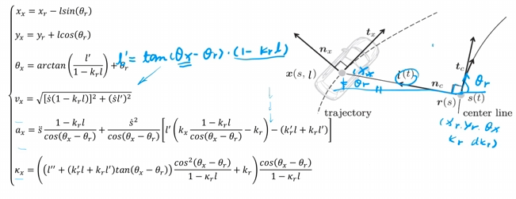

# Frenet坐标系

## 总述

- 参考资料：

1. [Frenet坐标系与Cartesian坐标系互转（一）：公式推导_frenet坐标系转换-CSDN博客](https://blog.csdn.net/u013468614/article/details/108748016)
2. [Lattice算法之Frenet坐标系提出的背景（共8个系列视频）](https://www.bilibili.com/video/BV1A44y187RG/?spm_id_from=333.999.0.0&vd_source=3da170c3416f78cfe40e1a7ba3a4f5f9)
3.  [Apollo项目坐标系研究_flu坐标系-CSDN博客](https://blog.csdn.net/davidhopper/article/details/79162385)

Frenet坐标系使用道路的中心线作为Base frame，使用参考线的切线向量和法线向量建立坐标系，**是一个动态的坐标系**。相比笛卡尔坐标系，Frenet坐标系简化了路径规划问题。

注意：下图中Frenet的q坐标轴也可以用d或l表示

## Cartesian坐标系到Frenet坐标系的转换

### Frenet坐标系认识

- frenet坐标系的原点为车辆当前位置到参考线最近的点，即为$r(s)$
- t轴（$t_c$）为参考轨迹在原点的切线方向
- n轴（$n_c$​）为垂直于t轴向外的轴为n轴（如何区别内外）
- 与笛卡尔坐标系的可视化关系

### Frenet坐标系概念

- **两个坐标系的量：**

1. Frenet坐标系： $\left[s, \dot{s}, \ddot{s}, l, \dot{l}, \ddot{l}, l^{\prime}, l^{\prime \prime}\right]$

2. 笛卡尔坐标系：$\left[\vec{x}, v_x, a_a, \theta_x, k_x\right]$

+ Frenet坐标系分量的含义：

  - $s$：Frenet纵坐标，即**纵向位移**； 

    $\dot{s}=\frac{d s}{d t}$：Frenet纵坐标对时间的导数，也即沿base frame的**纵向速度**； 

    $\ddot{s}=\frac{d \dot{s}}{d t}$：沿base frame的**纵向加速度**； 

  - $l$：Frenet横坐标，即**横向位移**； 

    $\dot{l}=\frac{d l}{d t}$：Frenet**横向速度**； 

    $\ddot{l}=\frac{d l}{d t}$：Frenet**横向加速度**； 

  - $l^{\prime}=\frac{d l}{d s}$：Frenet横向坐标对纵向坐标的导数，即**横轴对纵轴产生影响的速度**； 

    $l^{\prime \prime}=\frac{d l^{\prime}}{d s}$：Frenet横向坐标对纵向坐标的二阶导，即**横轴对纵轴产生影响的加速度**； 

+ 笛卡尔坐标系分量的含义：

  - $\vec{x}$：为对应Cartesian坐标系下的坐标，是一个**向量**； 
  - $\theta_x$：Cartesian坐标系下的**朝向**； 
  - $k_x=\frac{d \theta_x}{d s}$：轨迹的**曲率**，$s$为当前轨迹的弧长；
  - $v_x=\|\dot{\vec{x}}\|_2$：Cartesian坐标系下的**线速度**（无方向，无正负）； 
  - $a_x=\frac{d v_x}{d t}$：Cartesian坐标系下的**加速度**； 

- **要求笛卡尔坐标系到Frenet坐标系的转换公式，可以循序渐进分成三步：**

1. 已知：$\vec{x}=\left[x_x, y_x\right]$，去推导$[s, l]$
2. 已知：$\vec{x}=\left[x_x, y_x\right], \theta_x, v_x$，去推导$\left[s, l, \dot{s}, \dot{l}, l^{\prime}\right]$
3. 已知：$\vec{x}=\left[x_x, y_x\right], \theta_x, v_x, a_x, k_x$，去推导$\left[s, l, \dot{s}, l^{\prime}, \ddot{s}, l^{\prime \prime}\right]$

推到步骤可以跟着篇首给出的视频过程，也可以参考csdn的那篇blog

### 坐标系转换公式推导（参考了弘毅师兄的笔记）

- **求 $l$ 的大小和方向**

- 总结：$\large l$ 的表达式为 $\large l=sign \left(\vec{T_r} \times \vec{AB} \right) \cdot \|{\vec{AB}}\|_2$

- **求 $l$ 的一阶导数 $\dot{l}$**

- 总结：$\large \dot{l}$ 的表达式为 $\large \dot{l}= v_x \sin \left(\theta_x-\theta_r\right)$

- **再求 $l$ 对 $s$ 的一阶导 $l^ \prime$ 和二阶导 $ l^{\prime \prime}$**

- 总结： $\large l^ \prime$ 的表达式为 $\large l^ \prime= \left(1-k_rl \right) \tan\left(\theta_x-\theta_r\right)$

- **继续求$ l^{\prime \prime}$**

- 总结： $\large l^ {\prime\prime}$ 的表达式为 $\large l^{\prime \prime}=  -\left(k_r^{\prime} l+k_r l^{\prime}\right) \tan \left(\theta_x-\theta_r\right)+\frac{\left(1-k_r l\right)}{\cos ^2\left(\theta_x-\theta_r\right)}\left(\frac{1-k_r l}{\cos \left(\theta_x-\theta_r\right)} k_x-k_r\right)$

- **求$s, \dot{s}, \ddot{s}$**

### 公式转换总结

#### Cartesian转Frenet

$$
\left\{\begin{array}{lc}s= & s_r \\ \dot{s}= & \frac{v_x \cos \left(\theta_x-\theta_r\right)}{1-k_r l} \\ \ddot{s}= & \frac{\left.a_x \cos \left(\theta_x-\theta_r\right)-\dot{s}^2\left[l^{\prime}\left(k_x \frac{1}{\cos \theta_x l}-\theta_r\right)-k_r\right)-\left(k_r^{\prime} l+k_r l^{\prime}\right)\right]}{1-k_r l} \\ l= & \operatorname{sign}\left(\left(y_x-y_r\right) \cos \left(\theta_r\right)-\left(x_x-x_r\right) \sin \left(\theta_r\right)\right) \sqrt{\left(x_x-x_r\right)^2+\left(y_x-y_r\right)^2} \\ l^{\prime}= & \left(1-k_r l\right) \tan \left(\theta_x-\theta_r\right) \\ l^{\prime \prime}= & -\left(k_r^{\prime} l+k_r l^{\prime}\right) \tan \left(\theta_x-\theta_r\right)+\frac{\left(1-k_r l\right)}{\cos ^2\left(\theta_x-\theta_r\right)}\left(\frac{1-k_r l}{\cos \left(\theta_x-\theta_r\right)} k_x-k_r\right)\end{array}\right.
$$

#### Frenet转Cartesian

$$
\left\{\begin{array}{lc}x_x= & x_r-l \sin \left(\theta_r\right) \\ y_x= & y_r+l \cos \left(\theta_r\right) \\ \theta_x= & \arctan \left(\frac{l^{\prime}}{1-k_r l}\right)+\theta_r \in[-\pi, \pi] \\ v_x= & \sqrt{\left[\dot{s}\left(1-k_r l\right)\right]^2+\left(\dot{s} l^{\prime}\right)^2} \\ a_x= & \ddot{s} \frac{1-k_r l}{\cos \left(\theta_x-\theta_r\right)}+\frac{\dot{s}^2}{\cos \left(\theta_x-\theta_r\right)}\left[l^{\prime}\left(k_x \frac{1-k_r l}{\cos \left(\theta_x-\theta_r\right)}-k_r\right)-\left(k_r^{\prime} l+k_r l^{\prime}\right)\right] \\ k_x= & \left(\left(l^{\prime \prime}+\left(k_r^{\prime} l+k_r l^{\prime}\right) \tan \left(\theta_x-\theta_r\right)\right) \frac{\cos ^2\left(\theta_x-\theta_r\right)}{1-k_r l}+k_r\right) \frac{\cos \left(\theta_x-\theta_r\right)}{1-k_r l}\end{array}\right.
$$

