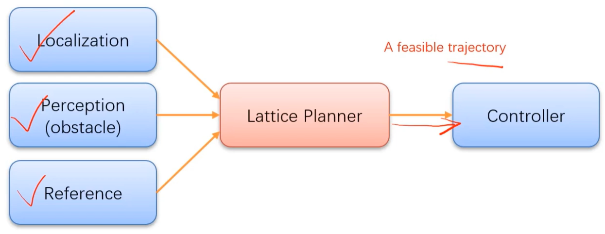

# Lattice Planner

## 总述

是一种基于采样的局部运动规划器

- 通过将车辆坐标系转换到参考线坐标系（frenet坐标系），然后在frenet坐标系下分别对frenet的 $d$ 轴和 $s$ 轴进行规划（其实分别对应路径规划和速度规划），形成frenet坐标系下的规划轨迹，然后将frenet坐标系下的轨迹合成到世界坐标系下还原为世界坐标系下的轨迹。（一次生成多条轨迹，从中选择最好的一条）

- 输入：定位信息、感知信息、高精度地图的参考线

- 输出：局部规划轨迹，并传入到控制器，由控制器完成局部轨迹的跟踪控制

Lattice Planner 输出的轨迹是**一条光滑无碰撞满足车辆运动学约束和速度约束**的平稳安全的局部轨迹

## 算法流程

1. 离散化参考线

2. 将车辆当前位姿信息转换到frenet坐标系下，获得车辆在frenet坐标系的初始状态

3. 基于障碍物信息和速度限制，计算目标距离并获得目标点，获得车辆在目标点位置frenet坐标系下的目标状态

4. 对轨迹状态进行采样，分别是轨迹运行时间t，目标速度v，及到参考线的横向位移d，通过这三个规划参数可以获得采样状态

5. 构建横向位移和纵向位移的多项式规划函数s(t)，d(s)，获得横向位移和纵向位移的规划函数后，进行时间插值就可以获得参考线frenet坐标系下的轨迹点

6. 将轨迹点从frenet坐标系转换到cartesian坐标系，就可以获得物理世界采样轨迹，由于横向和纵向都是通过高次多项式插值获得，以此cartesian坐标系下的轨迹也是光滑的

7. 采样轨迹的碰撞检测、曲率约束及最优轨迹打分：

   采样轨迹是一系列满足速度约束的光滑轨迹，但其还需要满足无碰撞和车辆运动学曲率约束的强制约束，及远离障碍物和靠近参考线等组成的代价约束

   采样轨迹的打分就是为了获得一条最优的满足约束条件的无碰撞光滑轨迹，该轨迹也是lattice输出到controller用于车辆跟随的轨迹